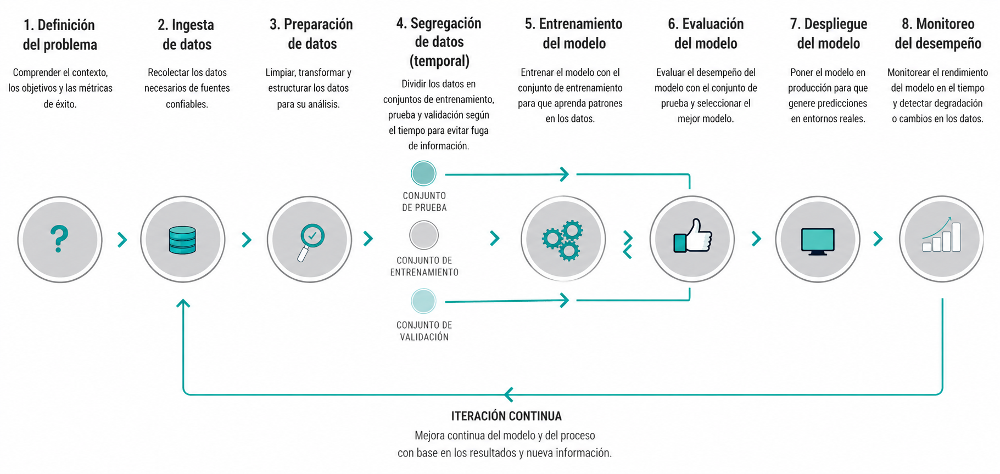
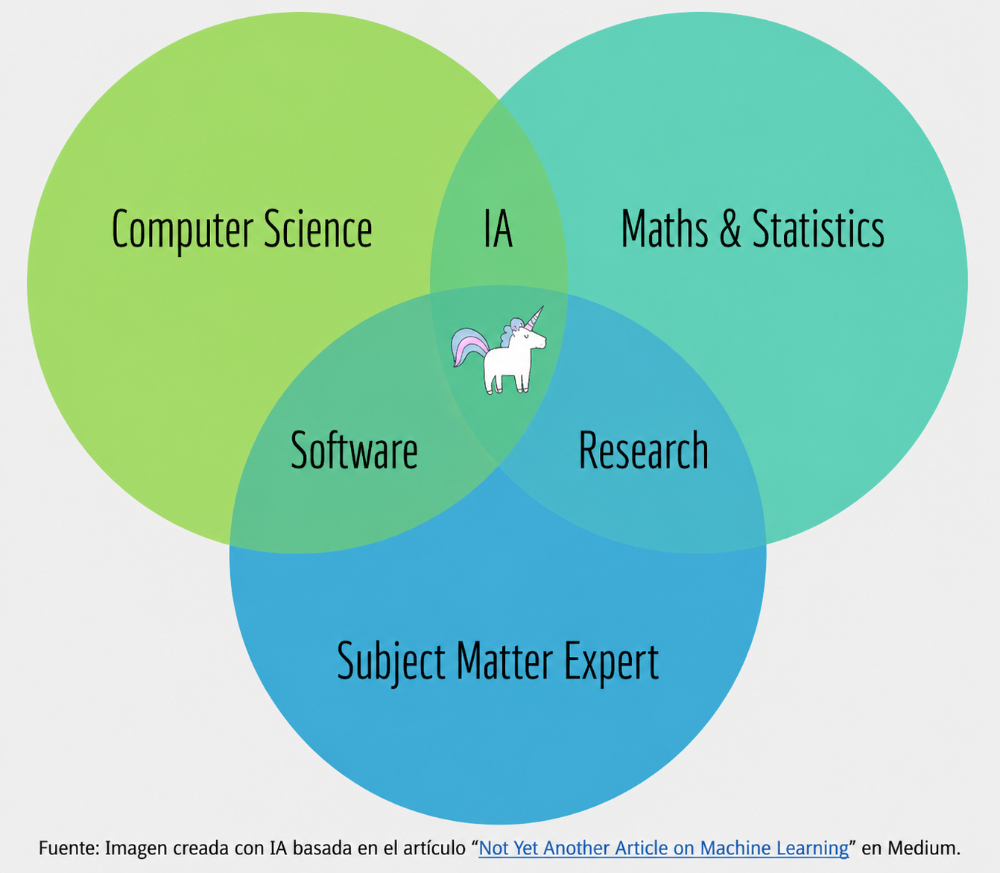

# Introducción a Ciencia de datos {background-color="#fdede8"}

---

## ¿Qué es la ciencia de datos?

- Diseña soluciones basadas en datos para resolver un problema:

    - organizar información  
    - identificar patrones  
    - automatizar tareas complejas  
    - apoyar la toma de decisiones  

- Trabaja con los datos disponibles de organizaciones e instituciones: 

    - desordenados, incompletos, no estructurados

- Gran parte del trabajo ocurre antes de la IA:

    - definir el problema correcto
    - limpiar datos  
    - estructurar información  

## ¿Qué es la **ciencia** de **datos**?

Desarollo de *sistemas* que dan soporte a la toma de decisiones que se traducen en acciones.

| **Ciencia** | **Datos** |
|-------------|-----------|
| Uso del método científico en el diseño e implementación de una solución | Para probar hipótesis |

- El resultado final es un **producto de datos** implementado (*modelo vivo*)
    - Dependencia de los datos disponibles
    - Usualmente, responde a una sola pregunta
    - Supone un sistema dinámico complejo
    - Los modelos generados no se pueden utilizar en otros sistemas 
    - Supone que modifica la realidad para la cuál fue diseñado

::: {.notes}
- Método científico: Definir el problema, plantear hipótesis, probar la hipótesis, etc.
	- Uso del MC tanto en el diseño de la solución como en la implementación de la misma.
- Definición de CD: Estudio fenomenológico de Sistemas Complejos Adaptativos, con el propósito de construir  
productos de datos que den soporte a la toma de decisiones y acciones sobre el sistema en 
cuestión (De Unánue, 2018)
- Además el producto de datos ofrece soluciones a problemas de contextos específicos
- 

:::

## Producto de datos 

### *No solamente es un modelo, es un sistema complejo*

- Conjunto de procesos que atraviesan los datos y que se adaptan al sistema en el que está implementado

## ¿Qué **no** es ciencia de datos?

- No es una tecnología
- No es una herramienta
- No es desarrollo de software
- No es *Business Intelligence*
- No es *Big Data*
- No es (solo) *Inteligencia Artificial*
- No es (solo) *machine learning*
- No es (solo) visualización
- No es (solo) hacer modelos

## ¿Qué **no** es ciencia de datos?

- No es una tecnología
- No es una herramienta
- No es desarrollo de software
- No es *Business Intelligence*
- No es *Big Data*
- No es (solo) *Inteligencia Artificial*
- No es (solo) *machine learning*
- No es (solo) visualización
- No es (solo) hacer modelos

... **pero las utiliza a todas para generar productos de datos**

---

### *¿Cómo utiliza IA para dar soporte a la toma de decisiones?*

:::: {.columns}
::: {.column style="width:50%; font-size: 0.7em;"}

- **Machine Learning (ML)**
    - **Aprendizaje supervisado** para clasificar o predecir
    - **Aprendizaje no supervisado** para identificar patrones (agrupaciones)
    - **Aprendizaje por reforzamiento** con agentes que actuan en función de recompensas o castigos  

- **Deep Learning (DL)**
    - Redes neuronales con grandes volúmenes de datos
    - Base de muchas aplicaciones actuales de IA generativa

- **Procesamiento de Lenguaje Natural (NLP)**
    - Permite procesar lenguaje humano en máquinas
    - Clasificar, extraer, resumir y generar texto

:::
::: {.column width="5%"}
<!-- empty column to create gap -->
:::
::: {.column style="width:35%; font-size: 0.6em;"}

:::
::::

# Ciencia de datos (IA) para política pública {background-color="#fdede8"}

- **DSSG (Data Science for Social Good)**
- Carnegie Mellon University
- [https://dssgfellowship.org/](https://dssgfellowship.org/)
    - Sistemas de priorización de recursos
    - Sistemas de alerta temprana

## Infraestructura hídrica subterránea 

### Ciudad de Syracuse, NY

:::: {.columns}
::: {.column style="width:50%; font-size: 0.6em;"}

**Contexto y problema**

- La infraestructura hídrica de la ciudad lleva más de un siglo
- Las tuberías de agua y drenaje tienen gran deterioro y comienzan a fallar costosa e inesperadamente
    - Roturas, fugas y otros incidentes al año
- Afectaciones a vecinos, comercios y tráfico
- El mantenimiento suele ocurrir después del daño

**Meta de la implementación**

- Reducir las fallas en la infraestructura hídrica de la ciudad
- Reducir costos de reparación de emergencia

**Acción, intervención o programa**

- El Gobierno del estado envía y concentra esfuerzos preventivos en puntos críticos

:::
::: {.column width="5%"}
<!-- empty column to create gap -->
:::
::: {.column style="width:45%; font-size: 0.6em;"}

- @dssg_preventive_care_infrastructure_2017

:::
::::

## Infraestructura hídrica subterránea 

### Ciudad de Syracuse, NY

:::: {.columns}
::: {.column style="width:50%; font-size: 0.6em;"}

**Datos disponibles**

- Antigüedad de tuberías, diagramas históricos hechos a mano
- Material de las tuberías, contenido del suelo
- Historial de roturas y reparaciones

**Análisis predictivo que informará mis acciones**

- Identificar qué tuberías específicas tenían mayor riesgo de romperse próximamente

:::
::: {.column width="5%"}
<!-- empty column to create gap -->
:::
::: {.column style="width:45%; font-size: 0.6em;"}

- @dssg_preventive_care_infrastructure_2017

:::
::::

## Ciencia de datos para políticas públicas
### ¿Cómo es diferente?

- En lugar de inferir mecanismos sobre una población para la 
  implementación de políticas públicas...
- Ciencia de datos es la manera de guiar a **nivel individual** 
  las decisiones, basados en datos/evidencia
    - Se enfoca en resolver problemas específicos
    - Se busca identificar entidades importantes que, al intervenir 
      sobre ellas, se puede resolver el problema

## Ciencia de datos para políticas públicas

| | Ciencias Sociales | Ciencia de Datos |
|---|---|---|
| **Pregunta** | ¿Por qué ocurre y quién asume el costo? | ¿Dónde, cuándo o sobre quién ocurrirá? |
| **Unidad de análisis** | Instituciones, incentivos, entidades agregadas | Entidades individuales (tubería, persona, edificio) |
| **Objetivo** | Explicar, diagnosticar, reformar | Predecir e intervenir |
| **Uso del dato** | Evidencia para un argumento sobre causas o eficiencia | Insumo para un modelo predictivo |
| **Resultado esperado** | Cambio institucional, de incentivos o de política pública | Acción operativa focalizada |

> Las ciencias sociales preguntan *por qué el sistema falla*
>    y *quién paga las consecuencias*.
> La ciencia de datos pregunta *dónde o sobre quién actuar primero*.

::: {.notes}
Predicciones precisas no son generalmente posibles

Incluso las predicciones con cierta incertidumbre pueden aportar un valor significativo
al influir en decisiones estratégicas

En lugar de predecir a todos, te enfocas en identificar cierto grupo de personas que (en general) tienden a comportarse de la misma manera

Si el proceso de aprendizaje identifica un grupo cuidadosamente definido de clientes que,

- por ejemplo, tienen una probabilidad tres veces mayor que el promedio de responder positivamente al correo, 

- la empresa obtiene grandes beneficios al eliminar de manera preventiva a los posibles no respondedores de la lista de envíos.

- A su vez, estos no respondedores también se benefician al recibir menos correo no deseado.

:::

---

### Diferente de *forecasting*

>Whereas forecasting estimates the total number of ice cream cones to
> be purchased next month in Nebraska, \[Data science\] tells you which
> [individual]{.underline} Nebraskans are most likely to be seen with a
> cone in hand [@siegel2016predictive]

- **Forecasting**: Estimación de métricas agregadas, como el número total de celulares que se venderán en la CDMX el próximo mes. Su enfoque es en valores globales o promedios para poblaciones completas.
- **Ciencia de Datos**: Identificar patrones a nivel individual. En este caso, utiliza datos para predecir qué personas específicas de la CDMX tienen mayor probabilidad de comprar un celular.

---

## *Pipeline* en un proyecto de Ciencia de datos

<small>Fuente original: <a href="https://medium.com/data-science/not-yet-another-article-on-machine-learning-e67f8812ba86">Not Yet Another Article on Machine Learning</a>. Adaptado y traducido con IA.</small>

## Equipos multidisciplinarios 

# Ejemplos de proyectos {background-color="#fdede8"}

## Daño estructural en techos

### Ciudad de Baltimore

:::: {.columns}
::: {.column style="width:50%; font-size: 0.6em;"}

- **Problema**
    - Edificios abandonados generan daños estructurales en viviendas vecinas
    - El deterioro puede extenderse a propiedades contiguas

- **Meta**
    - Reducir el número de casas con daño estructural 

- **Acción**
    - Realizar inspecciones e intervenciones preventivas para determinar demolición de emergencia, estabilización u otras reparaciones

- **Datos**
    - Imágenes aéreas
    - Datos administrativos
    - Historial de inspecciones

- **Análisis**
    - Generar un ranking de propiedades con mayor riesgo (score)

:::
::: {.column width="5%"}
<!-- empty column to create gap -->
:::
::: {.column style="width:45%; font-size: 0.6em;"}

:::
::::

## Priorización de carpetas de investigación

### Fiscalía de Zacatecas

:::: {.columns}
::: {.column style="width:50%; font-size: 0.6em;"}
- **Problema**
    - Sobrecarga de trabajo y poca capacidad institucional en fiscalía

- **Meta**
    - Aumentar la tasa de carpetas procesadas (reducir tiempo de resolución)

- **Acción**
    - Revisión de carpetas de investigación priorizadas

- **Datos**
    - Administrativos e información de carpetas de investigación

- **Análisis**
    - Generar un ranking de carpetas que tienen mayor probabilidad de finalizar en un plazo de 6 meses

:::
::: {.column width="5%"}
<!-- empty column to create gap -->
:::
::: {.column style="width:45%; font-size: 0.6em;"}

- Preprint: [https://arxiv.org/abs/2601.00396](https://arxiv.org/abs/2601.00396)

:::
::::

## Distribución eficiente de contenedores

### Terminal portuaria

:::: {.columns}
::: {.column style="width:50%; font-size: 0.6em;"}
- **Problema**
    - Gran número de reacomodos innecesarios al momento de estibar contenedores

- **Meta**
    - Reducir los movimientos desperdicio al momento de estibar contenedores

- **Acción**
    - Distribuir los contenedores de manera eficiente, proporcionando información sobre la prioridad de estiba

- **Datos**
    - Contenedores y movimientos

- **Análisis**
    - Predicción de contenedores con servicio y tiempo de estadía

:::
::: {.column width="5%"}
<!-- empty column to create gap -->
:::
::: {.column style="width:45%; font-size: 0.6em;"}

- Preprint: [https://arxiv.org/html/2604.06251v1](https://arxiv.org/html/2604.06251v1)

:::
::::

## Distribución eficiente de contenedores

### Terminal portuaria

---

### *Pipeline*

---

### [Referencias]{.fg style="--col: #e64173"}

  

**Parte de este material es basado en el curso: Machine Learning in practice de Rayid Ghani and Kid Rodolfa**
