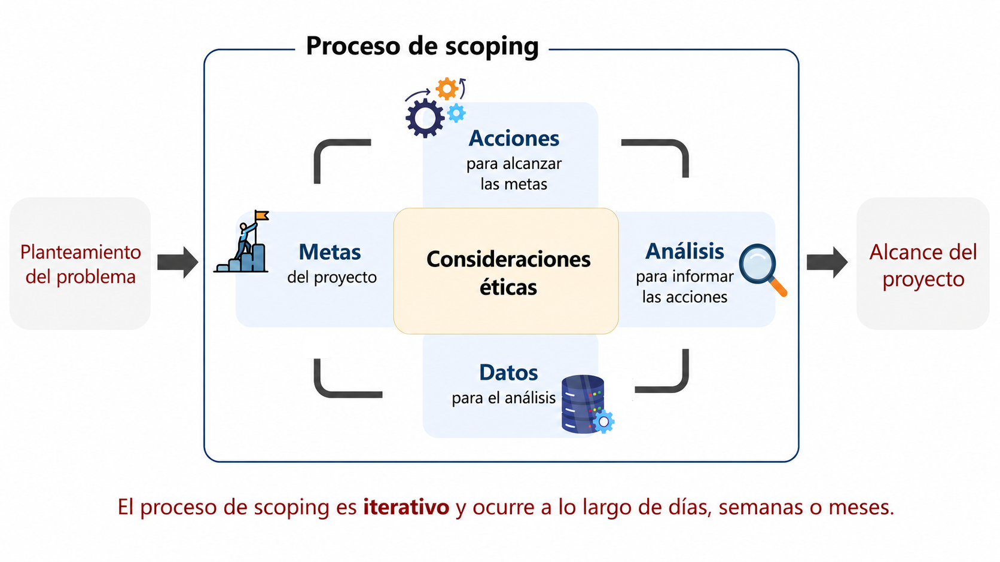
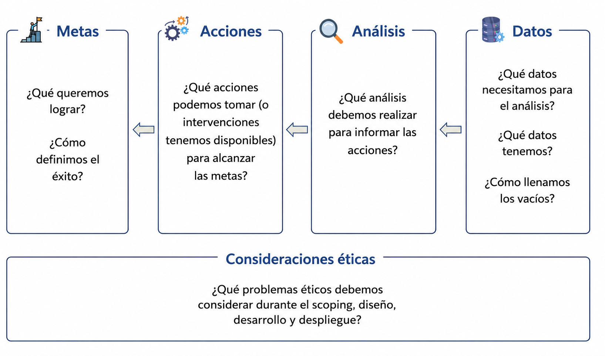
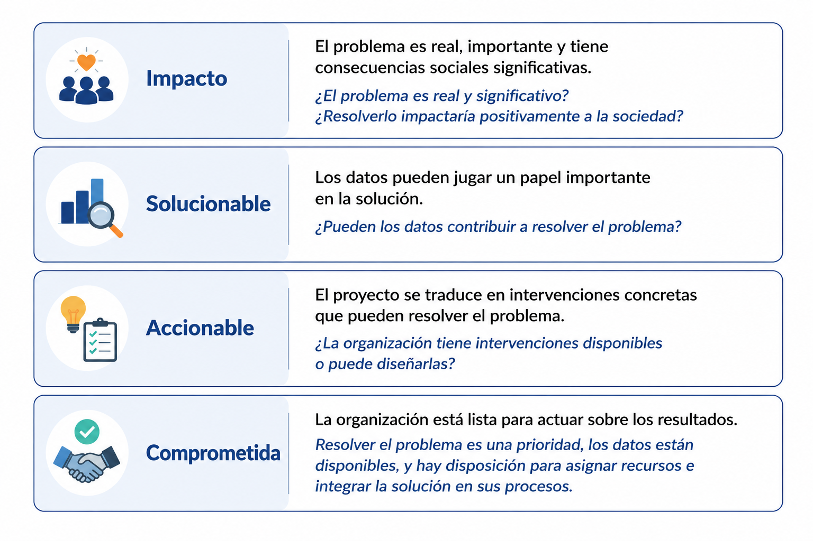
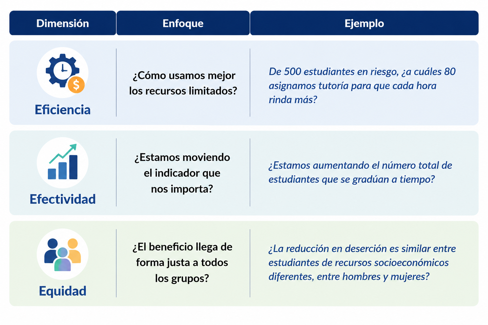
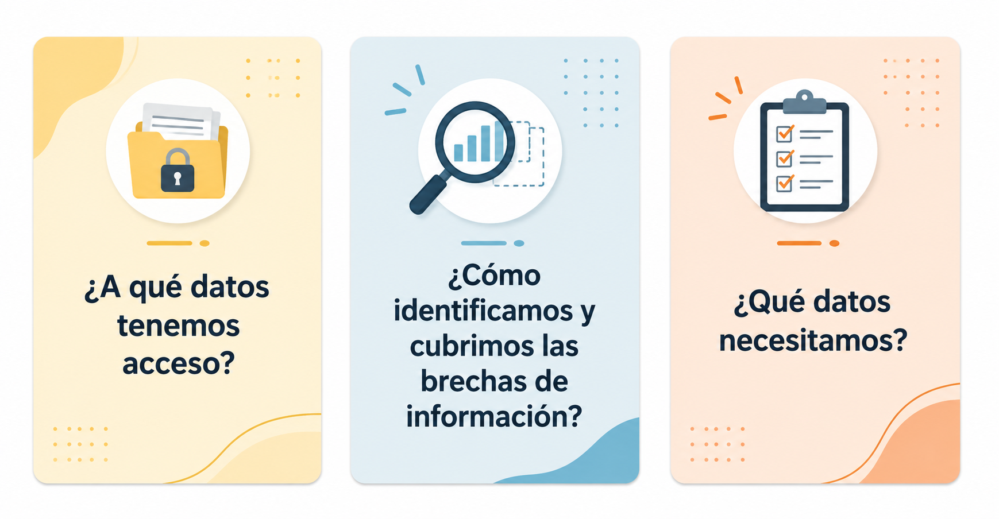
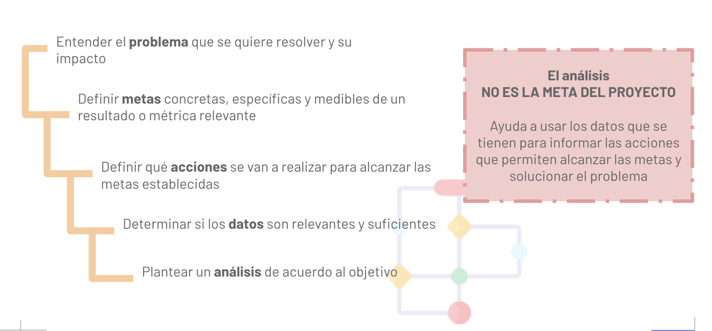

# *Project scoping* o alcance de proyecto{background-color="#fdede8"}

## ¿Por qué la formulación de un alcance de proyecto es crítica?
### Importancia del alcance o *scoping*

-   Un proyecto bien definido aumenta la probabilidad de que tu trabajo sea utilizado por las organizaciones y tenga un impacto

-   Permite que todos discutan, lleguen a acuerdos y luego se enfoquen en metas tangibles e identifiquen formas accionables para alcanzarlas.

-   Comenzamos con el problema (no con los datos) 

> Desafortunadamente los proyectos no vienen como problemas
    definidos

## Definir el alcance es un proceso iterativo y continuo

:::: {.columns}
::: {.column style="width:40%; font-size: 0.8em;"}

- Involucra distintos tipos de personas

- Se refina con el tiempo

- Se modifica como resultado de fases posteriores del proyecto

- Enfoque en lo que es accionable y conlleva a resultados tangibles
 y con beneficio para la sociedad

- Lleva tiempo (3 meses de manera inicial)

:::
::: {.column width="5%"}
<!-- empty column to create gap -->
:::
::: {.column style="width:55%; font-size: 0.8em;"}

:::
::::

---

### Proceso de scoping orientado a la acción y a las metas

::: {.notes}

Las conversaciones comienzan con los problemas de la organización

*Los fondos disponibles para el programa de asistencia de renta están por reducirse significativamente. ¿Cómo dirigimos los fondos limitados a quienes más los necesitan?*

*El desalojo es una vía conocida hacia el sinhogarismo. ¿Podemos usar los fondos de asistencia de renta como herramienta de prevención?*

*El programa actual de asistencia de renta requiere que los inquilinos en riesgo de desalojo inicien el contacto para recibir ayuda. ¿Podemos comunicarnos proactivamente con las personas vulnerables y ofrecerles ayuda sin esperar a que nos contacten?*

:::

---

### El proceso de scoping y sus resultados

:::{.notes}

Ejemplo de alcance de proyecto

**Metas**
- Minimizar el sinhogarismo entre los inquilinos que enfrentan desalojo
- *Eficiencia:* Maximizar la asignación de recursos a las personas que quedarán sin hogar
- *Efectividad:* Minimizar la tasa de sinhogarismo
- *Equidad:* Minimizar las disparidades en la tasa de sinhogarismo entre grupos demográficos

**Acciones**
- Realizar alcance proactivo y proporcionar fondos de asistencia de renta

**Datos**
- Datos administrativos a nivel individual del almacén de datos del condado: demografía, casos de desalojo, servicios para personas sin hogar, salud mental y conductual, y otros programas y servicios del condado, estado y federales

**Análisis**
- Predecir qué inquilinos que enfrentan desalojo tienen mayor probabilidad de interactuar con el sistema de personas sin hogar en el futuro cercano
- Predecir qué inquilinos que enfrentan desalojo tienen mayor probabilidad de permanecer en vivienda estable con asistencia de renta

**Consideraciones éticas**
- *Protección de datos:* La información sensible sobre los residentes del condado debe estar protegida
- *Discriminación/Equidad:* Los grupos desproporcionadamente afectados por crisis de vivienda deben ser considerados
- *Compensaciones entre metas:* Eficiencia vs. Equidad
- *Transparencia:* Involucrar a trabajadores de primera línea y comunidades afectadas sobre el nuevo programa
- *Limitaciones de datos:* No captura desalojos no judiciales ni personas que experimentan sinhogarismo sin interactuar con el sistema del condado
- *Análisis:* Los errores en las predicciones del modelo pueden hacer que la asistencia no llegue a personas vulnerables

:::

# Entendiendo el problema{background-color="#fdede8"}

---

### Criterios para un proyecto de ciencia de datos con impacto social

---

## Entendiendo el problema

- ¿Cuál es la magnitud del problema? ¿A quién/es o qué afecta? ¿Cuánto les afecta?
- ¿A qué problema se enfrenta la organización y por qué es una prioridad?
    - ¿Cómo ha abordado la organización el problema en el pasado y en el presente?
- ¿Quiénes son los actores involucrados dentro y fuera de la organización y cómo deben participar? (*entrevistas*)
  - Tomadores de decisiones / responsables del problema o programa
  - Equipo de datos
  - Usuarios
  - Miembros de la comunidad afectada

:::{.notes}

Entendiendo el problema — ACDHS

*Los fondos disponibles para el programa de asistencia de renta están por reducirse significativamente. ¿Cómo dirigimos los fondos limitados a quienes más los necesitan?*

*El desalojo es una vía conocida hacia el sinhogarismo. ¿Podemos usar los fondos de asistencia de renta como herramienta de prevención?*

*El programa actual requiere que los inquilinos en riesgo de desalojo inicien el contacto para recibir ayuda. ¿Podemos comunicarnos proactivamente con las personas vulnerables y ofrecerles ayuda sin esperar a que nos contacten?*

:::

## *Para este paso, busca conocer:*

- La organización (y las personas)
- El problema y por qué es importante
- ¿A quién afecta y cuánto?
- ¿Cómo están resolviendo el problema hoy (si es que lo están haciendo)?
- ¿Hay algún problema ético importante que deba considerarse desde el inicio?

::: {.callout-tip}
### Ejemplo
Una universidad ha detectado tasas bajas de graduados en la escuela
:::

# Metas{background-color="#fdede8"}

## 1: Determinar **metas**

Es el resultado **concreto, específico y medible** que, de alcanzarse, resuelve el problema que te interesa.

- ¿Qué resultados cambiarían si este proyecto tuviera éxito?
- ¿Qué limitaciones enfrenta la organización para alcanzar estas metas?
- ¿Quiénes son los interesados en alcanzar esta meta?
- Pueden haber varias metas: ¿cuáles son la prioritarias para el problema?

::: {.callout-important}
**La meta NO es construir un modelo, hacer un mapa, un panel o una predicción.**
Las soluciones técnicas son el *medio* para alcanzar la meta, no la meta en sí.
:::

## 1: Determinar **metas**

- Las metas deben: mejorar, maximizar, incrementar, disminuir, mitigar o reducir un resultado o métrica relevante
- Las metas se refinan **de lo abstracto a lo concreto**

::: {.callout-tip}
### Ejemplo
Mejorar la educación →  Aumentar el número de estudiantes que se gradúan a tiempo
:::

::: {.callout-note}
### ¿Cómo saber si tu meta está bien definida?
Quita mentalmente el modelo o análisis de tu enunciado.
Si la meta desaparece con él, estás describiendo el *análisis*, no la meta.

- ~~"Construir un modelo que prediga deserción escolar"~~ → sin modelo, no hay nada
- "Reducir la tasa de deserción escolar" → sigue teniendo sentido sin el modelo
:::

:::{.notes}

No hay una respuesta técnica a la tensión entre eficiencia,
efectividad y equidad. Es una **decisión política** que la
organización debe tomar antes de que empiece el análisis.

Este paso suele ser difícil porque muchas organizaciones no han definido explícitamente metas concretas para los problemas que abordan. A veces existen pero están implícitas; otras veces distintas partes de la organización tienen metas distintas. Insistir en la distinción meta/análisis aquí ayuda mucho para el resto del curso.

Metas de ACDHS

- Asignar mejor la asistencia de renta
- Asignar asistencia de renta a quienes van a quedar sin hogar
- Maximizar la asignación de asistencia de renta a quienes van a quedar sin hogar
- Maximizar la reducción del sinhogarismo
- Asignación de asistencia de renta para maximizar la reducción del sinhogarismo
- Minimizar las disparidades en la asignación de asistencia de renta
- Minimizar las disparidades en el sinhogarismo
- Minimizar las disparidades en los resultados causados por el sinhogarismo

:::: {.columns}
::: {.column width="50%"}

::: {.callout-warning}

Lo que puede salir mal

Un modelo que maximiza **eficiencia** concentra recursos donde
la señal de riesgo es más clara — que suelen ser los grupos
mejor representados en los datos, no los más vulnerables.

Un modelo que maximiza **equidad** puede intervenir donde la
probabilidad de cambiar el resultado es baja, sacrificando
eficiencia.
:::

:::
::: {.column width="50%"}

::: {.callout-tip}

El rol del scoping

Hacer visible la tensión **antes** de que empiece el análisis.

Preguntas clave:

- ¿Qué pesa más para la organización?
- ¿Hay grupos que no deben quedar fuera sin importar el costo?
- ¿Cómo medimos si la meta de equidad se cumplió?
:::

:::
::::

Esta diapositiva es útil para conectar con la parte de evaluación
del análisis más adelante en el curso. Cuando lleguemos a métricas
de evaluación de modelos (accuracy, precision, recall), vale la pena
retomar esta discusión: las métricas técnicas son neutrales en apariencia
pero implican decisiones sobre qué errores son aceptables y para quién.

Un modelo con 90% de accuracy puede estar siendo correcto el 100% del
tiempo para un grupo y el 70% para otro. Eso es un problema de equidad
que no aparece en el número global.

Para este grupo sin background técnico, el mensaje central es:
las decisiones sobre qué optimizar no las toma el modelo — las toma
la organización, y deben tomarse de forma explícita y documentada.
Si no se toman, el modelo las toma solo, de forma implícita,
y casi siempre reproduce el status quo.
:::

---

## 1. Determinar **metas**

## Ejercicio: 

### ¿Cuáles de estas son metas razonables para un proyecto de DS?

- Mejorar la calidad educativa en las escuelas públicas de la Ciudad de México
- Minimizar el tiempo de espera de los pacientes en urgencias
- Crear una plataforma de monitoreo de calidad del aire
- Disminuir el número de personas que terminan en situación de calle
- Construir un sistema de alerta temprana
- Implementar un modelo de machine learning para seleccionar casas en riesgo de caerse

---

## Ejemplos de buenas metas

### ¿Cuáles de estas son metas razonables para un proyecto de DS?

- ~~Mejorar la calidad educativa en las escuelas públicas de la Ciudad de México~~ *(muy abstracta)*
- Minimizar el tiempo de espera de los pacientes en urgencias ✓
- ~~Crear una plataforma de monitoreo de calidad del aire~~ *(es medio, no meta)*
- Disminuir el número de personas que terminan en situación de calle ✓
- ~~Construir un sistema de alerta temprana~~ *(es medio, no meta)*
- ~~Implementar un modelo de machine learning para seleccionar casas en riesgo de caerse~~ *(es el análisis, no la meta)*

---

## Checklist para identificar metas

- [ ] La meta trata sobre **resultados e impacto**, no sobre hacer algo (construir un modelo, mapa o panel)
- [ ] Si el proyecto tuviera éxito con esta meta, ¿cambiaría el mundo para las personas afectadas? ¿Mejoraría?
- [ ] ¿La meta es concreta, específica y medible, no un objetivo abstracto (educación)?
- [ ] ¿Tienes las limitaciones asociadas a cada meta (i.e. recursos limitados)?
- [ ] ¿Tienes metas explícitas de eficiencia, efectividad y equidad?
- [ ] ¿Has discutido los problemas éticos relacionados con tus metas?

# Acciones {background-color="#fdede8"}

> En DS el trabajo que hacemos solo puede tener un impacto si es accionable.

## 2: Identificar **acciones** 

- Es la actividad, intervención o programa que la organización ejecutará
con base en lo que el análisis recomiende. 

- Existe **antes** del modelo, el modelo solo decide *a quién*, *cuándo* o *dónde* aplicarla.

- El rol del sistema de ciencia de datos/IA/ML que podamos construir es **informar esas acciones e intervenciones**.

::: {.callout-tip}
### Ejemplo

1. Inscribir al estudiante en un programa de apoyo existente
2. Asignarle orientación personal con una trabajadora social
3. Crear un nuevo programa si ninguno cubre su situación

:::

::: {.notes}
Si la organización no tiene ninguna acción actual, es una señal de alerta:
puede significar que el proyecto no está listo para implementarse, o que
la "acción" tendría que diseñarse desde cero, lo cual es mucho más difícil.
:::

## Ejemplos de acciones:

- Departamento de salud **inspeccionando viviendas** en busca de riesgos de plomo
- Gobierno municipal realizando **mantenimiento preventivo de tuberías**
- Sistema escolar **inscribiendo estudiantes** en programas extracurriculares
- **Revisión médica prioritaria** durante el embarazo
- **Asistencia de renta** a hogares 

---

## Cada acción se conecta con una meta

- Inspeccionar viviendas en busca de riesgos de plomo 
    - **para prevenir el envenenamiento por plomo**

- Mantenimiento preventivo de tuberías 
    - **para prevenir fugas de agua**

- Inscribir estudiantes en programas extracurriculares 
    - **para apoyar su graduación a tiempo**

- Revisión médica prioritaria 
    - **para prevenir complicaciones durante el embarazo**

- Asistencia de renta
    - **para reducir personas en situación de calle**

---

## Identificando acciones que ayudan a alcanzar la meta

1. Enumera las intervenciones a las que ya tiene acceso la organización
2. Identifica cómo esas acciones impactan las metas identificadas
3. Profundiza en cada acción:
   - ¿Quién toma la acción?
   - ¿Es algo que ya hacen o algo nuevo?
   - ¿Quién es afectado/impactado por la acción?
   - ¿Hay restricciones de recursos?
   - ¿Problemas éticos?

:::{.notes}

Revisando nuestro ejemplo de asistencia de renta

**¿Quién toma la acción?** ACDHS y sus organizaciones asociadas

**¿Existente o nueva?** El programa de asistencia de renta existe, pero el alcance proactivo será nuevo

**¿A quién afecta?** Personas con casos de desalojo

**Metas:** Se conecta con las tres metas

**Restricciones:** Recursos para contactar ~30 personas por semana, fondos limitados, sin control sobre los criterios de elegibilidad

**Consideraciones éticas:** No llegar a personas en riesgo de sinhogarismo; ¿cómo ayudar a personas en riesgo que no son elegibles para asistencia de renta?

:::

## Checklist para identificar acciones relevantes

- [ ] ¿La acción es concreta? (ir más allá de: entender, identificar, estrategizar, planificar, observar...)
- [ ] ¿Se conecta con una meta?
- [ ] ¿Sobre quién o qué se realiza? ¿A qué nivel de granularidad? (ej. viviendas individuales vs. todas las viviendas de una calle)
- [ ] ¿Quién toma la acción?
- [ ] ¿Has considerado los problemas éticos? (ej. consecuencias adversas de actuar sobre alguien que no necesita la intervención; problemas de exclusión de alguien que sí la necesita)

# Datos {background-color="#fdede8"}

**Metas** ← **Acciones** ← **Datos**

## 3: Fuentes de **datos**

> *¿Qué datos tenemos que pueden ayudar a informar acciones que a su vez alcancen nuestras metas?*

:::{.notes}

**Ejemplo — Asistencia de renta:**
Datos administrativos a nivel individual del almacén de datos del condado: demografía, casos de desalojo, servicios para personas sin hogar, salud mental y conductual, y otros programas y servicios del condado, estado y federales.
:::

## ¿Qué datos necesitas?

**Datos para informar las metas y acciones:**

- Suficientes datos históricos y confiables
- Capturan el resultado que nos importa, no un proxy conveniente
- Permiten identificar la cohorte: ¿sobre quiénes mediremos el éxito?
- Tienen la misma granularidad que la acción: si la acción es sobre un
  estudiante específico, necesitamos datos a nivel de individuo, no de grupo

::: {.notes}
Este es uno de los errores más comunes en proyectos reales: construir un
modelo con datos agregados (nivel escuela, nivel municipio) cuando la
acción se toma sobre individuos — o al revés.
El ejemplo de deserción es útil aquí: si la tutoría se asigna una vez
por semestre, necesitas datos que estén disponibles *antes* de esa
decisión, no después. Un modelo que predice con datos del semestre que
ya terminó llega tarde para la acción.
¿qué pasa si los datos para medir la meta solo
existen con un año de retraso? ¿Sigue siendo útil el proyecto?
:::

## Checklist para datos

- [ ] ¿Has explorado fuentes de datos que consideras suficientes para abordar el problema?
- [ ] ¿Conoces el nivel de detalle, el historial y el formato de los datos?
- [ ] ¿Has explorado los problemas éticos de cada fuente de datos?
- [ ] ¿Has identificado vacíos en los datos?

# Análisis {background-color="#fdede8"}

## 4: **Análisis**

¿Qué análisis deberíamos de hacer para informar las acciones que me ayudarán a alcanzar las metas?

- El análisis es la implementación técnica que conecta los datos con la acción. 

- No es el objetivo del proyecto, es el mecanismo que hace posible tomar
mejores decisiones sobre *a quién*, *cuándo* o *dónde* actuar. 

::: {.callout-important}
El análisis **NO es la meta**. "Construir un modelo predictivo de deserción"
no es una meta, es una herramienta para alcanzarla.
:::

---

| **Tipos de análisis en CD** | **Pregunta clave** | **Definición** | **Ejemplo** |
|---|---|---|---|
| **Descripción** | ¿Qué ha pasado? | Resume y caracteriza lo ocurrido. | ¿Cuántos estudiantes desertaron el semestre pasado? |
| **Detección** | ¿Qué es inusual? | Identifica patrones o anomalías. | ¿Qué estudiantes presentan una caída atípica en asistencia o desempeño? |
| **Predicción** | ¿Qué pasará? | Estima resultados futuros. | ¿Qué estudiantes tienen mayor riesgo de no graduarse? |
| **Optimización** | ¿Qué conviene hacer? | Asigna recursos o selecciona acciones. | ¿A qué estudiantes asignar los pocos tutores disponibles? |
| **Inferencia causal** | ¿Qué funciona? | Estima el efecto de una intervención. | ¿La tutoría realmente redujo la deserción? |

::: {.notes}
Vale la pena detenerse en la diferencia entre predicción e inferencia causal,
que suele confundirse. Predecir quién desertará no te dice si tu intervención
funcionó — para eso necesitas diseño causal. En proyectos de política pública
esta distinción tiene consecuencias reales.
:::

## Identificando análisis que informan acciones

1. Comienza con la acción
2. Identifica qué información puede mejorar la acción
3. Identifica los análisis que pueden proveer esa información (puede ser una combinación)
4. ¿Cuáles son los problemas éticos del análisis? (ej. ¿podría el análisis ser "más incorrecto" para grupos históricamente marginados? ¿Actuando sobre los resultados se empeorarían los resultados para algunos grupos?)

> Un proyecto generalmente involucra múltiples tipos de análisis.

:::{.notes}

**Acción:** Realizar alcance y asignar fondos de asistencia de renta (para prevenir el sinhogarismo de personas que enfrentan desalojo)

**Información necesaria → Tipo de análisis:**

| Pregunta | Tipo |
|---|---|
| ¿Quién enfrenta desalojo actualmente? | Detección |
| ¿Quién está en riesgo de sinhogarismo futuro? | Predicción |
| ¿Quién permanecerá en vivienda estable con asistencia de renta? | Inferencia causal |
| ¿Cuál es la asignación óptima de los fondos limitados balanceando eficiencia, efectividad y equidad? | Optimización |

:::

## Checklist para análisis

- [ ] ¿El análisis informa una acción?
- [ ] ¿Qué tipo de análisis es? 
- [ ] ¿Tenemos acceso a datos relevantes para realizarlo y validarlo?
- [ ] ¿Cuáles son los problemas éticos? (ej. ¿qué pasa cuando el análisis produce información incorrecta? ¿actuando sobre los resultados se empeorarían los resultados para algunos grupos? ¿cómo mitigamos impactos desproporcionados?)

# Ética {background-color="#fdede8"}

::: {.notes}

**Plantillas de preguntas**

-   ¿Puedo detectar quién va a sufrir envenenamiento por plomo temprano?

-   ¿Puedo determinar qué inspecciones de viviendas priorizar?

-   ¿Cómo mejoro la programación y asignación de mis
    médicos/ambulancias/bomberos?

-   ¿Puedo enrutar solicitudes ciudadanas de manera más eficiente y
    efectiva?

-   ¿Qué políticas modifico para mejorar la mortalidad materna?

-   ¿Cuánto impacto está teniendo mi programa extraescolar?

-   ¿Puedo obtener datos que me ayuden a emparejar empleadores con
    empleados?

**Tipos de problemas**

-   Sistemas de Alerta Temprana
-   Cumplimiento/Inspecciones/Auditorías
-   Enrutamiento (Físico o Virtual)
-   Programación
-   Evaluación de Políticas
-   Generación de Hipótesis de Políticas
:::

## Consideraciones éticas 

- Los problemas éticos están presentes de forma continua en cada parte del proceso de scoping.

- Los revisamos aquí para asegurarnos de haber identificado los principales que necesitan discutirse desde el principio.

---

## Consideraciones éticas 

**Privacidad y confidencialidad**

- ¿Estás trabajando con datos personales o sensibles que son identificables individualmente?

- ¿Cómo estás protegiendo los datos?

**Propiedad de los datos**

- ¿Las personas que "poseen" los datos saben que los estás usando?

- ¿Tienes su permiso? ¿Cómo se obtuvo?

- ¿Pueden optar por no participar? ¿Cómo?

---

## Consideraciones éticas 

**Transparencia**

- ¿Qué aspectos del proyecto necesitan conocer los diferentes actores involucrados (tomadores de decisiones, trabajadores de primera línea, personas afectadas, público en general)?
- ¿Las personas a las que "se dirige" saben por qué y si están siendo "seleccionadas"?
- ¿Qué recurso tienen para impugnar una decisión que proviene de tu análisis?

---

## Consideraciones éticas 

**Discriminación / Equidad**

- ¿Hay grupos específicos para los que quieres asegurar equidad en los resultados?

- ¿Cómo defines, detectas e incrementas la equidad en los resultados?

**Responsabilidad**

- ¿Quiénes son las personas responsables de todo lo anterior?

**Licencia social**

- ¿Saldría en la portada del periódico nacional si se enteraran de lo que estás haciendo?

---

## Checklist para identificar problemas éticos

- [ ] No necesitamos tener todas las respuestas, pero es importante listar las preguntas que deben discutirse
- [ ] ¿Has identificado quién necesita estar involucrado en estas discusiones durante el scoping y el proyecto?
- [ ] ¿Has considerado cómo cambia el alcance del proyecto según las respuestas a estas preguntas?
- [ ] ¿Qué pasa con las implicaciones para las personas afectadas más adelante, y qué puede hacerse ahora para entenderlas y manejarlas?

::: {.notes}
La prueba del periódico es útil en clase porque es concreta e intuitiva.
Pero vale matizarla: no todo lo que es correcto pasa la prueba del periódico,
y no todo lo que la pasa es correcto. Es un punto de partida para la discusión,
no un criterio definitivo.
:::

## Resumen

## Ejemplo completo

- **0. Problema**: Tasas bajas de graduación en una universidad
- **1. Meta**: Aumentar el número de estudiantes que se gradúan a tiempo
- **2. Acción**: Asignar orientación personalizada con trabajadoras sociales antes del tercer semestre
- **3. Datos**:  Historial académico: créditos aprobados, promedio, tipo de institución de origen, fecha de ingreso
- **4. Análisis**: Predecir qué estudiantes tienen mayor riesgo de no graduarse en los próximos dos semestres 
- **5. Ética**: ¿El modelo penaliza a estudiantes de escuelas públicas o de regiones específicas? ¿Saben los estudiantes que existe este sistema? 

---
### [Basado en el curso: Machine Learning in practice]{.fg style="--col: #e64173"}

De Rayid Ghani and Kid Rodolfa

  

### Recursos útiles

- **Guía de scoping:** <https://datasciencepublicpolicy.org/our-work/tools-guides/data-science-project-scoping-guide/>
- **Plantilla de scoping:** <https://datasciencepublicpolicy.org/wp-content/uploads/2025/02/Blank-Worksheet-January-2025.pdf>

### Referencias

