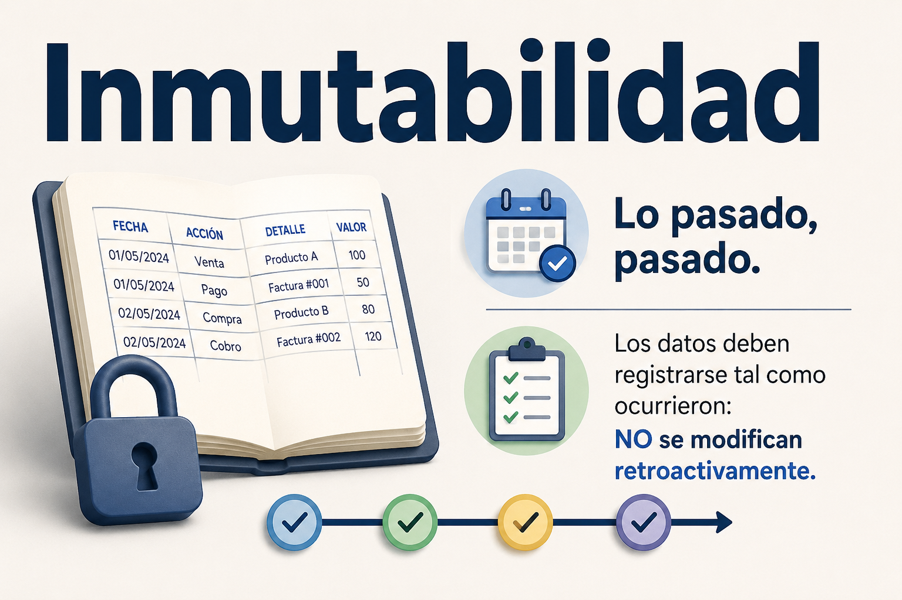
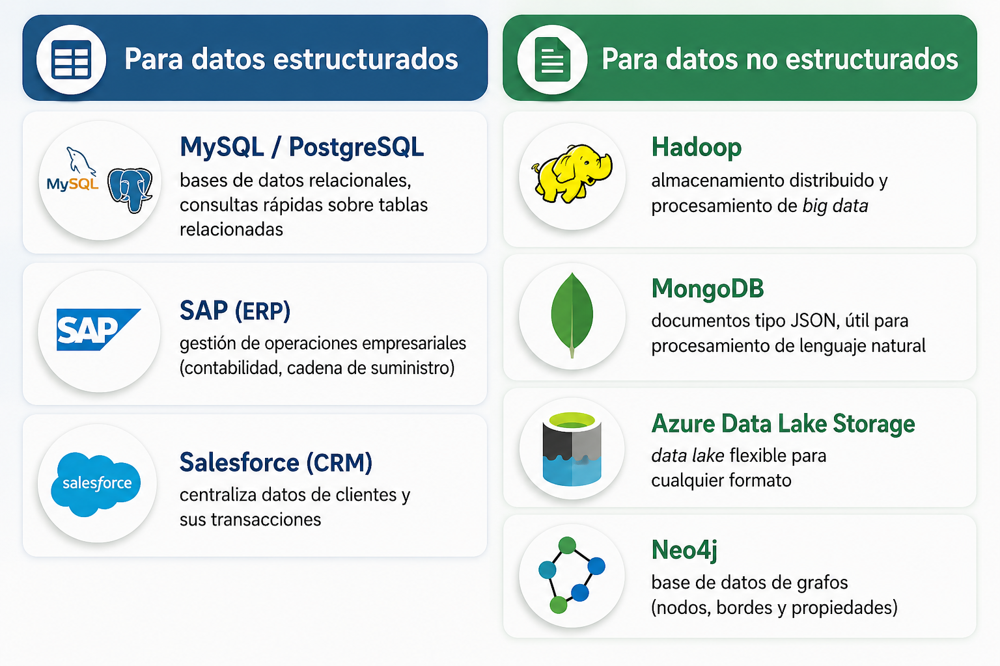
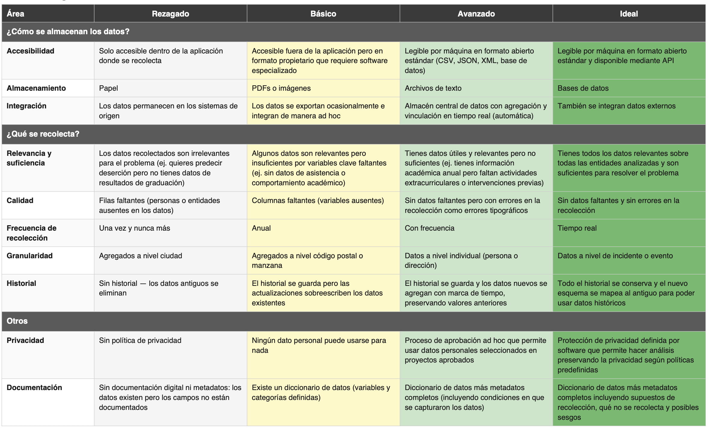
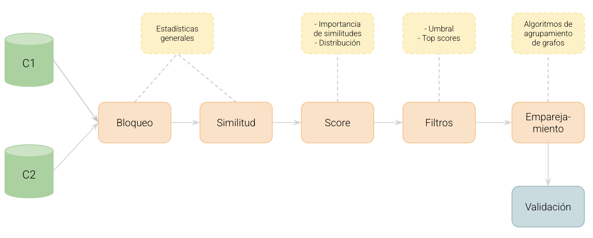

# ¿Qué son los datos? {background-color="#fdede8"}

## Los datos representan eventos

Los datos registran qué le pasa a **quién**, **dónde** y **cuándo**.

- Prácticamente todas nuestras interacciones con el mundo generan datos
- Lo primero que se nos ocurre son tablas con filas y columnas...
- ...pero la mayor parte de los datos del mundo **no siguen reglas estrictas de formato**

---

## ¿Qué queremos hacer con los datos?

:::: {.columns}

::: {.column width="50%"}
**Propósitos/Análisis**

- Entender y justificar
- Explicar
- Predecir
- Optimizar
- Detectar
:::

::: {.column width="50%"}
**Operaciones**

- Filtrar y seleccionar
- Transformar
- Agrupar / reducir
- Unir tablas
:::

::::

# Tipos de datos {background-color="#fdede8"}

---

## Estructurados, no estructurados y semi-estructurados

| | **Estructurados** | **No estructurados** |
|---|---|---|
| Qué son | Tablas con números y valores | Texto, audio, video, imágenes |
| Origen | Transacciones, registros, formularios | Correos, redes sociales, notas |
| Formatos | Excel, SQL | mp3, mp4, PDF, NoSQL |
| Almacenamiento | Bases de datos relacionales, *data warehouses* | *Data lakes* (formato nativo) |

- **Semi-estructurados** (JSON, XML). Contienen metadatos que facilitan su catalogamiento, pero no siguen una estructura rígida.

## Datos estructurados

Todos los datos estructurados deben poder representarse en tablas donde **cada celda contiene un solo valor**.

- **Pros**
    - Fáciles de usar para usuarios de negocio y modelos
    - Compatibles con muchas herramientas

- **Contras**
    - Uso limitado al propósito para el que fueron creados
    - Difícil modificar su estructura una vez definida

- **Ejemplos comunes**: datos de personas, transacciones, inventarios, catálogos, encuestas, hojas de cálculo planas, bases de datos

## Datos no estructurados

No tienen estructura ni formato definido. **La mayor parte de los datos del mundo son no estructurados.**. En general, deben procesarse para convertirse en datos estructurados antes de usarse en modelos.

- **Pros**
    - Se almacenan directamente desde la fuente
    - Se acumulan rápido por su flexibilidad

- **Contras**
    - Requieren alto grado de conocimiento técnico para analizarse
    - Limitados a herramientas especializadas

**Ejemplos**: audio, imágenes, videos, logs, texto

## Herramientas según tipo de dato

# Datos tabulares: tidy vs. no tidy {background-color="#fdede8"}

## ¿Qué es un dato "tidy"?

Un dato tabular está en formato **tidy** cuando cumple tres reglas:

1. Cada **variable** tiene su propia columna
2. Cada **observación** tiene su propia fila
3. Cada **celda** contiene un solo valor

Este formato es el estándar para análisis: facilita filtrar, agrupar, graficar y modelar.

::: {.callout-tip}
### ¿Por qué importa?
La mayoría de las herramientas de análisis esperan datos en este formato. Si los datos no están tidy, el primer paso siempre es transformarlos.
:::

## Ejemplo: formato ancho (no tidy)

En este formato, los valores de una variable están repartidos en varias columnas:

| País | 2020 | 2021 | 2022 |
|------|------|------|------|
| México | 5.2 | 4.8 | 6.1 |
| Guatemala | 3.1 | 3.5 | 4.0 |

El año es una variable, pero está "escondida" en los nombres de columna.
Esto dificulta, por ejemplo, graficar la tendencia por año.

## Ejemplo: formato largo (tidy)

El mismo dato, en formato tidy:

| País | Año | Tasa |
|------|-----|------|
| México | 2020 | 5.2 |
| México | 2021 | 4.8 |
| México | 2022 | 6.1 |
| Guatemala | 2020 | 3.1 |
| Guatemala | 2021 | 3.5 |
| Guatemala | 2022 | 4.0 |

Ahora `País`, `Año` y `Tasa` son columnas separadas. Cualquier filtro, agrupación o gráfica es directa.

## Otros problemas frecuentes en tablas

- **Valores faltantes**: celdas vacías sin indicar por qué
- **Violaciones de restricción**: un CP de Chicago asociado a San Francisco
- **Errores tipográficos**: "New Yrk" en vez de "New York"
- **Posibles duplicados**: mismo nombre, distinto registro
- **Múltiples valores en una celda**: "30k–40k" en lugar de un número

# Adquisición de datos {background-color="#fdede8"}

## ¿A qué datos tenemos acceso?

Antes de buscar datos externos, entender qué existe en la organización.

- ¿Qué tan atrás va la información histórica? ¿Ha tenido transformaciones?
- ¿Cuál es la **granularidad**? ¿A qué nivel se registra cada observación — individuo, grupo, institución, día, mes?
- ¿Cómo se recolectan y actualizan? ¿Con qué frecuencia?
- La pregunta no es *¿tenemos muchos datos?* sino **¿tenemos los datos correctos para esta pregunta específica?**

::: {.callout-tip}
### Ejemplo — Deserción escolar
Saber que "el 30% deserta" no es lo mismo que tener el historial semestre a semestre de cada persona.
:::

## Retos en adquisición

- **Conciencia interna**: la mayoría de las organizaciones no saben qué datos tienen
- **Políticos**: quién "posee" los datos, quién debe autorizar su uso
- **Legales y contractuales**: normativas, acuerdos de confidencialidad

---

- **Éticos**:

## Retos técnicos: acceso

¿Cómo se obtienen los datos?

- Acceso a API
- Vistas directas de la base de datos
- Archivos planos (Excel, CSV)
- Volcados de base de datos (*database dumps*)
- Transferencias entre sistemas

::: {.callout-important}
### Regla: obtener los datos lo más crudos posible
Procesarlos antes dificulta reproducir el análisis, oculta errores y hace difícil rastrear qué transformaciones se aplicaron.
:::

## Pipelines reproducibles

> Un buen *pipeline* puede repetirse, auditarse y mantenerse.

- **Repetible**: el mismo proceso produce el mismo resultado
- **Controlable**: cada paso está documentado y es verificable
- **Automatizable**: no depende de intervención manual
- **Con dependencias explícitas**: se sabe qué necesita qué

::: {.callout-important}
Si solo funciona en tu computadora, no funciona realmente.
:::

---

---

## 3: Fuentes de **datos**

::: {.callout-tip}
### Ejemplo 

¿Es suficiente para mejorar lo que hacen hoy? ¿Qué información ayudaría?

| id  | edad_ing | promedio_ing | créditos_1er | ... |  tipo_uni | fecha_ing | 
|-----|----------|--------------|--------------| --- |-----------|-----------|
| 1   | 18       | 8.5          | 40           | ... |  Pública  | 2018-08-15| 
| 2   | 19       | 7.8          | 30           | ... |  Privada  | 2017-08-20| 
| 3   | 20       | 9.2          | 45           | ... |  Pública  | 2016-08-10| 
| 4   | 21       | 6.9          | 25           | ... |  Privada  | 2018-01-12| 
| 5   | 18       | 8.1          | 35           | ... |  Pública  | 2017-09-05| 
| 6   | 22       | 7.5          | 28           | ... |  Pública  | 2016-07-22| 
| 7   | 19       | 9.0          | 42           | ... |  Privada  | 2015-08-30| 
| ..  | ..       | ..           | ..           | ... |  ..       | ..        | 

:::

::: {.notes}
Vale la pena mencionar que nadie en la organización suele saber qué datos
tiene toda la institución. Parte del trabajo de scoping es hacer ese inventario.
No tiene: situación económica, horas de trabajo, distancia al campus.
:::

## Identificando vacíos y preparación de los datos

¿Tenemos suficiente para avanzar o necesitamos enfocarnos en obtener datos adicionales?

- ¿Tenemos suficientes datos históricos?
- ¿Son confiables hacia atrás?
- ¿Están al nivel de granularidad correcto para informar las acciones?
- ¿Se pueden vincular distintos datos entre sí? (identificadores únicos para personas, lugares, etc.)
- ¿Tenemos los datos correctos para medir los resultados según las metas?

:::{.notes}

Ejemplo: Prevención de roturas de tuberías en Syracuse

La información clave sobre edad, diámetro y material de las tuberías solo estaba disponible en cuadernos escritos a mano de hace 100 años.

Digitalizar estratégicamente esos registros nos permitió predecir con mayor precisión si una tubería se rompería.

Regresando al ejemplo de asistencia de renta

**¿Qué datos necesitamos para tomar la acción?**
- Datos de desalojos actualizados al menos semanalmente
- Suficientes características a nivel individual para predecir el resultado
- Vínculos entre características, datos de desalojo y datos de sinhogarismo
- Información de contacto para hacer alcance a las personas identificadas

**¿Qué datos necesitamos para evaluar las metas?**
- Suficientes datos históricos para tener confianza en las predicciones
- Datos para identificar resultados: ¿quién queda sin hogar?
- Datos para identificar la cohorte: ¿quién tiene una solicitud de desalojo?

:::

## Marco de madurez de datos

## Reglas de procesamiento

Al transformar datos, seguir estas guías:

1. Absorbe y preserva todas las modalidades originales
2. Reduce la pérdida de información hasta el final del proceso
3. Modela la temporalidad de los datos
4. Registra la *data provenance* (de dónde viene cada dato)
5. Preserva la intencionalidad de cada paso
6. Haz visible qué está pasando en cada transformación

# Record Linkage {background-color="#fdede8"}

- Vinculación de registros: es un conjunto de técnicas diseñadas para integrar información dispersa que proviene de diferentes fuentes. 

- Su objetivo es identificar cuándo dos o más registros hacen referencia a la misma entidad, incluso cuando existen pequeñas diferencias entre los campos. 

## ¿Qué nos ayuda a resolver Record Linkage?

- Integrar diferentes fuentes de información -registros- sobre un individuo, clientes, empresas (entidades).
- Determinar si dos o más registros se refieren a la misma entidad, incluso cuando los datos no coinciden exactamente. 
- Detectar duplicados: ¿los ids corresponden a distintas entidades o pueden ser las mismas?
- Para realizar RecL debes de entender el contexto de los datos.

::: {.callout-warning}
- El manejo de datos personales implica una responsabilidad ética y legal.
- Se deben establecer acuerdos de uso y confidencialidad, además de implementar controles de seguridad robustos.
- Las prácticas con RecL deben garantizar privacidad, trazabilidad y transparencia en su implementación.
:::

## Sinónimos

-   (Data) matching
-   Merge/purge
-   Duplicate detection
-   De-dupling / deduplicación
-   Reference matching
-   Co-reference/anaphora resolution

## Pipeline 

{width="600px"}

## Bloqueo

- Reto computacional comparar cada registro contra todos los otros registros para ver si coinciden.
	- $n^2$
- Nos saltamos comparaciones entre pares de registros que es probable que no estén linkeados. 

:::: {.columns}

::: {.column style="width:40%; font-size: 0.6em;"}

### Tipos

- **Nombre**: Toma en cuenta las primeras dos letras del nombre.
- **Apellido**: Toma en cuenta la primera letra del nombre y la primera del apellido. 
- Comparar los registros que comienzan con la misma letra.

:::

::: {.column style="width:10%; font-size: 0.6em;"}

:::
::: {.column style="width:50%; font-size: 0.9em;"}

| Bloque | Registros por comparar |
|--------|------------------------|
| A      | Ana, Andrés, Antonia   |
| B      | Beatriz, Brend, Beatris|
| C      | Carolina, Carlos, Carl |

:::

::::

---

## Similitud

- Medir qué tan parecidos son los registros dentro de cada bloque.
- ¿Qué otra información tenemos para comparar?
	- Edad, lugar de nacimiento, dirección, género, etnicidad
	- Saber la distribución de las otras características a comparar
- ¿Qué se debe de hacer con los nulos?

**Tener estadísticas de toda la información que se utilizará para comparar**

---

## Similitud
### Levenshtein

- Es el número mínimo de operaciones necesarias para transformar `cadena1` en `cadena2`.
- Como regresa un entero se normaliza para que quede entre 0 y 1.

### Trigramas

- Calcula la intersección de trigramas entre las dos cadenas y se divide entre la unión de trigramas
- Ejemplo:
 

|trigramas|
|---------|
|[' g', ' ga', 'arc', 'cia', 'gar', 'ia ', 'rci']|

## Similitud
### Ejemplo 

- `ana sofia garcia perez`

| variaciones                     | trigramas | levenstein |
|--------------------------------|-----------|------------|
| ana sofia garcia perez         | 1.000     | 1.000      |
| ana sofia garcia peres         | 0.833     | 0.955      |
| ana sofia garsia peres         | 0.630     | 0.909      |
| ana karla garcia perez         | 0.607     | 0.818      |
| laura garcia perez             | 0.464     | 0.682      |
| ana fernanda ramirez lopez     | 0.143     | 0.423      |

## Score
### Creación

- Sumar las métricas de similitud ($m$) y *asignarles* un peso ($w$)

$$score = \sum_i w_i \cdot m_i$$

:::: {.columns}

::: {.column style="width:30%; font-size: 0.6em;"}

#### Similitudes textuales (0.75)

- 0.15 — Primer apellido  
- 0.15 — Segundo apellido  
- 0.15 — Nombre  
- 0.30 — Nombre completo  

*(Promedio entre trigram y Levenshtein)*
:::

::: {.column style="width:30%; font-size: 0.6em;"}

#### Fecha de nacimiento (hasta 0.15)

- 0.15 si coincide exactamente  
- 0.05 si hay ±1 día de diferencia  
- 0.00 si la diferencia > 1 día  

:::

::: {.column style="width:30%; font-size: 0.6em;"}

####  Atributos adicionales (0.10)

- 0.02 - Nacionalidad  
- 0.02 - Grupo étnico
- 0.02 - Lugar de nacimiento
- 0.02 - Género
- 0.01 - Escolaridad
- 0.01 - Estado civil  

**Total = 1**

:::

::::

---

## Score
### Comportamiento

| Comparación variaciones     | Score | Comentario                                      |
|----------------------------|-------|-------------------------------------------------|
|  joana perez mendez       | 1.000 | Caso: igual                                     |
|  joana perez mendez       | 0.750 | Caso: nombre igual todo lo demás diferente      |
|  juana perez mendez       | 0.953 | Caso: typo en nombre                           |
|  joana                    | 0.615 | Caso: solo primer nombre                       |
|  juana perez              | 0.727 | Caso nombre + primer apellido                  |
|  juana gomez perez        | 0.502 | Caso nombre + dos apellidos                    |
|  juana gomez              | 0.414 | Caso nombre + apellido diferente               |

## Validación

- ¿Hasta qué punto los emparejamientos representan a la misma entidad, y no falsos positivos?
- Las coincidencias detectadas sean efectivamente correctas
- ¿Cuáles son las consecuencias de una equivocación? ¿para qué se va a utilizar el RecLink?
- Selección aleatoria de registros y revisar manualmente. 

---

###  [Blog](https://egobiernoytp.tec.mx/es/blog/record-linkage)

---

### [Basado en el curso: Machine Learning in practice]{.fg style="--col: #e64173"}

De Rayid Ghani and Kid Rodolfa

  

### [Referencias]{.fg style="--col: #e64173"}

- Tokle, J., & Bender, S. (2021). Record Linkage. In I. Foster, R. Ghani, R. Jarmin, F. Kreuter, & J. Lane (Eds.), Big Data and Social Science: Data Science Methods and Tools for Research and Practice (2nd ed., pp. 63–90). CRC Press.

