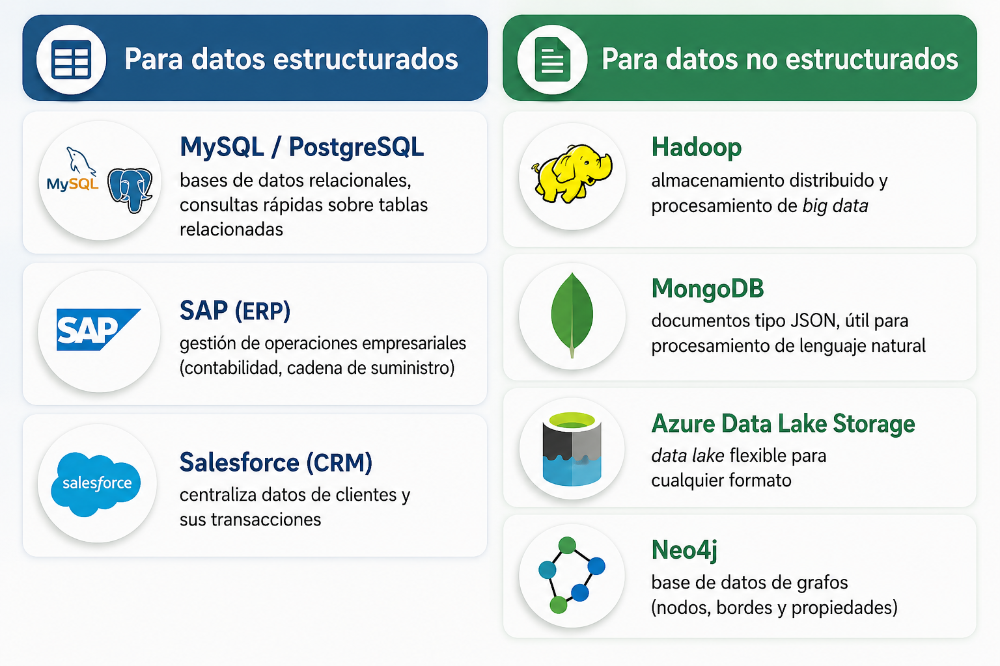

# ¿Qué son los datos? {background-color="#fdede8"}

## Los datos representan eventos

Los datos registran qué le pasa a **quién**, **dónde** y **cuándo**.

- Prácticamente todas nuestras interacciones con el mundo generan datos
- Lo primero que se nos ocurre son tablas con filas y columnas...
- ...pero la mayor parte de los datos del mundo **no siguen reglas estrictas de formato**


---


:::{.notes}

¿Qué queremos hacer con los datos?

:::: {.columns}

::: {.column width="50%"}
**Propósitos/Análisis**

- Entender y justificar
- Explicar
- Predecir
- Optimizar
- Detectar
:::

::: {.column width="50%"}
**Operaciones**

- Filtrar y seleccionar
- Transformar
- Agrupar / reducir
- Unir tablas
:::

::::

:::

# Tipos de datos {background-color="#fdede8"}

---

## Estructurados, no estructurados y semi-estructurados

| | **Estructurados** | **No estructurados** |
|---|---|---|
| Qué son | Tablas con números y valores | Texto, audio, video, imágenes |
| Origen | Transacciones, registros, formularios | Correos, redes sociales, notas |
| Formatos | Excel, SQL | mp3, mp4, PDF, NoSQL |
| Almacenamiento | Bases de datos relacionales, *data warehouses* | *Data lakes* (formato nativo) |

- **Semi-estructurados** (JSON, XML). Contienen metadatos que facilitan su catalogamiento, pero no siguen una estructura rígida.


## Estructurados, no estructurados y semi-estructurados


# Datos tabulares {background-color="#fdede8"}


> Tidy vs. no tidy 

## ¿Qué es un dato "tidy"?

Un dato tabular está en formato **tidy** cuando cumple tres reglas:

1. Cada **variable** tiene su propia columna
2. Cada **observación** tiene su propia fila
3. Cada **celda** contiene un solo valor

Este formato es el estándar para análisis: facilita filtrar, agrupar, graficar y modelar.

::: {.callout-tip}
### ¿Por qué importa?
La mayoría de las herramientas de análisis esperan datos en este formato. Si los datos no están tidy, el primer paso siempre es transformarlos.
:::


## Ejemplo: formato ancho (no tidy)

En este formato, los valores de una variable están repartidos en varias columnas:

| País | 2020 | 2021 | 2022 |
|------|------|------|------|
| México | 5.2 | 4.8 | 6.1 |
| Guatemala | 3.1 | 3.5 | 4.0 |

- El año es una variable, pero está "escondida" en los nombres de columna.
- Esto dificulta, por ejemplo, graficar la tendencia por año.


## Ejemplo: formato largo (tidy)

El mismo dato, en formato tidy:

| País | Año | Tasa |
|------|-----|------|
| México | 2020 | 5.2 |
| México | 2021 | 4.8 |
| México | 2022 | 6.1 |
| Guatemala | 2020 | 3.1 |
| Guatemala | 2021 | 3.5 |
| Guatemala | 2022 | 4.0 |

- Ahora `País`, `Año` y `Tasa` son columnas separadas. Cualquier filtro, agrupación o gráfica es directa.


# Adquisición de datos {background-color="#fdede8"}

## ¿A qué datos tenemos acceso?

Antes de buscar datos externos, entender qué existe en la organización.

- ¿Qué tan atrás va la información histórica? ¿Ha tenido transformaciones?
- ¿Cuál es la **granularidad**? ¿A qué nivel se registra cada observación — individuo, grupo, institución, día, mes?
- ¿Cómo se recolectan y actualizan? ¿Con qué frecuencia?
- La pregunta no es *¿tenemos muchos datos?* sino **¿tenemos los datos correctos para esta pregunta específica?**

::: {.callout-tip}
### Ejemplo — Deserción escolar
Saber que "el 30% deserta" no es lo mismo que tener el historial semestre a semestre de cada persona.
:::

## Identificando vacíos y preparación de los datos

¿Tenemos suficiente para avanzar o necesitamos enfocarnos en obtener datos adicionales?

- ¿Tenemos suficientes datos históricos?
- ¿Son **confiables** hacia atrás?
- ¿Están al nivel de **granularidad** correcto para informar las acciones?
- ¿Se pueden vincular distintos datos entre sí? (identificadores únicos para personas, lugares, etc.)
- ¿Tenemos los datos correctos para medir los resultados según las metas?


## Identificando vacíos y preparación de los datos


### Ejemplo: Prevención de roturas de tuberías en Syracuse

- La información clave sobre edad, diámetro y material de las tuberías solo estaba disponible en cuadernos escritos a mano de hace 100 años.

    - Digitalizar **estratégicamente** esos registros permitió predecir con mayor precisión si una tubería se rompería.

- Registros administrativas a nivel lugar ayudaron para predecir el resultado
- Vinculación entre datos administrativos e imágenes

:::{.notes}

**¿Qué datos necesitamos para tomar la acción?**
- Datos de desalojos actualizados al menos semanalmente
- Vínculos entre características, datos de desalojo y datos de sinhogarismo
- Información de contacto para hacer alcance a las personas identificadas

**¿Qué datos necesitamos para evaluar las metas?**
- Suficientes datos históricos para tener confianza en las predicciones
- Datos para identificar resultados: ¿quién queda sin hogar?
- Datos para identificar la cohorte: ¿quién tiene una solicitud de desalojo?

:::

---

::: {.callout-tip}
### Ejemplo de **datos** en deserción escolar

¿Es suficiente para mejorar lo que hacen hoy? ¿Qué información ayudaría?

| id  | edad_ing | promedio_ing | materias_reprobadas| créditos_1er | ... |  tipo_uni | fecha_ing | 
|-----|----------|--------------|-------------|--------------| --- |-----------|-----------|
| 1   | 18       | 8.5          |  0          | 40           | ... |  Pública  | 2018-08-15| 
| 2   | 19       | 7.8          |  1          | 30           | ... |  Privada  | 2017-08-20| 
| 3   | 20       | 9.2          |  0          | 45           | ... |  Pública  | 2016-08-10| 
| 4   | 21       | 6.9          |  2          | 25           | ... |  Privada  | 2018-01-12| 
| 5   | 18       | 8.1          |  1          | 35           | ... |  Pública  | 2017-09-05| 
| 6   | 22       | 7.5          |  0          | 28           | ... |  Pública  | 2016-07-22| 
| 7   | 19       | 9.0          |  0          | 42           | ... |  Privada  | 2015-08-30| 
| ..  | ..       | ..           | ..          | ..           | ... |  ..       | ..        | 

| tipo_uni | año_ing | n_estudiantes | edad_prom | promedio_ing_prom | créditos_1er_prom | % deserción |
|----------|---------|---------------|-----------|-------------------|-------------------|-------------|
| Pública  | 2016    | 1,240         | 20.4      | 8.1               | 36.2              | 18.5%       |
| Pública  | 2017    | 1,315         | 19.8      | 8.3               | 37.0              | 16.2%       |
| Pública  | 2018    | 1,402         | 19.5      | 8.4               | 38.1              | 14.7%       |
| Privada  | 2015    | 860           | 19.9      | 8.6               | 39.4              | 11.3%       |
| Privada  | 2017    | 905           | 19.6      | 8.5               | 38.8              | 10.1%       |
| Privada  | 2018    | 948           | 20.1      | 8.2               | 36.5              | 12.4%       |
| ..       | ..      | ..            | ..        | ..                | ..                | ..          |

:::

::: {.notes}
Vale la pena mencionar que nadie en la organización suele saber qué datos
tiene toda la institución. Parte del trabajo de scoping es hacer ese inventario.
No tiene: situación económica, horas de trabajo, distancia al campus.
:::


## Retos en adquisición

- **Conciencia interna**: 
    - la mayoría de las organizaciones no saben qué datos tienen
- **Políticos**: 
    - quién "posee" los datos, quién debe autorizar su uso
- **Legales y contractuales**: 
    - normativas, acuerdos de confidencialidad


## Retos en adquisición

- **Éticos**:


## Retos en adquisición

- **Técnicos**: 

    - *¿cómo se obtienen los datos?*
    - Acceso con API
    - Vistas directas de la base de datos
    - Archivos planos (Excel, CSV)
    - Volcados de base de datos (*database dumps*)
    - Transferencias entre sistemas
    - infraestructura

::: {.callout-important}
### Regla: obtener los datos lo más crudos posible
Procesarlos antes dificulta reproducir el análisis, oculta errores y hace difícil rastrear qué transformaciones se aplicaron.
:::

## Marco de madurez de datos


# Infraestructura {background-color="#fdede8"}

> ¿Qué se necesita para tener lo mínimo en infraestructura para el desarrollo de un producto de datos?

## **Pensar** en pipelines reproducibles

> Un buen *pipeline* puede repetirse, auditarse y mantenerse.

- **Repetible**: el mismo proceso produce el mismo resultado
- **Controlable**: cada paso está documentado y es verificable
- **Automatizable**: no depende de intervención manual
- **Con dependencias explícitas**: se sabe qué necesita qué

::: {.callout-important}
Si solo funciona en tu computadora, no funciona realmente.
:::


## Elementos

1. Cómputo/procesamiento

2. Almacenamiento
    - Datos estructurados
    - Datos no estructurados

3. Código

4. Reproducibilidad

5. Identidad permisos


## Cómputo / procesamiento

- Computadoras: CPU/GPU/RAM
- Servidores en la nube:
    - AWS: EC2
    - Azure: Máquinas virtuales
    - 
- Acceso a través de ssh o con credenciales de acceso
- Aquí es donde se corre python

## Almacenamiento

### Datos estructurados 

- Software?

    - Postgres
    - SQLlite
    - MySQL
    - Oracle 
    - SAP
    - Salesforce (CRM)

Tipos de archivos de almacenamiento. 
- .dump
- .csv
- .xlsx
- .sql

- DBeaver es un IDE de estas bases de datos 

## Almacenamiento

### Datos no estructurados

- Software?
    - Hadoop
    - Mongo db
    - Azure Data Lake Storage
    - AWS: s3
    - Neo4j: base de datos de grafos

Tipos de archivos de almacenamiento

- .parquet

## Código

- Git: 

En la nube:

- Github
- Gitlab
- Bitbucket


## Reproducibilidad

- Docker

## Seguridad

- Manejo de roles
- Credenciales
- usuarios


```
                   INFRAESTRUCTURA DE DATOS

                           ┌───────────┐
                           │ Usuarios │
                           └─────┬─────┘
                                 │
                        red / seguridad
                                 │
              ┌──────────────────┴─────────────────┐
              │                                    │
        ┌─────▼─────┐                        ┌─────▼─────┐
        │  Cómputo  │                        │   Datos   │
        │           │                        │           │
        │ servidor  │                        │ Postgres  │
        │ CPU / RAM │                        │ S3        │
        │ Python    │                        │ archivos  │
        └─────┬─────┘                        └───────────┘
              │
        ┌─────▼──────┐
        │   Código   │
        │ Git/GitHub │
        │ ambientes  │
        └────────────┘

             + identidad / permisos / secretos
             + logs / backups / monitoreo
```

# Infraestructura {background-color="#fdede8"}

> ¿Qué se necesita, como mínimo, en infraestructura para desarrollar un producto de datos?

## **Pensar** en pipelines reproducibles

> Un buen *pipeline* puede repetirse, auditarse y mantenerse.

- **Repetible**: el mismo proceso con los mismos insumos produce el mismo resultado
- **Controlable**: cada paso está documentado y es verificable
- **Automatizable**: no depende de intervención manual
- **Con dependencias explícitas**: se sabe qué paso necesita a cuál, y qué versiones de software usa
- **Idempotente**: si se corre dos veces, no duplica ni corrompe datos

::: {.callout-important}
Si solo funciona en tu computadora, no funciona realmente.
:::

## Elementos

1. **Cómputo / procesamiento**: dónde corre el código
2. **Almacenamiento**: dónde viven los datos
   - Estructurados
   - Semiestructurados
   - No estructurados
   - Georreferenciados
3. **Código**: control de versiones
4. **Ambientes y reproducibilidad**: con qué versiones corre
5. **Orquestación**: cuándo y en qué orden corre
6. **Identidad, permisos y seguridad**: quién puede ver o hacer qué
7. **Operación**: logs, respaldos, monitoreo y costos

## Cómputo / procesamiento

- **Recursos**: CPU (procesos generales), GPU (modelos de *deep learning*), RAM (cuántos datos caben en memoria)
- **Local**: tu computadora; suficiente para muchos proyectos
- **Servidores en la nube** (máquinas virtuales):
  - AWS: EC2
  - Azure: Virtual Machines
  - Google Cloud: Compute Engine
- **Entornos gestionados**: Google Colab, Databricks, SageMaker, Azure ML
- **Serverless**: funciones que corren solo cuando se llaman (AWS Lambda, Cloud Functions)
- Acceso: `ssh` con llaves o credenciales de acceso
- Aquí es donde corre Python (o R, SQL, etc.)

::: {.callout-tip}
Antes de pedir un servidor más grande, pregunta: ¿el problema es de RAM, de CPU o de un código ineficiente?
:::

## Almacenamiento: tipos de datos

| Tipo | Ejemplo | Dónde se guarda típicamente |
|---|---|---|
| Estructurado | tablas con filas y columnas | bases relacionales, Parquet |
| Semiestructurado | JSON de una API, XML | MongoDB, columnas `jsonb` en Postgres, *data lake* |
| No estructurado | PDF, texto, imágenes, audio | almacenamiento de objetos (S3, Azure Blob) |
| Georreferenciado | polígonos de municipios, imágenes satelitales | PostGIS, GeoParquet, GeoTIFF |

## Almacenamiento

### Datos estructurados: bases de datos relacionales

- **Transaccionales (OLTP)**: muchas escrituras pequeñas, para operar sistemas
  - PostgreSQL, MySQL, SQLite, Oracle, SQL Server
- **Analíticas (OLAP)**: consultas sobre muchos registros, para analizar
  - DuckDB (local), BigQuery, Snowflake, Redshift
- Sistemas empresariales que **usan** bases de datos por dentro:
  - SAP (ERP), Salesforce (CRM)
- **IDE / clientes**: DBeaver, pgAdmin, DataGrip

::: {.callout-note}
SQLite y DuckDB son un solo archivo: no necesitan servidor. Excelentes para empezar.
:::

## Almacenamiento

### Formatos de archivo

| Formato | Qué es | Cuándo usarlo |
|---|---|---|
| `.csv` | texto plano, separado por comas | intercambio simple; sin tipos de dato |
| `.xlsx` | hoja de cálculo | entrega a usuarios finales, no como fuente |
| `.parquet` | columnar, comprimido, con tipos | análisis de datos tabulares grandes |
| `.json` | anidado, semiestructurado | respuestas de APIs |
| `.sql` | script de SQL | crear tablas, cargar datos |
| `.dump` | respaldo de una base de datos | restaurar/migrar una base completa |

::: {.callout-tip}
Parquet es para datos **estructurados**: suele ocupar una fracción del CSV y se lee mucho más rápido.
:::

## Almacenamiento

### Datos semiestructurados y no estructurados

- **Almacenamiento de objetos** (*object storage*): guarda cualquier archivo
  - AWS S3, Azure Blob Storage / Data Lake Storage, Google Cloud Storage
- **Data lake**: repositorio de archivos crudos en su formato original
- **Bases NoSQL**:
  - Documentos: MongoDB (JSON)
  - Grafos: Neo4j (redes, relaciones)
  - Llave-valor: Redis
- **Bases vectoriales**: *embeddings* para búsqueda semántica y agentes de IA
  - pgvector (extensión de Postgres), Pinecone, Chroma
- **Ecosistemas distribuidos**: Hadoop (HDFS) → hoy más común Spark sobre S3

## Almacenamiento

### Arquitecturas por capas

```
  crudo (raw)   →   limpio (clean)   →   analítico (curated)
  tal como llega    tipos, llaves,        tablas listas para
  (JSON, CSV, PDF)  duplicados            modelos y tableros
```

- También llamada arquitectura *medallion*: bronce → plata → oro
- **Nunca** se sobrescriben los datos crudos
- *Data warehouse*: estructurado y curado · *Data lake*: crudo y flexible · *Lakehouse*: ambos

# Datos georreferenciados {background-color="#fdede8"}

## ¿Qué los hace distintos?

- Además de atributos, tienen **geometría** y un **sistema de referencia de coordenadas (CRS)**
- Dos modelos:
  - **Vectorial**: puntos (escuelas), líneas (carreteras), polígonos (municipios, AGEB)
  - **Raster**: cuadrícula de pixeles (imágenes satelitales, luces nocturnas, temperatura)

::: {.callout-important}
Sin CRS, las coordenadas son solo números. Siempre documenta y verifica el CRS.
:::

## Sistemas de referencia (CRS)

- **Geográfico** (grados): EPSG:4326 (WGS84), el de GPS y la mayoría de las APIs
- **Proyectado** (metros): necesario para calcular **distancias y áreas**
  - Para México: EPSG:6372 (Lambert Cónica Conforme, ITRF2008), usado por INEGI
- Unir capas con CRS distintos = errores silenciosos

```python
import geopandas as gpd
mun = gpd.read_file("municipios.gpkg")
mun.crs                      # ¿en qué CRS viene?
mun = mun.to_crs(6372)       # reproyectar a metros
mun["area_km2"] = mun.area / 1e6
```

## Formatos de archivo geoespaciales

| Formato | Tipo | Comentario |
|---|---|---|
| Shapefile (`.shp` + `.shx` + `.dbf` + `.prj`) | vectorial | el más común, pero antiguo: varios archivos, nombres de columna ≤ 10 caracteres, máx. 2 GB |
| GeoPackage (`.gpkg`) | vectorial | un solo archivo (SQLite); **recomendado** |
| GeoJSON (`.geojson`) | vectorial | texto; ideal para web y APIs, pesado para datos grandes |
| GeoParquet (`.parquet`) | vectorial | columnar; rápido para análisis a escala |
| KML / KMZ | vectorial | Google Earth |
| GeoTIFF / COG (`.tif`) | raster | *Cloud Optimized GeoTIFF* se lee por partes desde la nube |
| NetCDF / Zarr | raster multidimensional | clima: variable × tiempo × espacio |

## Bases de datos geoespaciales

- **PostGIS**: extensión de PostgreSQL; el estándar abierto
- **DuckDB spatial** y **SpatiaLite**: sin servidor, para trabajo local
- **BigQuery GIS**, Snowflake: en la nube a gran escala
- Clave: **índices espaciales** (GiST en PostGIS) para que las consultas sean rápidas

```sql
-- ¿Cuántas clínicas hay en cada municipio?
SELECT m.cvegeo, m.nom_mun, COUNT(c.id) AS n_clinicas
FROM municipios m
LEFT JOIN clinicas c
  ON ST_Contains(m.geom, c.geom)
GROUP BY m.cvegeo, m.nom_mun;
```

## Herramientas y buenas prácticas

- **Python**: `geopandas`, `shapely`, `pyproj`, `rasterio`, `xarray`; `h3` para hexágonos
- **Visual**: QGIS (libre), kepler.gl, `folium`
- **Fuentes en México**: Marco Geoestadístico de INEGI (llave `CVEGEO`), DENUE, CONABIO
- Buenas prácticas:
  - Guarda en GeoPackage o GeoParquet, no en shapefile
  - Une por **clave** (`CVEGEO`) cuando se pueda; por geometría solo cuando sea necesario
  - Simplifica geometrías para visualizar; conserva las originales para calcular
  - Cuida la privacidad: una coordenada exacta puede identificar a una persona

# Código, ambientes y orquestación {background-color="#fdede8"}

## Código

- **Git**: control de versiones local
- En la nube: GitHub, GitLab, Bitbucket
- Qué **sí** va en Git: código, SQL, documentación, configuración
- Qué **no**: datos grandes, credenciales, archivos `.env`
  - Usa `.gitignore`
  - Para versionar datos: DVC o Git LFS

::: {.callout-warning}
Una contraseña subida a GitHub debe considerarse comprometida, aunque borres el commit.
:::

## Ambientes y reproducibilidad

- **Ambientes virtuales**: aíslan las dependencias de cada proyecto
  - `venv`, `conda`, `uv`
- **Dependencias explícitas y fijas**: `requirements.txt`, `pyproject.toml` + *lockfile*
- **Contenedores (Docker)**: empaquetan sistema operativo + librerías + código
  - `Dockerfile` → **imagen** (receta) → **contenedor** (instancia corriendo)
  - `docker compose`: levanta varios servicios juntos (p. ej. Python + Postgres/PostGIS)
- Semillas aleatorias fijas, rutas relativas, parámetros en archivos de configuración

## Orquestación

> ¿Quién corre el pipeline, cuándo y en qué orden?

- Programación simple: `cron`
- En el repositorio: GitHub Actions
- Orquestadores: Airflow, Prefect, Dagster
- Transformaciones en SQL: dbt
- Modelan el pipeline como un **grafo de dependencias (DAG)**: si un paso falla, los siguientes no corren

# Seguridad y operación {background-color="#fdede8"}

## Identidad, permisos y seguridad

- **Usuarios y roles**: permisos por rol, no por persona (IAM en la nube, `GRANT` en SQL)
- **Principio de mínimo privilegio**: cada quien accede solo a lo que necesita
- **Secretos**: variables de entorno, archivos `.env`, gestores (AWS Secrets Manager, Azure Key Vault)
- **Acceso**: llaves SSH, autenticación de dos factores
- **Datos personales**: anonimizar/seudonimizar, cifrar, cumplir el marco legal de protección de datos
- **Red**: firewalls, bases de datos no expuestas a internet

## Operación

- **Logs**: qué corrió, cuándo y con qué resultado
- **Monitoreo y alertas**: enterarte de que falló antes que el usuario
- **Respaldos**: regla 3-2-1 (3 copias, 2 medios distintos, 1 fuera de sitio), y probar que se pueden restaurar
- **Costos**: la nube cobra por uso; apaga instancias, define presupuestos y alertas
- **Documentación**: README, diccionario de datos, diagrama de arquitectura

## De lo mínimo a lo escalable

| Componente | Mínimo viable | Escalable |
|---|---|---|
| Cómputo | laptop | VM / Databricks / serverless |
| Datos tabulares | Parquet + DuckDB | Postgres, BigQuery, Snowflake |
| Datos geo | GeoPackage + geopandas | PostGIS, GeoParquet en S3 |
| No estructurados | carpeta organizada | S3 / Blob Storage |
| Código | Git + GitHub | + revisión de código y CI |
| Ambientes | `uv` / `venv` + lockfile | Docker |
| Orquestación | un script `main.py` | Airflow / Prefect / Dagster |
| Seguridad | `.env` fuera de Git | IAM, roles, gestor de secretos |

## Panorama general

```
                     INFRAESTRUCTURA DE DATOS

                           ┌──────────┐
                           │ Usuarios │
                           └────┬─────┘
                                │
                    identidad / permisos / red
                                │
        ┌───────────────────────┼────────────────────────┐
        │                       │                        │
  ┌─────▼──────┐         ┌──────▼──────┐          ┌──────▼───────┐
  │  Cómputo   │ ◄─────► │    Datos    │          │  Productos   │
  │            │         │             │ ───────► │              │
  │ laptop/VM  │         │ crudo       │          │ tableros     │
  │ CPU/GPU    │         │ → limpio    │          │ APIs         │
  │ RAM        │         │ → analítico │          │ modelos      │
  │ Python     │         │ Postgres    │          │ reportes     │
  └─────▲──────┘         │ PostGIS     │          └──────────────┘
        │                │ S3/Parquet  │
  ┌─────┴──────┐         └─────────────┘
  │   Código   │
  │ Git/GitHub │
  │ ambientes  │
  │ Docker     │
  └─────▲──────┘
        │
  ┌─────┴────────┐
  │ Orquestación │
  │ cron/Airflow │
  └──────────────┘

      + secretos / logs / respaldos / monitoreo / costos
```


## Reglas de procesamiento

Al transformar datos, seguir estas guías:

1. Absorbe y preserva todas las modalidades originales
2. Reduce la pérdida de información hasta el final del proceso
3. Modela la temporalidad de los datos
4. Registra la *data provenance* (de dónde viene cada dato)
5. Preserva la intencionalidad de cada paso
6. Haz visible qué está pasando en cada transformación

## Otros problemas frecuentes en tablas


- **Valores faltantes**: celdas vacías sin indicar por qué
- **Violaciones de restricción**: un CP de Chicago asociado a San Francisco
- **Errores tipográficos**: "New Yrk" en vez de "New York"
- **Posibles duplicados**: mismo nombre, distinto registro
- **Múltiples valores en una celda**: "30k–40k" en lugar de un número

## Herramientas según tipo de dato




# Record Linkage {background-color="#fdede8"}


- Vinculación de registros: es un conjunto de técnicas diseñadas para integrar información dispersa que proviene de diferentes fuentes. 

- Su objetivo es identificar cuándo dos o más registros hacen referencia a la misma entidad, incluso cuando existen pequeñas diferencias entre los campos. 


## ¿Qué nos ayuda a resolver Record Linkage?

- Integrar diferentes fuentes de información -registros- sobre un individuo, clientes, empresas (entidades).
- Determinar si dos o más registros se refieren a la misma entidad, incluso cuando los datos no coinciden exactamente. 
- Detectar duplicados: ¿los ids corresponden a distintas entidades o pueden ser las mismas?
- Para realizar RecL debes de entender el contexto de los datos.

::: {.callout-warning}
- El manejo de datos personales implica una responsabilidad ética y legal.
- Se deben establecer acuerdos de uso y confidencialidad, además de implementar controles de seguridad robustos.
- Las prácticas con RecL deben garantizar privacidad, trazabilidad y transparencia en su implementación.
:::


## Sinónimos

-   (Data) matching
-   Merge/purge
-   Duplicate detection
-   De-dupling / deduplicación
-   Reference matching
-   Co-reference/anaphora resolution

## Pipeline 

{width="600px"}


:::{.notes}

## Bloqueo

- Reto computacional comparar cada registro contra todos los otros registros para ver si coinciden.
	- $n^2$
- Nos saltamos comparaciones entre pares de registros que es probable que no estén linkeados. 

:::: {.columns}

::: {.column style="width:40%; font-size: 0.6em;"}


### Tipos

- **Nombre**: Toma en cuenta las primeras dos letras del nombre.
- **Apellido**: Toma en cuenta la primera letra del nombre y la primera del apellido. 
- Comparar los registros que comienzan con la misma letra.

:::

::: {.column style="width:10%; font-size: 0.6em;"}


:::
::: {.column style="width:50%; font-size: 0.9em;"}

| Bloque | Registros por comparar |
|--------|------------------------|
| A      | Ana, Andrés, Antonia   |
| B      | Beatriz, Brend, Beatris|
| C      | Carolina, Carlos, Carl |

:::

::::

---


## Similitud

- Medir qué tan parecidos son los registros dentro de cada bloque.
- ¿Qué otra información tenemos para comparar?
	- Edad, lugar de nacimiento, dirección, género, etnicidad
	- Saber la distribución de las otras características a comparar
- ¿Qué se debe de hacer con los nulos?


**Tener estadísticas de toda la información que se utilizará para comparar**

---

## Similitud
### Levenshtein

- Es el número mínimo de operaciones necesarias para transformar `cadena1` en `cadena2`.
- Como regresa un entero se normaliza para que quede entre 0 y 1.


### Trigramas

- Calcula la intersección de trigramas entre las dos cadenas y se divide entre la unión de trigramas
- Ejemplo:
 

|trigramas|
|---------|
|[' g', ' ga', 'arc', 'cia', 'gar', 'ia ', 'rci']|


## Similitud
### Ejemplo 

- `ana sofia garcia perez`

| variaciones                     | trigramas | levenstein |
|--------------------------------|-----------|------------|
| ana sofia garcia perez         | 1.000     | 1.000      |
| ana sofia garcia peres         | 0.833     | 0.955      |
| ana sofia garsia peres         | 0.630     | 0.909      |
| ana karla garcia perez         | 0.607     | 0.818      |
| laura garcia perez             | 0.464     | 0.682      |
| ana fernanda ramirez lopez     | 0.143     | 0.423      |


## Score
### Creación


- Sumar las métricas de similitud ($m$) y *asignarles* un peso ($w$)

$$score = \sum_i w_i \cdot m_i$$

:::: {.columns}

::: {.column style="width:30%; font-size: 0.6em;"}

#### Similitudes textuales (0.75)

- 0.15 — Primer apellido  
- 0.15 — Segundo apellido  
- 0.15 — Nombre  
- 0.30 — Nombre completo  

*(Promedio entre trigram y Levenshtein)*
:::

::: {.column style="width:30%; font-size: 0.6em;"}


#### Fecha de nacimiento (hasta 0.15)

- 0.15 si coincide exactamente  
- 0.05 si hay ±1 día de diferencia  
- 0.00 si la diferencia > 1 día  


:::


::: {.column style="width:30%; font-size: 0.6em;"}


####  Atributos adicionales (0.10)

- 0.02 - Nacionalidad  
- 0.02 - Grupo étnico
- 0.02 - Lugar de nacimiento
- 0.02 - Género
- 0.01 - Escolaridad
- 0.01 - Estado civil  

**Total = 1**

:::

::::

---


## Score
### Comportamiento

| Comparación variaciones     | Score | Comentario                                      |
|----------------------------|-------|-------------------------------------------------|
|  joana perez mendez       | 1.000 | Caso: igual                                     |
|  joana perez mendez       | 0.750 | Caso: nombre igual todo lo demás diferente      |
|  juana perez mendez       | 0.953 | Caso: typo en nombre                           |
|  joana                    | 0.615 | Caso: solo primer nombre                       |
|  juana perez              | 0.727 | Caso nombre + primer apellido                  |
|  juana gomez perez        | 0.502 | Caso nombre + dos apellidos                    |
|  juana gomez              | 0.414 | Caso nombre + apellido diferente               |

:::

## Validación

- ¿Hasta qué punto los emparejamientos representan a la misma entidad, y no falsos positivos?
- Las coincidencias detectadas sean efectivamente correctas
- ¿Cuáles son las consecuencias de una equivocación? ¿para qué se va a utilizar el RecLink?
- Selección aleatoria de registros y revisar manualmente. 

---

###  [Blog](https://egobiernoytp.tec.mx/es/blog/record-linkage)


---


### [Basado en el curso: Machine Learning in practice]{.fg style="--col: #e64173"}

De Rayid Ghani and Kid Rodolfa

<div style="width: 40%;">
  
</div>


### [Referencias]{.fg style="--col: #e64173"}

- Tokle, J., & Bender, S. (2021). Record Linkage. In I. Foster, R. Ghani, R. Jarmin, F. Kreuter, & J. Lane (Eds.), Big Data and Social Science: Data Science Methods and Tools for Research and Practice (2nd ed., pp. 63–90). CRC Press.


