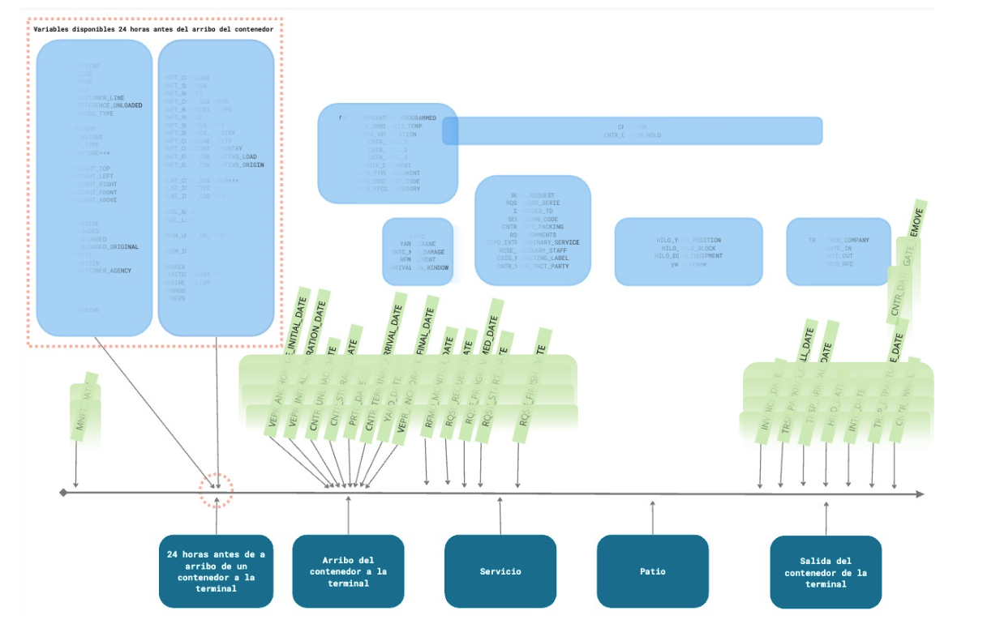

## ¿Dónde estamos? 

# Exploración de datos {background-color="#fdede8"}

## ¿Por qué es importante?
### Objetivos

- Conocer el contexto de los datos y validar su adquisición
    - ¿Coinciden con lo que te dijeron que te dieron?
    - Validar si los datos son relevantes y suficientes — primera iteración
- Entendimiento del problema y dominio
    - Alcance del proyecto *bien definido*
- Identificar errores: faltantes, anómalos, saltos en tiempo, rangos, distribuciones, conteos, categorías
- Identificar las variables que formarán parte del modelo y las que podemos generar a partir de ellas
- Interpretación de resultados

## ¿Qué hacer en la exploración?
### Algunos lineamientos iniciales

- **Tablas**: Identificar las más relevantes a tu problema
    - **Variables**: *Entendimiento progresivo*, ¿qué información esperarías que fuera importante? ¿Está disponible?
- **Entidades** (*objeto* o *persona* de interés):
    - ¿Cómo se identifican? ¿Cuáles son sus características relevantes? ¿Cambian con el tiempo?
    - ¿Qué eventos les ocurren? (pacientes → visitas; estudiantes → años de escuela; ambulancias → viajes)
    - ¿Sobre qué entidades harás el análisis, cuáles quieres estudiar, cuáles quieres impactar?

## ¿Qué exploramos?

- **Distribuciones** de variables y **correlaciones** entre ellas
- **Cambios y tendencias** a lo largo del tiempo
- **Valores faltantes**: ¿cuántos hay, hay un patrón, por qué están ausentes?
- **Valores atípicos** (*outliers*)
- **Etiquetas/resultados**: distribución de la etiqueta y cohorte
- **Tablas cruzadas**: cómo se diferencian las clases positiva y negativa sin usar modelos
- Mucho más...

# EDA y GEDA {background-color="#fdede8"}

- **EDA** (*Exploratory Data Analysis*): Análisis Exploratorio de Datos es una etapa inicial para conocer descriptivamente los datos.

- **GEDA** (*Graphical Exploratory Data Analysis*): Análisis exploratorio de los datos apoyándonos en visualizaciones o gráficos

> Entre el 40% y 60% del proyecto se dedica a esta etapa.

## Tipos de EDA/GEDA

+ Por tipo de variable: 
    - numérica, 
    - categórica,
    - temporal
    - geográfica
+ Por número de variables: 
    - univariado, 
    - multivariado.
+ Por rol de la variable: 
    - explicativa, 
    - output.

## Análisis descriptivos y gráficos

- Validar estadísticas descriptivas con gráficas
- [Cuarteto de Anscombe](https://www.autodesk.com/research/publications/same-stats-different-graphs):

## Data profiling

Es un EDA **univariado** donde queremos conocer los resúmenes estadisticos de cada variable con la que contamos *sin importar su rol*.

**Objetivo**

+ Primera aproximación a toda la información disponible
+ Identificar errores
+ Identificar imposibilidades
+ Conocer distribuciones

## 1. Variables numéricas

  + Tipo de dato: 
    - `float`: precio de una casa, temperatura, índice de masa corporal
    - `integer`: edad, número de visitas al médico, conteo de transacciones
  + Media (*mean*); Desviación estándar
  + Cuartiles: 25%, 50%, 75%; Valor máximo y mínimo

::: {.callout-warning}
## ¿Qué buscar?
- ¿El rango tiene sentido? Una edad de -3 o de 200 años es una señal de error.
- ¿Hay acumulación en valores redondos (0, 100, 1000)? Puede indicar imputación o captura manual.
- ¿La media y la mediana (percentil 50%) están muy alejadas? La distribución probablemente tiene sesgo.
:::

## 2. Variables categóricas

  + Número de categorías
  + Valor de las categorías
  + Moda
  + Proporción de observaciones por categoría (Top 1, 2, 3)

::: {.callout-note}
## Ejemplos de variables categóricas
**Ordinales** (tienen orden): nivel educativo, nivel de dolor (leve/moderado/severo)  
**Nominales** (sin orden): género, municipio, tipo de crimen, diagnóstico médico  
:::

::: {.callout-warning}
## ¿Qué buscar?
- ¿Hay más categorías de las esperadas? Pueden ser errores de captura.
- ¿Hay faltas de ortografía o variantes del mismo valor? `"Ciudad de México"`, `"CDMX"`, `"cdmx"` pueden ser la misma categoría.
- ¿Una categoría concentra casi todo? Puede ser poco informativa para el modelo.
:::

## 3. Fechas

  + Fecha inicio y fecha fin
  + Huecos en las fechas (¿solo hay datos entre semana? ¿faltan meses?)
  + Formato de fecha: idealmente `YYYY-MM-DD`
  + Tipo de dato: `date`, `time`, `timestamp`

::: {.callout-note}
## Ejemplos de variables de fecha
`fecha_nacimiento`, `fecha_ingreso_hospital`, `timestamp_transaccion`, `fecha_denuncia`
:::

::: {.callout-warning}
## ¿Qué buscar?
- ¿El formato es consistente? `01/02/2023` puede ser 1 de febrero o 2 de enero según el origen del dato.
- ¿Hay fechas imposibles? Fecha de egreso anterior a fecha de ingreso.
- ¿Hay huecos regulares? Ausencia de datos en fines de semana puede indicar un proceso operativo, no datos faltantes reales.
:::

## 4. Texto

  + Longitud promedio, mínima, máxima
  + Identificar el idioma, si es posible

::: {.callout-note}
## Ejemplos de variables de texto
Notas clínicas, descripción de un delito, comentarios en redes sociales, respuestas abiertas de encuestas
:::

::: {.callout-warning}
## ¿Qué buscar?
- ¿Hay observaciones con longitud 0 o 1 carácter? Probablemente valores vacíos disfrazados (`"."`, `"-"`, `"N/A"`).
- ¿La longitud máxima es absurdamente grande? Puede haber texto concatenado por error.
- ¿Hay mezcla de idiomas? Afecta el preprocesamiento y los modelos de NLP.
:::

## 5. Geoespaciales

+ Las coordenadas se expresan como **(latitud, longitud)**
+ La **latitud** indica norte (+) o sur (−); la **longitud** indica este (+) u oeste (−)

::: {.callout-warning}
## ¿Qué buscar?
- ¿Las coordenadas caen dentro del área geográfica esperada? Coordenadas en el océano para datos de una ciudad son un error.
- ¿Latitud y longitud están intercambiadas? Los valores de longitud en México rondan -90 a -118; la latitud entre 14 y 32. Si ves lo contrario, están al revés.
- ¿Hay coordenadas en (0, 0)? Es el valor por default cuando no se capturó la ubicación real.
:::

## 6. Imágenes

Necesitaremos convertir a arrays numéricos para poder analizarlas — a partir de ahí se tratan como datos numéricos.

  + Número de imágenes y formatos: `png`, `jpg`, `dcm` *(formato especial para imágenes médicas)*
  + Tamaños (e.g., 200×600 px) — ¿son consistentes?

::: {.callout-note}
## Ejemplos de variables de imagen
Radiografías (`dcm`), fotos de escenas del crimen, capturas de cámaras de tráfico, imágenes satelitales
:::

::: {.callout-warning}
## ¿Qué buscar?
- ¿Todos los tamaños son iguales? Modelos como CNNs requieren input de tamaño fijo.
- ¿Las imágenes están en escala de grises o en color (RGB)? Determina la forma del array: `(H, W)` vs `(H, W, 3)`.
- ¿Hay imágenes corruptas o completamente negras/blancas? Son equivalentes a valores faltantes.
:::

# Principios de visualización {background-color="#fdede8"}

---

### Principios de visualización

](img/principios_visualizacion.png)

---

### **NO uses Pie Charts**, son difíciles de interpretar

](img/pie_chart_1.png)

---

### **NO uses Pie Charts**, son difíciles de interpretar

- Mejor ocupa un gráfico de barras ordenada de mayor a menor en horizonta

](img/pie_chart_2.png)

---

###  *¿Qué observas?*

](img/pie_chart_3d.png)

---

###  *¿Qué observas?*

](img/fake_data_visualizations_1.png)

- Tips escenciales en [How to spot visualization lies](https://flowingdata.com/2017/02/09/how-to-spot-visualization-lies/) para evitar en tus visualizaciones.

---

###  *¿Qué observas?*

](img/fake_data_visualizations_2.png)

---

###  *¿Qué observas?*

](img/fake_data_visualizations_3.png)

---

###  *¿Qué observas?*

](img/bad_visualizations_1.png)

---

###  *¿Qué observas?*

](img/bad_visualizations_2.jpg)

## Principios de visualización

### **Consejos**

+ Escoje la gráfica adecuada: Para ello es probable que debas probar una cuantas porque te darán diferente información.
+ Siempre agrega etiquetas a los ejes para saber de qué estamos hablando (incluye unidades y comas si estas hablando de cantidades).
+ Siempre inicia los ejes en 0. Eje Y que no empieza en 0, exagera diferencias. Siempre revisa la escala.
+ Si estas graficando proporciones haz que la escala sea de 0 a 100 para que la gente no malinterprete la gráfica.
+ Siempre agrega un título a tu gráfica que sea la síntesis de lo que dice tu gráfica.
+ Si tienes proporciones, revisa que no den más de 1 (o 100).

## **Errores comunes al hacer gráficas**

::: {.callout-warning}
## Trampas frecuentes

1. **Colores secuenciales para datos categóricos**: el gradiente implica orden donde no lo hay.
2. **Truncar el eje**: oculta la magnitud real de las diferencias.
3. **Gráficas 3D sin necesidad**: distorsionan las proporciones.
4. **Sobreinterpretar ruido**: una diferencia visual pequeña puede no ser estadísticamente significativa.
5. **No solo usen boxplots**: no todas las distribuciones siguen normalidad.

:::

## Importante

### Asegúrate de conocer la **temporalidad de sus datos**

- ¿Cuándo sucede cada variable en tus datos?

---
### Referencias

<small>

+ Notas de introducción de ciencia de datos de Liliana Millán
+ [Seaborn tutorial](https://seaborn.pydata.org/tutorial.html), [Seaborn documentation](https://seaborn.pydata.org/api.html), [Seaborn gallery](https://seaborn.pydata.org/examples/index.html)
+ [Data to viz](https://www.data-to-viz.com/)
+ [Graphical Data Analysis with R](https://www.crcpress.com/downloads/K25332/Chapter_1.pdf)
+ [How to spot visualization lies — FlowingData](https://flowingdata.com/2017/02/09/how-to-spot-visualization-lies/)
+ [Fundamentals of Data Visualization — Claus Wilke](https://clauswilke.com/dataviz/)
+ [The Truthful Art — Alberto Cairo](https://www.albertocairo.com/)

</small>
