# De política pública a análisis: la formulación analítica {background-color="#fdede8"}

## Formulación analítica

Antes de elegir algoritmos o datos, hay que responder una pregunta más básica:
**¿cómo traducimos el problema de política pública a algo que podamos resolver con ML?**

- El alcance del proyecto define las metas y acciones del problema de política pública
- La formulación analítica traduce esas metas a un problema concreto y medible

Para que sea útil, debe:

- Ser detallada y específica: quién, cuándo y para qué acción
- Conectar con el uso del modelo en la vida real: cómo se usará el sistema una vez construido

---

## Formulación analítica

Además de las metas y acciones bien definidas debemos de responder:

- ¿Qué tipo de análisis estarán haciendo? 
    - *Descriptivo, predicción, clasificación, optimización, etc*
- ¿Cuáles son las entidades relevantes? ¿Cómo identificamos la cohorte?
    - Parte importante del análisis exploratorio
    - ¿Qué eventos tiene la entidad?
- ¿Cómo definimos la etiqueta que queremos predecir?
    - ¿Qué tan en el futuro queremos predecir?

## Alcance del proyecto
### Ejemplo: graduados

| | |
|---|---|
| **Problema** | Tasas bajas de graduación en una universidad |
| **Meta** | Aumentar el número de estudiantes que se gradúan a tiempo |
| **Acción** | Orientación personalizada con trabajadoras sociales |
| **Datos** | Base de datos de estudiantes y su historial académico |
| **Análisis** | **Predecir** qué estudiantes tienen menor probabilidad de graduarse |

---

## Formulación analítica
### Ejemplo: graduados

**¿Cada cuándo se toma la decisión?**

**¿Quién está incluido en la cohorte?**

**¿Cuál es la salida?**

**¿Qué resultado estás prediciendo?**

**¿Para qué propósito?**

**El primer día de cada semestre**, para
**todos los estudiantes inscritos en licenciatura**,
podemos identificar a los **100 estudiantes** con
**mayor riesgo no graduarse en los siguientes 3 años**
**para canalizarlos con trabajadores sociales**.

## Formulación analítica: **Elementos**

**¿Cada cuándo se toma la decisión?**

**¿Quién está incluido en la cohorte?**

**¿Cuál es la salida?**

**¿Qué resultado estás prediciendo?**

**¿Para qué propósito?**

**Frecuencia de actualización**: cada cuándo se necesita la información generada por el análisis 

**Cohorte**: Conjunto de entidades sobre las que se predice

**Unidad y tamaño de la acción**: sobre cuántas entidades se puede intervenir (restricciones)

**Resultado del análisis**: el evento que el modelo intenta anticipar/modelar/describir

**Acción**: la decisión de política pública (intervención) que se tomará con base en el resultado del análisis

## Alcance del proyecto
### Ejemplo: techos en riesgo

| | |
|---|---|
| **Problema** | Edificios abandonados generan daños estructurales en viviendas vecinas |
| **Meta** | Reducir el número de casas con daño estructural |
| **Acción** | Inspecciones preventivas para determinar demolición, estabilización u otras reparaciones |
| **Datos** | Imágenes aéreas, datos administrativos, historial de inspecciones |
| **Análisis** | Predecir las propiedades con mayor riesgo de derrumbe |

---

## Formulación analítica
### Ejemplo: techos en riesgo

**¿Cada cuándo se toma la decisión?**

**¿Quién está incluido en la cohorte?**

**¿Cuál es la salida?**

**¿Qué resultado estás prediciendo?**

**¿Para qué propósito?**

**Cada año, al recibir nuevas imágenes aéreas**, para
**todas las manzanas de la ciudad de Baltimore**,
podemos identificar las **1,000 propiedades**
con **mayor riesgo de tener daño estructural en techos**
para que **se manden inspectores a revisar la estructura detalladamente**.

# Elementos de modelado {background-color="#fdede8"}

> Para un problema de predicción

## ¿Cómo resolver un problema de predicción? 

1.  Define y crea las filas --**unidad de predicción**--
2.  Define y crea la --**etiqueta**-- (variable objetivo -- *what event and
    when?*)
3.   Define y crea los --**predictores**-- (*features*/predictores)
4.   Crea los ***datasets*** de entrenamiento y validación
5.   Entrenar los modelos en los *datasets* de **entrenamiento**
6.   Validar los modelos en los *datasets* de **validación**
7.   Seleccionar el \"mejor\" de modelo

. . .

::: {.callout-note}

Esto debe ser más sencillo si tienes tu formulación analítica lista

:::

---

## Unidad de predicción y etiqueta

- ¿*Sobre quién* o *qué* se predice? Cohorte (conjunto de entidades)

### La etiqueta y el tiempo

- ¿*Qué* queremos saber del futuro? o ¿qué queremos saber de las entidades? 
- La etiqueta no es solo "¿qué queremos predecir?" sino también **¿a partir de qué momento?**
    - **Fecha de corte** (*as_of_date*): todo la información que se "sabe" es anterior a esa fecha.

::: {.callout-tip}
### Ejemplo: graduados

La fecha de corte es el inicio del semestre. El modelo solo puede usar información anterior a ese día.

:::

---

## Etiqueta
### Acción

-   La etiqueta desencadenará la **acción** o **intervención** que se ejecutará:
    - Qué instalaciones inspeccionar
    - Qué contenedores acomodar en área de servicios
    - Qué carpetas se priorizarán
    - Qué estudiantes tendrán atención personalizada
    - Qué techos revisar

## Predictores (*features*)
### La información que usa el modelo para aprender

- Son todas las variables que describen a la entidad y que usamos para hacer la predicción
- A diferencia de la estadística tradicional, en ML no elegimos unos pocos predictores cuidadosamente: el sistema puede trabajar con **cientos o miles de variables**
- Las reconoces en tu EDA y GEDA
- Ejemplos en el caso de estudiantes:

| Tipo | Ejemplos |
|---|---|
| Académico | promedio, créditos cursados, materias reprobadas |
| Comportamiento | asistencia, cambios de carrera, bajas temporales |
| Contexto | tipo de universidad, modalidad, año de ingreso |

# Tasa base y línea base {background-color="#fdede8"}

> Elementos importantes antes de construir cualquier modelo

## ¿Contra qué comparamos el modelo?

- Un modelo de ML no se evalúa en el vacío: sus resultados siempre son relativos a algo
- Antes de modelar necesitamos saber dos cosas:
  1. **¿Qué tan frecuente es el fenómeno que queremos predecir?**
        - *baserate*
  2. **¿Qué tan bien se resuelve el problema hoy, sin modelo?** 
        - *baseline*

---

## *Baserate* — Tasa base

Qué tan frecuente es el evento que queremos predecir (históricamente):

- El 15% de los estudiantes no se ha graduado
- El 30% de los contenedores requiere servicio
- El 8% de los techos presenta daño estructural por año

. . .

Nos sirve para dos cosas:

- **Entender la dificultad del problema**: un evento muy raro es más difícil de predecir
- **Estimar el impacto potencial del modelo**: ¿cuántos casos podríamos atender si mejoramos la detección?

---

## *Baseline* — Línea base

Es la referencia que mide qué tanto se resuelve el problema en la actualidad, *es contra lo que se compararán los modelos de ML*.

- Existen ciertos consignatarios que históricamente han tenido más servicio. 
- Inspecciones basadas en **un solo atributo** (ej: solo edificios antiguos)
- Una **regla heurística** (ej: si no ha pagado en los últimos 6 meses)
- **Nada**: no existe ningún sistema de alerta hoy

. . .

::: {.callout-caution}

###  Si el modelo no supera al *baseline*, no justifica su implementación.

Imagina que la universidad identifica estudiantes en riesgo con una sola regla:
*"promedio menor a 7 en el primer semestre"* — y eso detecta al 40% de los que eventualmente no se gradúan.

Si tu modelo de ML, después de meses de trabajo, detecta al 38%... **el modelo no aporta valor.**

:::

:::{.notes}
 En un sistema de detección de fraude, si actualmente se detecta fraude con una regla heurística (e.g., transacciones mayores a $10,000 se marcan como sospechosas), la efectividad de nuestro modelo debe ser superior a esa regla para justificar su uso.
:::

---

## En resumen

| | Tasa base (*baserate*) | Línea base (*baseline*) |
|---|---|---|
| **Pregunta** | ¿Qué tan frecuente es el evento? | ¿Qué tan bien se resuelve hoy? |
| **Ejemplo** | 15% de estudiantes no se gradúa | No existe sistema de alerta |
| **Nos dice** | Qué tan **difícil** es el problema | Qué tan **útil** debe ser el modelo |
| **Es la cantidad que...** | queremos **afectar** con la acción | usamos para **medir** qué tan efectivo es la implementación del modelo |

# Entrenamiento y validación {background-color="#fdede8"}

## Ya tenemos los ingredientes... ¿y ahora?

Hasta aquí hemos definido:

- [ ] La **unidad de predicción**: sobre quién predecimos
- [ ] La **etiqueta**: qué queremos predecir y cada cuando
- [ ] Los **predictores**: con qué información
- [ ] La **tasa base** y la **línea base**: contra qué comparamos

. . .

Ahora viene la pregunta central del ML:

> **¿Cómo saber si el modelo que entrenamos funcionará cuando lo usemos en la realidad, con datos que nunca ha visto?**

## ¿Cómo aprende un modelo de ML?

El modelo recibe una tabla donde cada fila es una entidad, cada columna es un predictor, y también se genera una columna que es la etiqueta:

| ID | Promedio | Créditos | Asistencia | ... | ¿Se graduó? |
|---|---|---|---|---|---|
| 1 | 8.5 | 40 | 90% | ... | Sí |
| 2 | 6.2 | 28 | 61% | ... | No |
| 3 | 9.1 | 45 | 95% | ... | Sí |
| 4 | 5.8 | 20 | 55% | ... | No |

. . .

El modelo busca **patrones** en los predictores que expliquen la etiqueta:

> *"Los estudiantes con promedio menor a 7, menos de 30 créditos y asistencia menor al 65% tienden a no graduarse"*

## ¿Cómo aprende un modelo de ML?

El modelo recibe una tabla donde cada fila es una entidad, cada columna es un predictor, y también se genera una columna que es la etiqueta:

| ID | Promedio | Créditos | Asistencia | ... | ¿Se graduó? |
|---|---|---|---|---|---|
| 1 | 8.5 | 40 | 90% | ... | Sí |
| 2 | 6.2 | 28 | 61% | ... | No |
| 3 | 9.1 | 45 | 95% | ... | Sí |
| 4 | 5.8 | 20 | 55% | ... | No |

. . .

Una vez que aprende esos patrones, puede aplicarlos a **estudiantes nuevos**, donde la etiqueta aún no se conoce, y hacer una predicción.

> **Lo que evaluamos es precisamente eso: ¿qué tan bien predice el modelo cuando enfrenta casos que nunca vio?**

---

## El problema de generalización 

Un modelo puede aprender tan bien los datos con los que lo entrenamos que simplemente los **memoriza** en lugar de aprender patrones generales.

- Esto se llama **sobreajuste** (*overfitting*): Se ve perfecto durante el entrenamiento pero falla cuando enfrenta casos nuevos, exactamente cuando más lo necesitamos

- El caso contrario también existe: un modelo demasiado simple que no aprende ni los patrones básicos, **subajuste** (*underfitting*).

> La meta no es un modelo que recuerde el pasado, sino uno que **anticipe el futuro**.

## El problema de generalización 

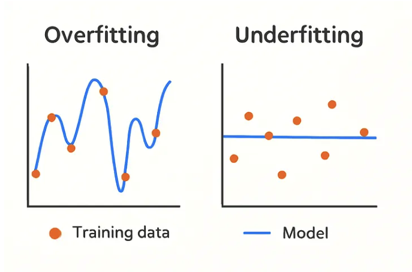

## Sobreajuste

---

## La solución: separar entrenamiento y validación

Para saber si el modelo generaliza, necesitamos evaluarlo con datos que **nunca vio durante el entrenamiento**.

Por eso dividimos los datos en dos conjuntos:

| Conjunto | ¿Para qué sirve? |
|---|---|
| **Entrenamiento** | El modelo aprende patrones aquí |
| **Validación** | Medimos qué tan bien predice casos nuevos |

. . .

Proceso de validación: partir los datos de distintas formas para estimar el desempeño real del modelo con mayor confianza.

. . .

::: {.callout-tip}
### Es como estudiar con un temario...

... y ser evaluado con preguntas que no viste, eso mide si de verdad aprendiste.
:::

---

## Validación cruzada (*k-fold*)

- Divide los datos en *k* grupos
- Entrena con *k-1* grupos y valida con el restante
- Rota hasta que todos los grupos hayan sido usados para validar
- Promedia los resultados al final

---

## Validación cruzada (*k-fold*)

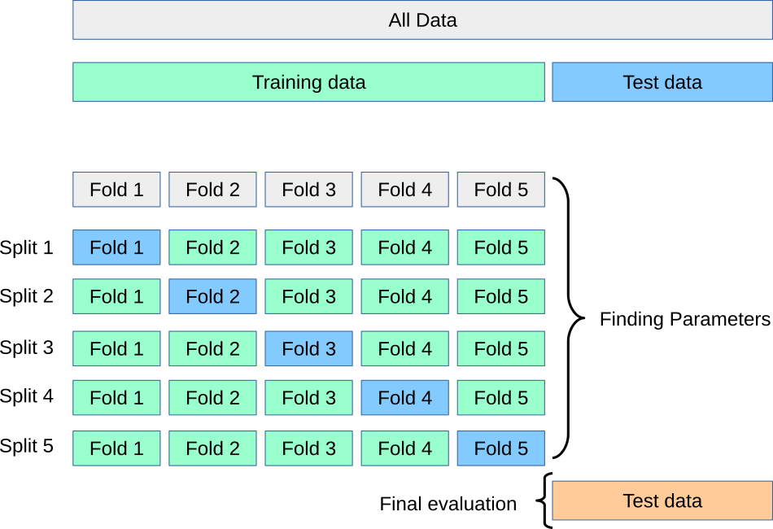

## *k-fold*: paso a paso

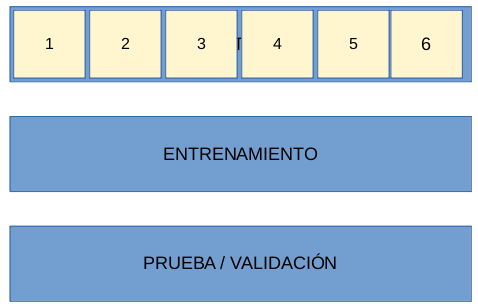

---

## *k-fold*: paso a paso

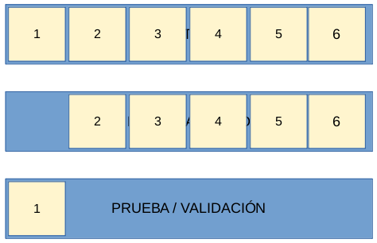

---

## *k-fold*: paso a paso

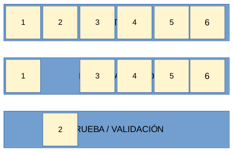

---

## *k-fold*: paso a paso

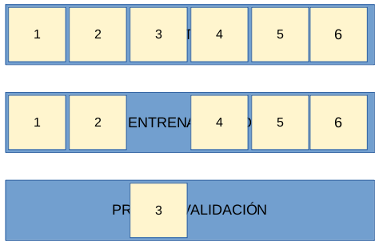

---

## *k-fold*: paso a paso

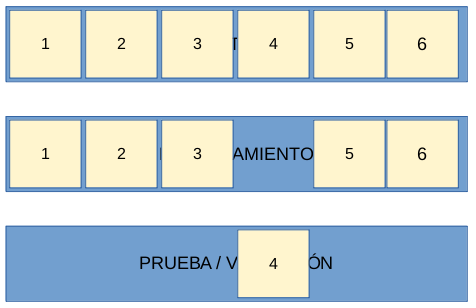

---

## *k-fold*: paso a paso

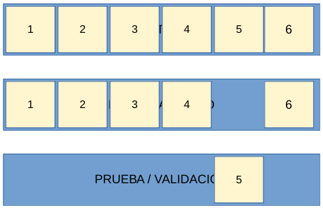

---

## *k-fold*: paso a paso

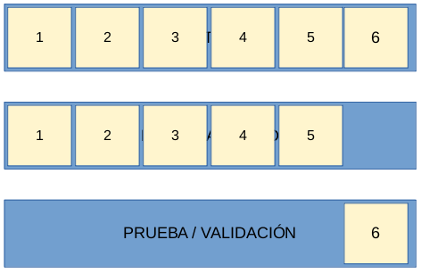

---

## Al final del *k-fold*

Esto hay que hacerlo para **cada modelo** que quieras entrenar:

1. Selecciona el "mejor" modelo
2. Entrénalo en **todos** los datos de entrenamiento
3. Pruébalo en los datos de **validación final**

  algoritmos   hiperparámetros   métrica por *fold*              agregación (promedio)
  ------------ ----------------- ------------------------------- ----------------------
  RF           $\ldots$          { 0.3, 0.4, 0.3, 0.6, 0.7, 0.8 }   0.51
  RF           $\ldots$          $\ldots$                             0.48
  LR           $\ldots$          $\ldots$                             0.40
  DT           $\ldots$          $\ldots$                             0.32
  DT           $\ldots$          $\ldots$                             0.31

# Validación Temporal Cruzada {background-color="#fdede8"}

> El tiempo importa

## Validación Temporal Cruzada

### En política pública, los datos tienen orden cronológico

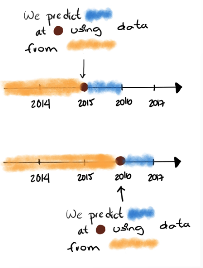

- No podemos entrenar con datos del **futuro** y validar con datos del **pasado**, sería trampa.
- La validación temporal respeta ese orden: **siempre entrenamos con el pasado y validamos con el futuro.**

---

## Particiones temporales

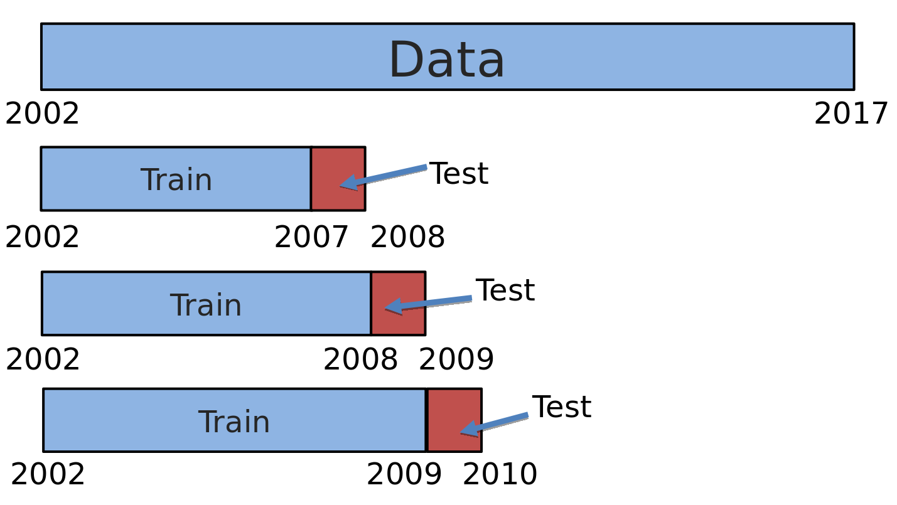

---

## Ejemplo: estudiantes ordenados en el tiempo

| id | edad_ing | promedio_ing | créditos_1er | ... | fecha_ing  | graduo_5_años | conjuntos |
|----|----------|--------------|--------------|-----|------------|---------------|-----------|
| 7  | 19       | 9.0          | 42           | ... | 2015-08-30 | 1             | entrena   |
| 6  | 22       | 7.5          | 28           | ... | 2016-07-22 | 0             | entrena   |
| 3  | 20       | 9.2          | 45           | ... | 2016-08-10 | 1             | entrena   |
| 2  | 19       | 7.8          | 30           | ... | 2017-08-20 | 0             | entrena   |
| 5  | 18       | 8.1          | 35           | ... | 2017-09-05 | 1             | entrena   |
| 4  | 21       | 6.9          | 25           | ... | 2018-01-12 | 0             | valida    |
| 1  | 18       | 8.5          | 40           | ... | 2018-08-15 | 1             | valida    |

---

## Zona de espera de la etiqueta

- Existen ciertos segmentos temporales que solo se toman para que **suceda la etiqueta**

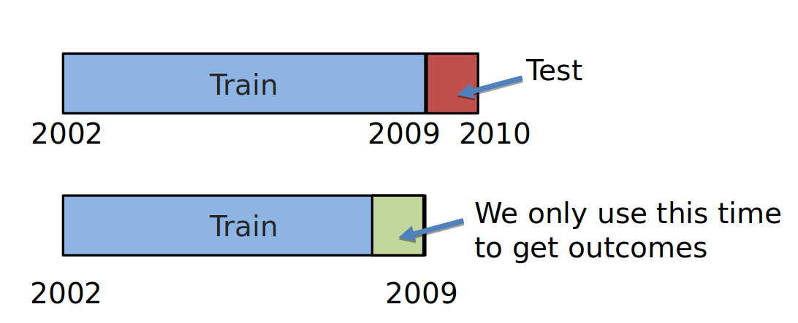

> En el ejemplo: si queremos saber si un estudiante se gradúa en 5 años, necesitamos esperar esos 5 años antes de poder incluirlo como dato de entrenamiento.

---

## Temporalidades

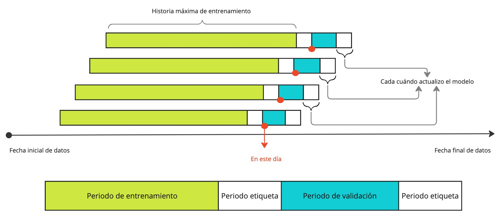

---

## Temporalidades

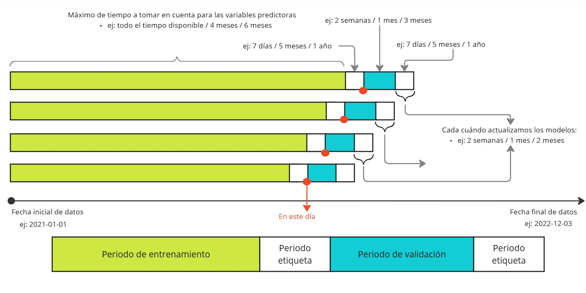

---

## Ejemplo temporal

---

## Evaluaciones a través del tiempo

---

## Tres preguntas clave antes de entrenar

1. **¿Desde cuándo hasta cuándo?** ¿Qué rango de datos históricos usar?
2. **¿Cada cuándo se toma la decisión?** Define con qué frecuencia se actualiza el modelo.
3. **¿Cuánto tiempo tarda en observarse la etiqueta?** No podemos medir si alguien se graduó si aún no han pasado 5 años.

---

## Consideraciones adicionales

- *Hold outs* basados en la estructura de los datos

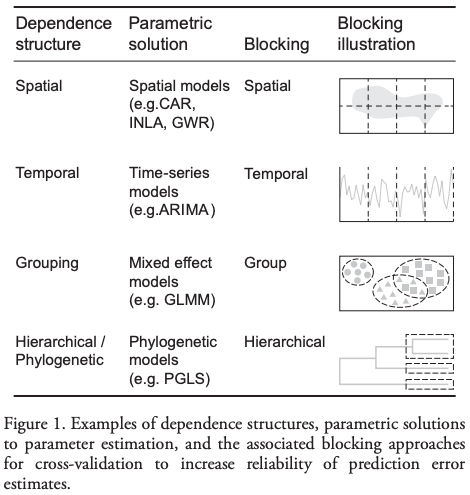

# Selección del modelo {background-color="#fdede8"}

## ¿Cómo seleccionar el mejor modelo?

- Corremos muchos modelos con distintos **algoritmos** e **hiperparámetros**
- Los comparamos usando una **métrica** sobre los datos de validación
- Seleccionamos el que mejor **generaliza**, no el que mejor se ve en entrenamiento
- Lo comparamos siempre contra la **línea base**: si no supera lo que ya hacemos hoy, no sirve

. . .

> La siguiente clase explora los algoritmos que podemos usar en este proceso.

---

### [Basado en el curso: Machine Learning in practice]{.fg style="--col: #e64173"}

De Rayid Ghani and Kit Rodolfa

  

