# Modelado {background-color="#fdede8"}
> *Machine learning*

---

## Aprendizaje de máquina o *machine learning*

:::: {.columns}
::: {.column style="width:50%; font-size: 0.7em;"}

.

### **Aprendizaje supervisado**

- para clasificar o predecir

### **Aprendizaje no supervisado** 

- para identificar patrones (agrupaciones)

### **Aprendizaje por reforzamiento** 

- con agentes que actuan en función de recompensas o castigos  

:::
::: {.column width="5%"}
<!-- empty column to create gap -->
:::
::: {.column style="width:35%; font-size: 0.6em;"}

:::
::::

:::{.notes}
- X es el conjunto de variables
- Y es la variable objetivo
- Buscar la función $F$ que mejor estime o prediga. 

Una distinción clave en el aprendizaje automático es que el objetivo no es solo encontrar la mejor función F que pueda estimar o predecir Y para los resultados observados (es decir, los valores de Y conocidos), sino encontrar una función que se generalice mejor a datos nuevos y no vistos, a menudo en el futuro. Esta diferencia hace que los métodos se centren más en la generalización y **menos en simplemente ajustar los datos observados de la mejor manera posible.**

¿Qué es Machine Learning (ML)?
Machine Learning es una rama de la Inteligencia Artificial que le permite a las computadoras **aprender de datos** sin ser programadas explícitamente para cada tarea.

**Analogía:** Imagina que quieres enseñarle a un niño a distinguir perros de gatos. No le das una lista de reglas ("si tiene bigotes, es gato"). En cambio, le muestras cientos de fotos hasta que aprende solo. Machine Learning funciona igual: en lugar de escribir reglas, le damos ejemplos y el algoritmo descubre los patrones por sí mismo.

Un proyecto de ML sigue 8 pasos clave. Saltarse alguno suele costar caro más adelante.

 **Entender el problema de negocio** | Sin claridad del objetivo, el mejor modelo del mundo es inútil |
 **Mapear el problema a uno de ML** | ¿Es predicción? ¿Clasificación? ¿Agrupación? |
 **Obtener e integrar los datos** | Los datos suelen venir de muchas fuentes y requieren combinarse |
 **Explorar y procesar los datos** | Datos sucios producen modelos basura (*"garbage in, garbage out"*) |
 **Crear features (variables)** | Las variables correctas determinan en gran parte el éxito del modelo |
 **Seleccionar métodos de ML** | Depende del tipo de datos, cantidad y restricciones técnicas |
 **Evaluar el desempeño** | ¿Todos los errores son igual de graves? Elegir la métrica correcta es crucial |
 **Desplegar, mantener y actualizar** | Los modelos se degradan con el tiempo; necesitan reentrenamiento periódico |

:::

# Aprendizaje supervisado {background-color="#fdede8"}

## Aprendizaje supervisado

Contamos con **datos históricos etiquetados**: sabemos cuál era la respuesta correcta en el pasado y usamos eso para enseñarle al modelo.

> *Es como estudiar con un libro de ejercicios que incluye las respuestas. El modelo aprende de sus errores comparando su predicción contra la respuesta correcta.*

Ejemplos:

- ¿Esta casa tendrá un daño estructural el siguiente año? (Sí / No)
- ¿Este paciente desarrollará diabetes en 2 años? (Sí / No)
- ¿Cuánto costará esta casa? ($450,000)

## ¿Qué busca?

El aprendizaje supervisado busca encontrar una función que mapee los predictores a la etiqueta:

$$f(X) = Y$$

- **X**, los predictores (*features*): información relacionada a la entidad
- **Y**, la etiqueta (*outcome*): lo que queremos predecir
- **f**, el modelo: la función que aprende la relación entre X y Y

    - *¿En el ejemplo de graduados, quién sería qué?*

. . .

::: {.callout-tip}
### Ejemplo: estudiantes en riesgo

- **X**: calificaciones, créditos cursados, asistencia, materias reprobadas
- **Y**: ¿el estudiante se graduará en 3 años? (sí / no)
- **f**: el modelo aprende qué combinación de esos factores anticipa que un estudiante no terminará

:::

---

## Función *f* 

La función cuya forma es definida por el **algoritmo**, y cuyos **parámetros** son aprendidos durante el entrenamiento.

- El modelo es el algoritmo + los datos
     - Un **algoritmo** es un conjunto de reglas que resuelven un problema
- En la clase de hoy aprenderemos la estructura de algunos algoritmos y sus respectivos parámetros como:

    - Árboles de decisión/Random Forest
    - Regresión lineal / logística
    - KNN
    - SVM

## Tipos de aprendizaje supervisado

La diferencia fundamental está en qué tipo de variable queremos predecir:

- **Regresión**: variable numérica
  - Predecir el número de solicitudes de transparencia que recibirá una dependencia

- **Clasificación**: variable categórica
  - Predecir si un estudiante se gradúa o no
  - Predecir si una solicitud de transparencia indica un problema de acceso a medicamentos

---

## Tipos de aprendizaje supervisado

### Ejemplos

| Problema | Tipo |
|----------|------|
| Predecir si un estudiante no se graduará a tiempo | 🏷️ Clasificación |
| Estimar si una llamada al 911 es falsa |  🏷️ Clasificación  |
| Identificar si una solicitud de transparencia indica un problema de acceso a medicamentos | 🏷️ Clasificación |
| Determinar si una licitación tiene señales de alerta | 🏷️ Clasificación |
| Predecir el número de colonias que reportarán más de 10 alertas falsas en un trimestre | 📈 Regresión |
| Estimar el presupuesto que una dependencia destinará a medicamentos el siguiente año | 📈 Regresión |

# Algoritmos {background-color="#fdede8"}

- Árboles de decisión
- Bosques aleatorios

## Árboles de decisión

- Los métodos basados en árboles sirven tanto para problemas de **regresión** como de **clasificación**.
- Implican dividir el espacio predictor en una serie de regiones simples.
    - Dada una base de datos se fabrican diagramas de construcciones lógicas, muy similares a los sistemas de predicción basados en reglas, que sirven para representar y categorizar una serie de **condiciones que ocurren de forma sucesiva**.
- Los métodos basados en árboles son **simples e interpretables**.

---

## Árboles de decisión

### Ejemplo 

- Conjunto de datos: Juegos de Juan dado el clima:

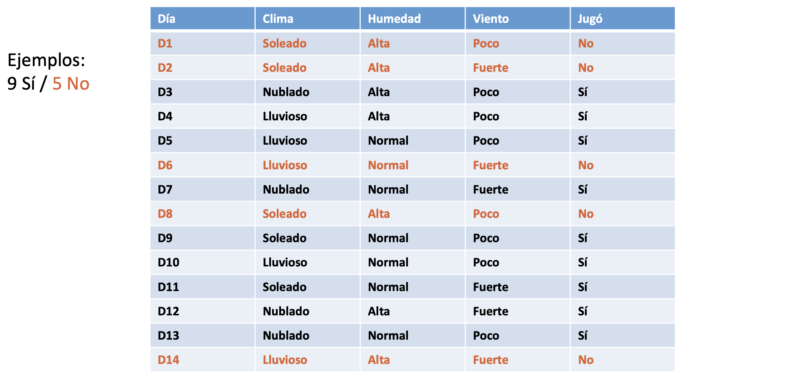

---

## Árboles de decisión

### Idea central

- Si el día 15 está lloviendo, la humedad es alta y hay poco viento, 
    - ¿Juan jugará o no?

Estrategia divide y vencerás:

1. Dividir en subconjuntos
    - **Sin incertidumbre: paramos**
    - **Con incertidumbre: seguimos dividiendo**
2. Buscar divisiones que reduzcan la mezcla de clases en cada subconjunto

---

## Árboles de decisión

- Divides las categorías de cada variable y paras en la que genera una división en la clasificación sin incertidumbre (pureza)

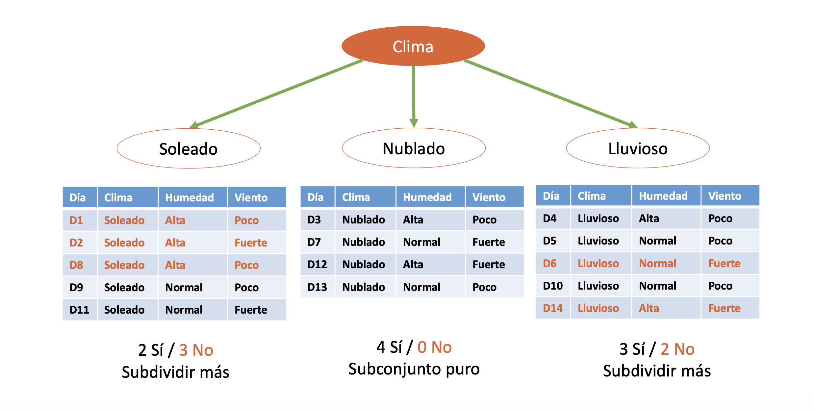

## Árboles de decisión

- Lo mides para cada variable: ¿cuál genera una división sin incertidumbre?

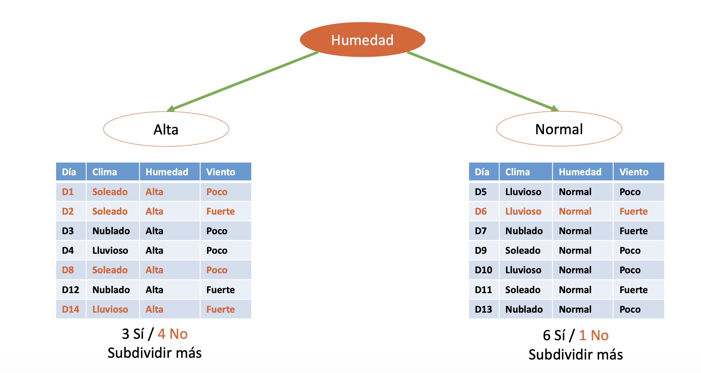

## Árboles de decisión

- Lo mides para cada variable: ¿cuál genera una división sin incertidumbre?

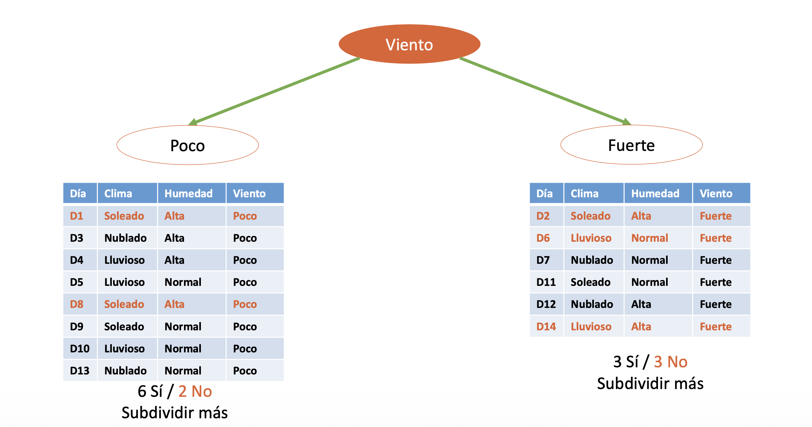

## Árboles de decisión

- Si hay incertidumbre, **sigues** subdividiendo

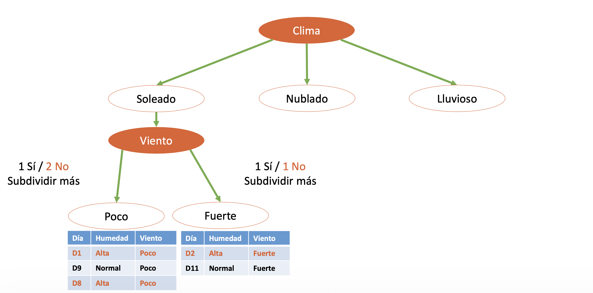

## Árboles de decisión

- Si hay no incertidumbre, **paras**

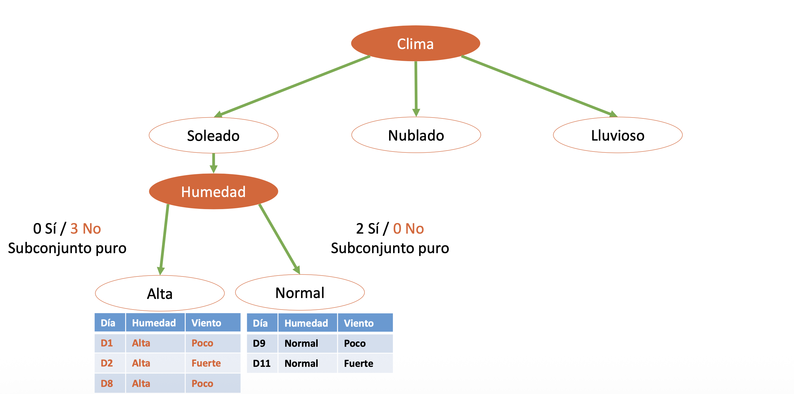

## Árboles de decisión

- Si hay incertidumbre, **sigues** subdividiendo

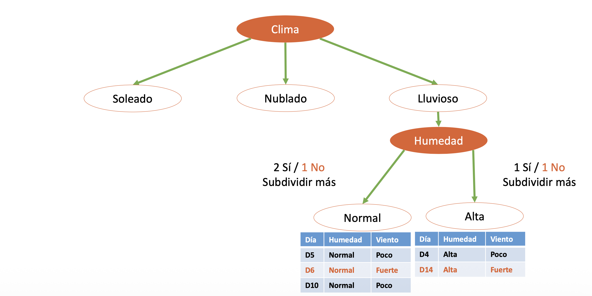

## Árboles de decisión

- Si hay no incertidumbre, **paras**

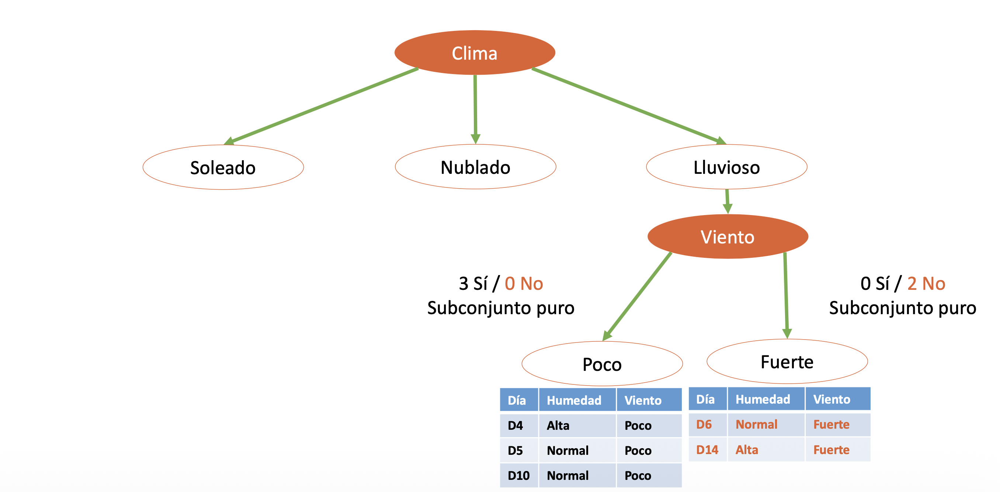

## Árboles de decisión

- Elementos: Nodo raíz, nodos interno, nodo terminal (hoja)

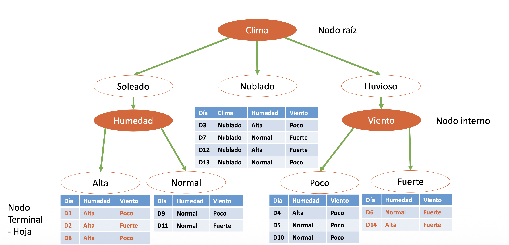

## Árboles de decisión

### Árbol final

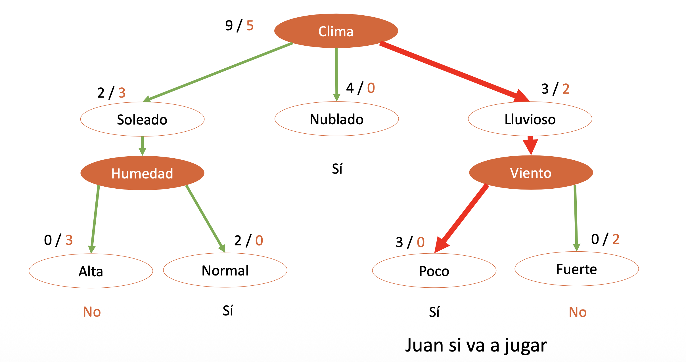

## Detalles del proceso de creación del árbol

- Es computacionalmente inviable considerar **cada posible partición** del espacio de características.
- Las métricas para realizar la división binaria son Entropía, Índice Gini y error de clasificación
    - Todas buscan lo mismo: la división que genera 
      **mayor ganancia de información** y **menor impureza**

:::{.notes}

 Métricas para realizar división binaria

- Tasa de error de clasificación $E(S) = 1 - \max_k(p_k)$

- Entropía $H(S) = -\sum_{k=1}^{K} p_k \log_2(p_k)$

- Índice Gini: $G(S) = \sum_{k=1}^{K} p_k(1 - p_k) = 1 - \sum_{k=1}^{K} p_k^2$

- Se selecciona el atributo con la **mayor ganancia de información**.
- El atributo óptimo minimiza la información requerida para clasificar y refleja la menor **impureza** en las particiones resultantes.
- $p_k$: probabilidad de que un registro arbitrario en $S$ pertenezca a la clase $C_k$

$$H(S) = -\sum_{k=1}^{K} p_k \log_2(p_k)$$

| Distribución | Entropía     | Interpretación      |
|--------------|-------------|---------------------|
| 0/6          | 0           | Certidumbre total   |
| 3/3          | 1           | Incertidumbre total |
| 6/0          | 0           | Certidumbre total   |

Por regla de L'Hôpital: $0 \log_2 0 = 0$

:::

## Sobreajuste en árboles de decisión

Sin restricciones, un árbol puede clasificar los datos de entrenamiento **perfectamente** (dividiendo hasta el *final*), pero **generaliza mal** a datos nuevos.

- Soluciones:

    - **Parar anticipadamente:** detener la división cuando no sea estadísticamente significativa.
    - **Poda post-crecimiento:** dejar crecer el árbol y luego podarlo con datos de prueba

> Un árbol más pequeño con menos divisiones puede tener **menor varianza** y **mejor interpretabilidad** a costa de un pequeño sesgo.

## Variables continuas

Para atributos continuos (e.g., temperatura):

1. Ordenar los valores posibles de menor a mayor
2. Calcular el **punto medio** entre cada par adyacente como posible umbral de corte
3. Evaluar la entropía para cada corte
4. Seleccionar el umbral con **mínima entropía** (máxima ganancia)

Ejemplo de condición resultante: `temperatura > 72.3`

## Consideraciones

- Muy fáciles de explicar (incluso más que la regresión lineal)
- Reflejan la toma de decisiones humana 
- Se pueden visualizar gráficamente e interpretar sin expertise 
- Menor precisión predictiva que otros métodos supervisados 
- Al **agregar muchos árboles** se mejora sustancialmente el rendimiento 

## Bosques aleatorios

:::: {.columns}
::: {.column style="width:50%; font-size: 0.8em;"}

](img/rf.png)

:::
::: {.column width="5%"}
<!-- empty column to create gap -->
:::
::: {.column style="width:45%; font-size: 0.8em;"}

Conjunto de muchos árboles de decisión trabajando juntos.

La idea principal es:

> En lugar de confiar en un solo árbol, combinamos muchos árboles para tomar una decisión más robusta.

:::
::::

---

## Bosques aleatorios

*¿Por qué usar muchos árboles?*

Un solo árbol puede:

- aprender demasiado los datos (*overfitting*)
- ser muy sensible a pequeños cambios
- cometer errores por una mala división inicial

*Random Forest* reduce eso porque:

- cada árbol aprende algo ligeramente distinto
- los errores individuales se compensan
- la predicción final suele ser más estable

---

## Bosques aleatorios

- *¿Cómo logra que los árboles sean diferentes?* Cada árbol:
    - ve una muestra distinta de los datos
    - usa subconjuntos distintos de variables
    - aprende reglas diferentes
    - Así el modelo obtiene “muchas opiniones”.

- Ventajas
    - Reduce overfitting y generaliza mejor
    - Funciona muy bien con datos tabulares
    - Maneja relaciones no lineales
    - Requiere menos ajuste que otros modelos

---

## Bosques aleatorios
### *Random Forest*

- Desventaja principal: 
    - el modelo completo se vuelve más difícil de explicar
    - *ganamos precisión, pero perdemos interpretabilidad*

> La **combinación de una gran cantidad de árboles** a menudo puede resultar en mejoras dramáticas en la precisión de la predicción, a expensas de alguna pérdida de interpretación.

# Algoritmos {background-color="#fdede8"}
- Regresión lineal 
- Regresión logística

## Antes: 

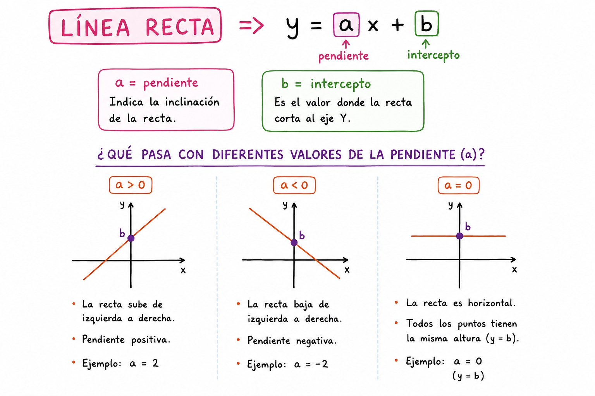

## Regresión Lineal

- Predicción de variable **continua**: $y$
    - aka. variable dependiente 
- Con información de los predictores: $X_1, X_2, X_n$
    - aka. variables independientes
- Ajustamos una **línea recta** a los datos:

$$ y  =  b_0 + b_1 X_1 $$

- $b_0$ es el intercepto, 
- $b_1$ es la pendiente, 
    - que tanto cambia $y$ con respecto a $X$, 
    - magnitud de impacto.

## Regresión Lineal

- Para determinar la mejor línea recta se realiza el **método de mínimos cuadrados** basado en el error residual

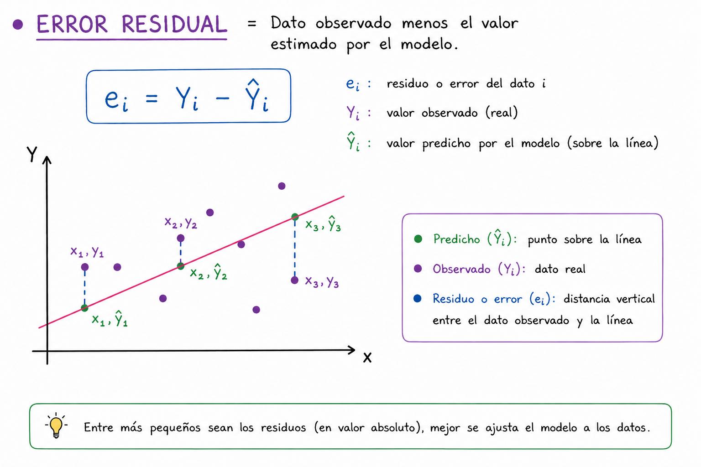

## Regresión Lineal

- Traza la "mejor línea recta" que pasa a través de los datos para predecir un valor numérico.

    - Los coeficientes nos dan el efecto de cada variable: 
        - $y  =  b_0 + b_1 X_1 + b_2 X_2 + b_i X_i$
    - Directo, **interpretable**, rápido de entrenar

- Limitaciones

    - Solo captura relaciones lineales
    - Si la relación es curva (forma de U, exponencial, etc.), el modelo falla
    - En la aplicación estadística real debes de cumplir supuestos para tener conclusiones adecuadas
        - Linealidad, homocedasticidad, normalidad de los errores

--- 

## Regresión Logística

- Predicción de una variable **categórica** o binaria: $y$
- Con información de los predictores: $X_1, X_2, X_n$
- Se realiza una transformación sobre $y$ porque no se puede predecir 0 o 1 con la regresión lineal
    - Transformación sigmoide:

$$y = p(y|X) = \frac{1}{1 + e^{-(b_0+b_1 X_1)}}$$

- Modela la probabilidad de que $y = 1$ (clase positiva) dado $X$
- Observa que seguimos teniendo los coeficientes de la recta pero dentro de una ecuación para poder ajustarlos a $y$ binaria. 

---

## Regresión Logística

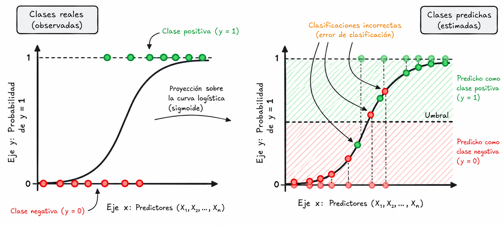

# Algoritmos {background-color="#fdede8"}
- KNN
- SVM
    - Se pueden usar predicción numérica pero ambos se usan mejor en **clasificación categórica**

## K-Vecinos Más Cercanos (KNN)

- Para clasificar un punto nuevo, busca los **k puntos más similares** en los datos históricos y asigna la categoría más común entre ellos.
    - *Dime con quién andas y te diré quién eres.*
    - Si un nuevo estudiante tiene características muy similares a 5 nuevos que resultaron no graduarse, es probable que también lo sea. 

**El parámetro clave:** `k` (número de vecinos)

- `k` muy pequeño (k=1): el modelo es muy sensible al ruido
- `k` muy grande: el modelo se vuelve demasiado general y pierde precisión
- Se elige k probando diferentes valores y evaluando el desempeño

---

## K-Vecinos Más Cercanos (KNN)

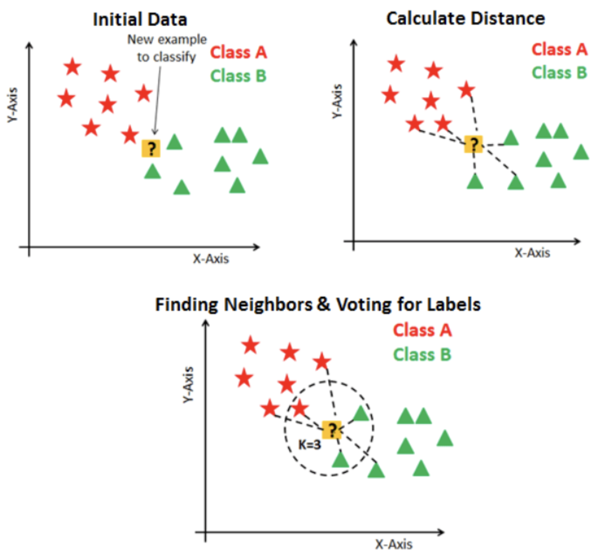

---

## K-Vecinos Más Cercanos (KNN)

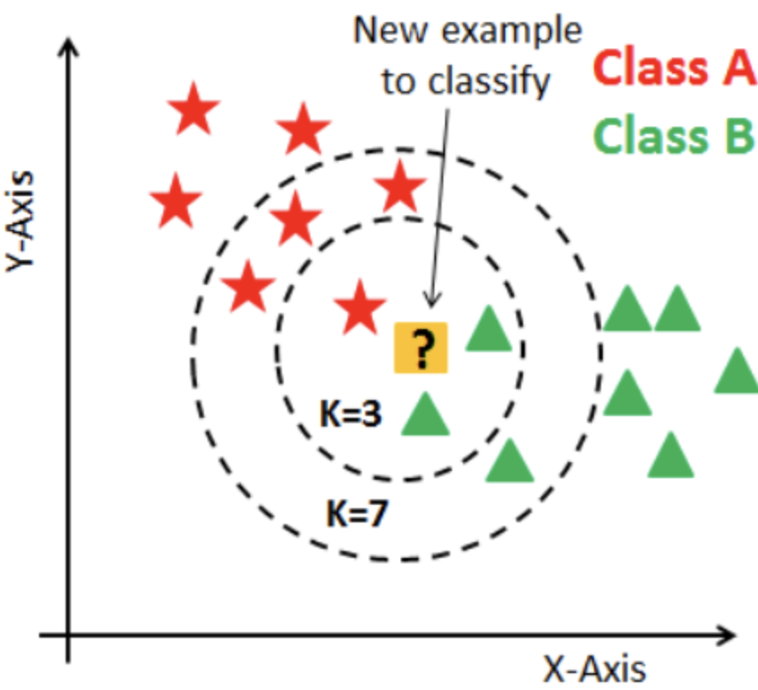

---

## Máquinas de Soporte Vectorial (SVM)

- Maximiza la distancia entre las clases
	- Los puntos más cercanos al margen determinan la frontera

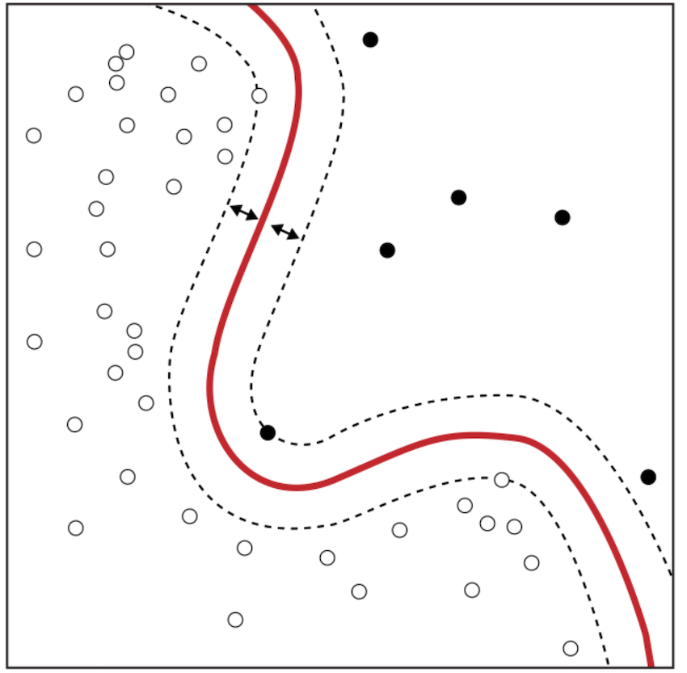

## Máquinas de Soporte Vectorial (SVM)

Encuentra la **frontera de decisión óptima** que separa dos clases con el mayor margen posible.

> Imagina que tienes manzanas y naranjas esparcidas en una mesa. SVM busca trazar la línea que las separa manteniendo la mayor distancia posible de los puntos más cercanos de cada lado (esos puntos cercanos son los "vectores de soporte").

**Limitaciones:**

- Difícil de interpretar
- No escala bien a millones de registros

---

## Otros algoritmos

- **Gradient Boosting (XGBoost, LightGBM)**: construye árboles secuencialmente, cada uno corrigiendo los errores del anterior. Muy poderoso en competencias y datos tabulares.

- **Naive Bayes**: clasifica usando probabilidades. Muy rápido y sorprendentemente bueno para texto (ej. detectar spam o categorizar solicitudes).

- **Redes Neuronales**: capas de nodos interconectados que aprenden representaciones complejas. Base de los modelos de lenguaje e imagen.

## ¿Cómo elegir el mejor modelo?

No existe un algoritmo universalmente superior, la respuesta siempre depende de tus datos y tu problema.

La estrategia es simple: **entrenar varios y comparar**

- Entrenas los algoritmos que vimos hoy con tus datos
- Los evalúas sobre el conjunto de validación, datos que ninguno vio durante el entrenamiento
- Comparas sus resultados contra la **línea base** que definiste antes de modelar
- Te quedas con el que mejor generaliza y supera lo que ya se hace hoy

---

### [Basado en el curso: Machine Learning in practice]{.fg style="--col: #e64173"}

De Rayid Ghani and Kid Rodolfa

  

### [Referencias]{.fg style="--col: #e64173"}
