## Retomando: *¿Cómo elegir el mejor modelo?*

No existe un algoritmo universalmente superior, la respuesta siempre depende de tus datos y tu problema.

La estrategia es simple: **entrenar varios y comparar**

- Entrenas los algoritmos de aprendizaje supervisado con tus datos
- Los evalúas sobre el conjunto de validación, datos que no vio durante el entrenamiento
- Comparas sus resultados contra la **línea base** que definiste antes de modelar
- Te quedas con el que mejor generaliza, supera lo que ya se hace hoy y es costeable


# Métricas {background-color="#fdede8"}


## Umbral de decisión
### Del score a la predicción

:::: {.columns}
::: {.column style="width:48%; font-size: 0.68em;"}

- Un modelo no predice directamente sí o no:
    - regresa un **score** continuo entre 0 y 1
    - representa qué tan seguro está el modelo de que una observación pertenece a la clase positiva
- Necesitamos definir un **umbral** (corte en el score) para convertir ese score en una decisión:
    - Todo score **≥** umbral → predecimos **1** (positivo)
    - Todo score **<** umbral → predecimos **0** (negativo)

> ¿Qué umbral usamos? Depende del problema. El más común por default es **0.5**, pero rara vez es el mejor.

:::
::: {.column width="4%"}
:::
::: {.column style="width:48%; font-size: 0.68em;"}

*Con umbral = 0.5*

|  id | score | etiqueta real | predicción |
|----:|------:|:-------------:|:----------:|
| 168 | 0.995 | 1 | **1** ✓ |
| 132 | 0.966 | 1 | **1** ✓ |
| 170 | 0.782 | 0 | **1** ✗ |
| 128 | 0.753 | 1 | **1** ✓ |
| 159 | 0.589 | 0 | **1** ✗ |
| 117 | 0.336 | 1 | 0 ✗ |
| 104 | 0.334 | 0 | 0 ✓ |
| 147 | 0.318 | 0 | 0 ✓ |
| 184 | 0.223 | 1 | 0 ✗ |
| 128 | 0.201 | 0 | 0 ✓ |
| 121 | 0.124 | 0 | 0 ✓ |
| 148 | 0.017 | 0 | 0 ✓ |
:::
::::

---

## Umbral de decisión
### Clasificando cada caso

:::: {.columns}
::: {.column style="width:48%; font-size: 0.68em;"}
Cada predicción cae en una de cuatro categorías:

- **TP**: predijo 1, era 1 → acierto
- **TN**: predijo 0, era 0 → acierto
- **FP**: predijo 1, era 0 → error (falso positivo)
- **FN**: predijo 0, era 1 → error (falso negativo)

<br>

> Con umbral = 0.5 en esta tabla: ¿cuántos TP, FP, FN y TN identificas?

:::
::: {.column width="4%"}
:::
::: {.column style="width:48%; font-size: 0.68em;"}

|  id | score | real | pred | tipo |
|----:|------:|:----:|:----:|:----:|
| 168 | 0.995 | 1 | 1 | **TP** |
| 132 | 0.966 | 1 | 1 | **TP** |
| 170 | 0.782 | 0 | 1 | **FP** |
| 128 | 0.753 | 1 | 1 | **TP** |
| 159 | 0.589 | 0 | 1 | **FP** |
| 117 | 0.336 | 1 | 0 | **FN** |
| 104 | 0.334 | 0 | 0 | **TN** |
| 147 | 0.318 | 0 | 0 | **TN** |
| 184 | 0.223 | 1 | 0 | **FN** |
| 128 | 0.201 | 0 | 0 | **TN** |
| 121 | 0.124 | 0 | 0 | **TN** |
| 148 | 0.017 | 0 | 0 | **TN** |
:::
::::

---

## Matriz de confusión
### De los casos individuales al resumen

:::: {.columns}
::: {.column style="width:48%; font-size: 0.7em;"}
Los 12 casos se resumen en una sola tabla:

<br>

|  | **Pred 1** | **Pred 0** |
|:--|:--:|:--:|
| **Real 1** | TP = 3 | FN = 2 |
| **Real 0** | FP = 2 | TN = 5 |

<br>

- Aciertos en la diagonal (TP + TN = **8**)
- Errores fuera de la diagonal (FP + FN = **4**)

:::
::: {.column width="4%"}
:::
::: {.column style="width:48%; font-size: 0.7em;"}
En general, la matriz de confusión tiene esta forma:


:::
::::

---

## Distribución de scores
### El umbral a escala

:::: {.columns}
::: {.column style="width:38%; font-size: 0.7em;"}
- En la tabla vimos 12 casos; en la práctica tenemos miles
- La distribución de scores muestra cómo se separan (o no) las dos clases
- Un modelo ideal tendría dos picos bien separados: negativos a la izquierda, positivos a la derecha
- El **traslape** entre clases es donde viven nuestros errores

<br>

> ¿El modelo separa bien las clases?

:::
::: {.column width="4%"}
:::
::: {.column style="width:58%; font-size: 0.7em;"}
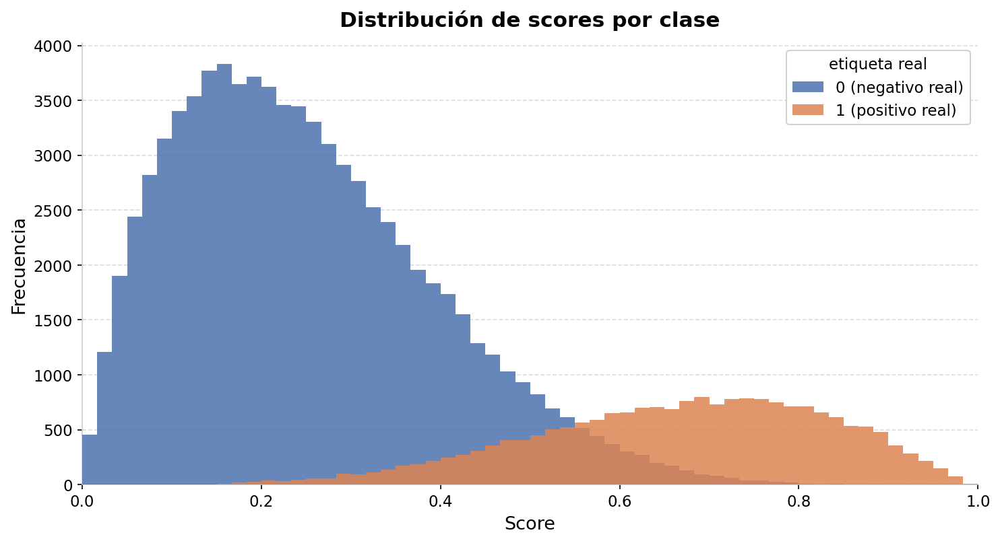
:::
::::

---

## Moviendo el umbral
### Umbral = 0.5

:::: {.columns}
::: {.column style="width:38%; font-size: 0.7em;"}

- La mayoría de los negativos reales quedan correctamente a la izquierda
    - algunos FP
- Pero una parte importante de los positivos reales también queda a la izquierda
    - varios FN
- La mayoría de los modelos usan este valor por default, pero rara vez es el más conveniente

:::
::: {.column width="4%"}
:::
::: {.column style="width:58%; font-size: 0.7em;"}
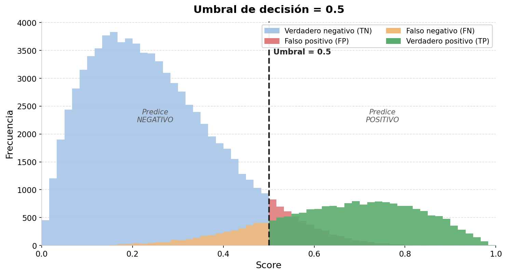
:::
::::

---

## Moviendo el umbral
### Umbral = 0.3

:::: {.columns}
::: {.column style="width:38%; font-size: 0.7em;"}

- Capturamos más positivos reales
    - muchos menos FN
- Pero también clasificamos como positivos a muchos negativos
    - muchos más FP
- El modelo se vuelve más *sensible* pero menos *eficiente*

> ¿Cuándo conviene? Cuando perderse un caso real cuesta más que una alarma falsa, por ejemplo, detectar riesgo de abandono escolar

:::
::: {.column width="4%"}
:::
::: {.column style="width:58%; font-size: 0.7em;"}
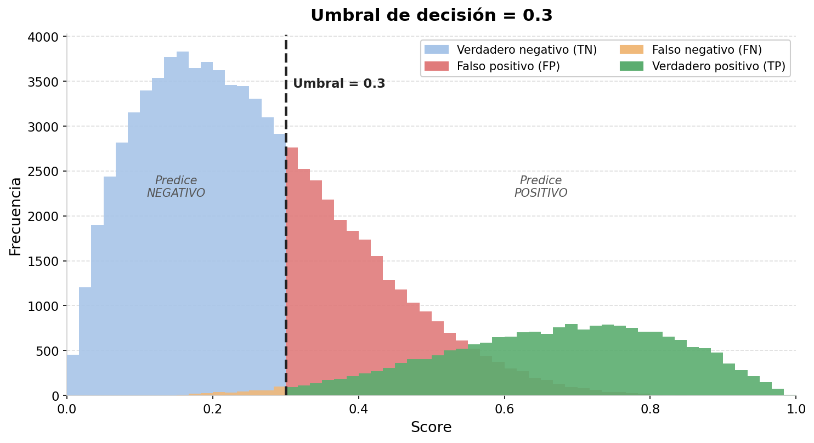
:::
::::

---

## Moviendo el umbral
### Umbral = 0.7

:::: {.columns}
::: {.column style="width:38%; font-size: 0.7em;"}

- Casi no hay FP: cuando el modelo dice "positivo", casi siempre acierta
- Pero dejamos fuera a la mayoría de los positivos reales
    - muchos FN
- El modelo es muy eficiente pero poco sensible

> ¿Cuándo conviene? Cuando actuar sobre un falso positivo tiene un costo alto, por ejemplo, intervenciones punitivas o costosas

:::
::: {.column width="4%"}
:::
::: {.column style="width:58%; font-size: 0.7em;"}
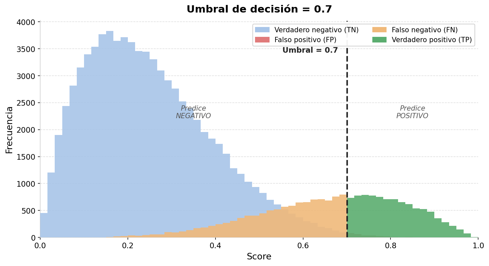
:::
::::


## Métricas generales
### Accuracy

- La razón de predicciones correctas (positivas y negativas) sobre todas las predicciones:

$$\frac{VP+VN}{VP+VN+FP+FN}=\frac{aciertos}{total}$$

- Problema de los techos (30 casas): detectar los techos con daño estructural para priorizar inspección

:::: {.columns}
::: {.column style="width:50%; font-size: 0.7em;"}


| N = 30       | Pred  = 1 | Pred  = 0 |
|--------------|-----------|-----------|
| **Real = 1** | TP = 10   ✅   | FN = 3  ❌     |
| **Real = 0** | FP = 5   🔎    | TN = 12  👍    |

:::
::: {.column width="5%"}
:::
::: {.column style="width:40%; font-size: 0.7em;"}


$$\frac{10+12}{30}=\frac{22}{30}=0.73$$

:::
::::

---

## Métricas generales
### Accuracy no es sufieciente

:::: {.columns}
::: {.column style="width:50%; font-size: 0.7em;"}

Considera este escenario alternativo: el modelo predijo casi todo como negativo.

- Accuracy sube a **0.76**: parece mejor que el ejemplo anterior
- Pero solo detecta **1 de 13** casas dañadas

| N = 30       | Pred  = 1 | Pred  = 0 |
|--------------|-----------|-----------|
| **Real = 1** | 1    ✅   | 2  ❌     |
| **Real = 0** | 5   🔎    | 22  👍    |

$$\frac{1+22}{30}=\frac{23}{30}=0.76$$

:::
::: {.column width="5%"}
:::
::: {.column style="width:40%; font-size: 0.7em;"}

<br><br>

> La accuracy no distingue entre tipos de error.
> En problemas con clases desbalanceadas o donde los errores tienen costos distintos, necesitamos métricas más específicas: **eficiencia** y **cobertura**.

:::
::::

---

## Métricas
### Eficiencia (*Precision*)

De las entidades que el modelo predijo como positivas, ¿en cuántas acertó?


$$\text{Eficiencia} = \frac{TP}{TP+FP}$$


:::: {.columns}
::: {.column style="width:35%; font-size: 0.8em;"}


**Escenario 1**

$$\frac{10}{10+5}=0.66$$

| N = 30       | Pred  = 1 | Pred  = 0 |
|--------------|-----------|-----------|
| **Real = 1** | 10   ✅   | 3  ❌     |
| **Real = 0** | 5   🔎    | 12  👍    |

:::
::: {.column style="width:35%; font-size: 0.8em;"}


**Escenario 2**

$$\frac{1}{1+5}=0.16$$

| N = 30       | Pred  = 1 | Pred  = 0 |
|--------------|-----------|-----------|
| **Real = 1** | 1    ✅   | 2  ❌     |
| **Real = 0** | 5   🔎    | 22  👍    |

:::
::: {.column style="width:30%; font-size: 0.8em;"}

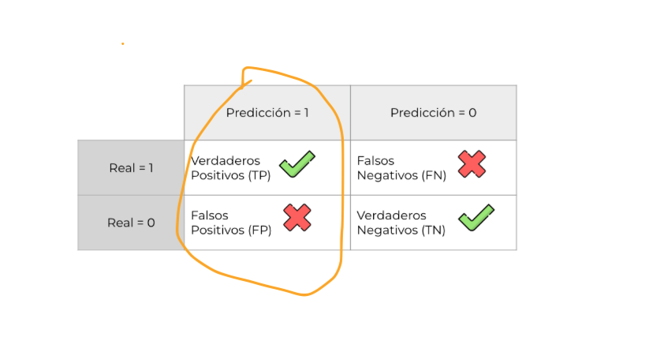

:::
::::

---

## Métricas
### Cobertura (*Recall*)

De las entidades que realmente eran positivas, ¿cuántas detectó el modelo?

$$\text{Cobertura} = \frac{TP}{TP+FN}$$

:::: {.columns}
::: {.column style="width:35%; font-size: 0.8em;"}

**Escenario 1**

$$\frac{10}{10+3}=0.76$$

| N = 30       | Pred  = 1 | Pred  = 0 |
|--------------|-----------|-----------|
| **Real = 1** | 10   ✅   | 3  ❌     |
| **Real = 0** | 5   🔎    | 12  👍    |

:::
::: {.column style="width:35%; font-size: 0.8em;"}

**Escenario 2**

$$\frac{1}{1+2}=0.33$$

| N = 30       | Pred  = 1 | Pred  = 0 |
|--------------|-----------|-----------|
| **Real = 1** | 1    ✅   | 2  ❌     |
| **Real = 0** | 5   🔎    | 22  👍    |

:::
::: {.column style="width:30%; font-size: 0.8em;"}


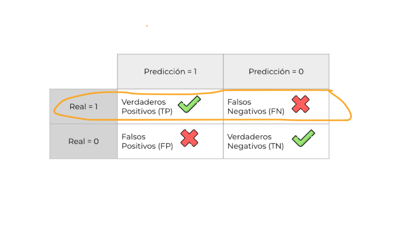

:::
::::

---

## Curva ROC

:::: {.columns}
::: {.column style="width:45%; font-size: 0.8em;"}

- Al variar el umbral de clasificación, se obtienen diferentes valores de TPR (cobertura) y FPR (tasa de falsos positivos):
    - Umbral alto (0.9): solo ejemplos con score muy alto se clasifican como positivos
    - Umbral bajo (0.1): se clasifican más ejemplos como positivos
- La curva ROC muestra este trade-off en todo el rango de umbrales posibles
- 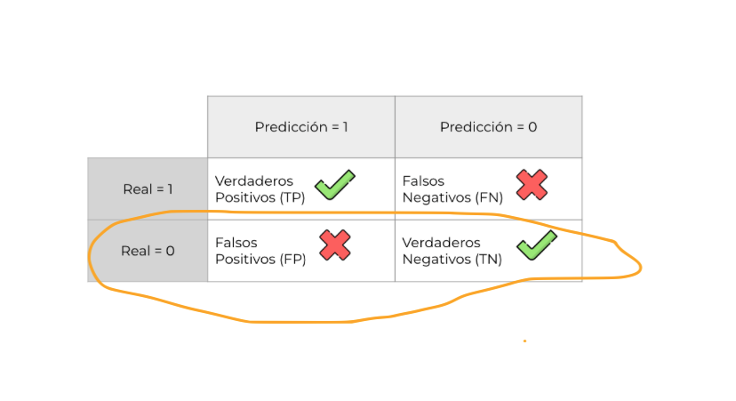

:::
::: {.column width="10%"}
:::
::: {.column style="width:40%; font-size: 0.8em;"}

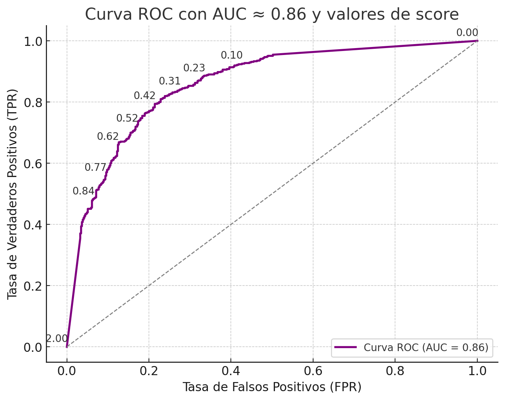

:::
::::


## Curva ROC
### Área bajo la curva (AUC)

:::: {.columns}
::: {.column style="width:45%; font-size: 0.8em;"}

- Utilízala solamente si te interesa [todo]{.underline} el espacio de umbrales posibles
- AUC = 1 es un clasificador perfecto
- AUC = 0.5 equivale a clasificar al azar

:::
::: {.column width="10%"}
:::
::: {.column style="width:40%; font-size: 0.8em;"}

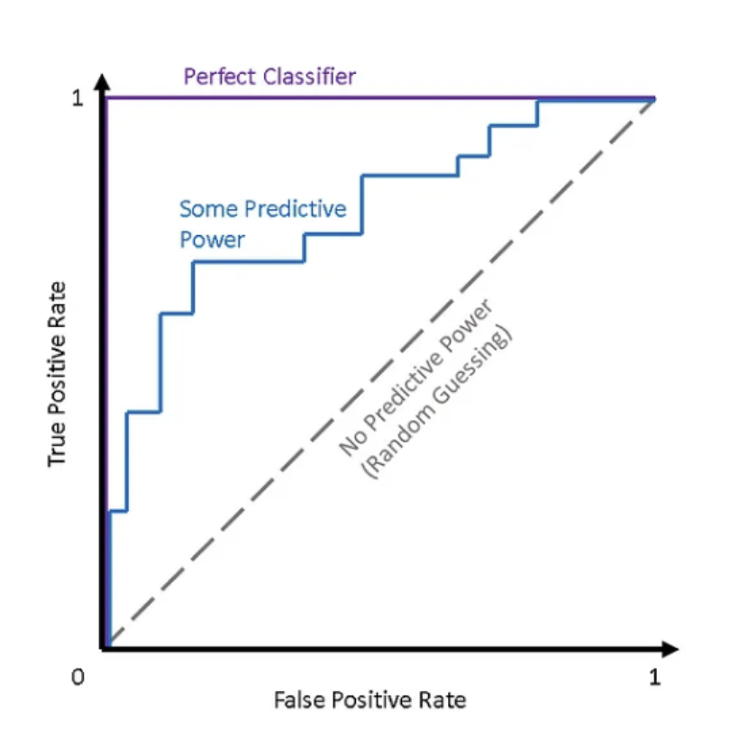

:::
::::


## Métricas
### Consideraciones

- Existe también *specificity* o tasa de verdaderos negativos: proporción de negativos identificados correctamente
- La media armónica de eficiencia y cobertura es la $F1$, útil cuando quieres balancear ambas métricas

- Existe un **trade-off** entre eficiencia y cobertura:
    - Mayor eficiencia → umbral más alto → menos FP, más FN
    - Mayor cobertura → umbral más bajo → más FP, menos FN

## Métricas
### *Cheatsheet*

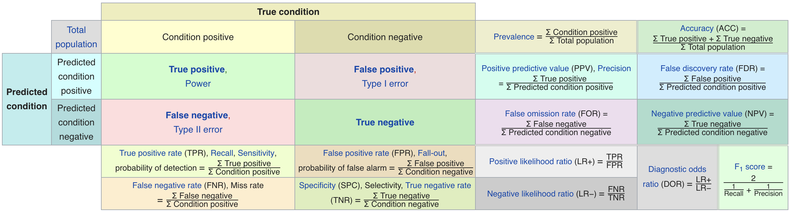

::: {.notes}
Recuerda que un modelo es igual a un algoritmo, un conjunto de
predictores calculados en un conjunto de entrenamiento (el cual en
nuestro caso está dado en un punto del tiempo, *as_of_date*), una
selección particular de hiperparámetros.
:::

# Métricas con $k$: cuando los recursos son determinan el valor del umbral {background-color="#fdede8"}

- El umbral no es una decisión técnica, es una decisión de política pública que tiene implicaciones en el problema

## El umbral lo determina el problema, no el modelo

En la práctica, el umbral no se fija arbitrariamente en 0.5 o cualquier otro valor del score.
Se fija en función de **cuántas entidades puedes atender**.


- ¿Cuántos inspectores tenemos?
- ¿Cuántos estudiantes puede atender el equipo de tutorías?
- ¿Cuántas solicitudes puede procesar el área de atención?

> En la práctica, el "umbral" se convierte en una **$k$**: el número de entidades al que podemos llegar con los recursos que tenemos.


## ¿Qué significa la $k$?

**No tienes recursos infinitos.**

- $k$ = número de entidades al que puedes llegar con los recursos disponibles
- Ordenas las entidades por score de mayor a menor
- Tomas las **primeras $k$** como predicciones positivas, independientemente del valor exacto del score

> El score ya no importa como número absoluto. Lo que importa es el **orden**: quién está más arriba en la lista.


## Métricas con $k$ 
### Las dos preguntas que nos importan

:::: {.columns}
::: {.column style="width:45%; font-size: 0.8em;"}

**¿Qué tan bien usamos los recursos?**

De las $k$ entidades que seleccionamos para atender,
¿en cuántas encontramos realmente el problema?

- **Eficiencia\@k** (*Precision\@k*)

$$\text{eficiencia@k} = \frac{TP \in k}{k}$$

> Mide si estamos mandando los recursos
> a los lugares correctos.

:::
::: {.column width="10%"}
:::
::: {.column style="width:45%; font-size: 0.8em;"}

**¿Qué tan bien cubrimos el problema?**

De todas las entidades que realmente están en riesgo,
¿cuántas logramos detectar con nuestros $k$ recursos?

- **Cobertura\@k** (*Recall\@k*)

$$\text{cobertura@k} = \frac{TP \in k}{P}$$

> Mide si estamos llegando a todos
> los que necesitan atención.

:::
::::

## Métricas con $k$
### ¿Por qué no actuar sobre toda la lista?


:::: {.columns}
::: {.column style="width:45%; font-size: 0.8em;"}

**Restricción de recursos**

Solo puedes atender a $k$ entidades:
inspectores, tutores, camas, turnos disponibles.

- La $k$ la fija el mundo operativo.


**Restricción por costo de error**

Actuar sobre un falso positivo tiene consecuencias
graves: legales, económicas, reputacionales.

- La $k$ reduce el costo de equivocarse.

:::
::: {.column width="10%"}
:::
::: {.column style="width:45%; font-size: 0.8em;"}

En ambos casos, **el modelo rankea y tú decides
hasta dónde cortas la lista**.


- ¿Qué tan bien usamos los $k$ recursos disponibles?

    - $\text{eficiencia@k} = \frac{TP \in k}{k}$


- ¿Qué proporción del problema total logramos cubrir?

    - $\text{cobertura@k} = \frac{TP \in k}{P}$


:::
::::


## Escenario 1
### Techos

:::: {.columns}
::: {.column style="width:60%; font-size: 0.9em;"}

- Existen 10 casas que se evaluaron
    - $n=10$
- Tenemos solo 5 inspectores
    - $k=5$
- Ordenamos de mayor a menor y asignamos las primeras 5 entidades a inspección

:::
::: {.column width="5%"}
:::
::: {.column style="width:25%; font-size: 0.9em;"}

  entidad   *score*    $k$
  --------- --------- ---------
  35        0.70      **Sí**
  98        0.68      **Sí**
  5         0.55      **Sí**
  47        0.52      **Sí**
  3         0.20      **Sí**
  1         0.19      No
  2         0.18      No
  15        0.17      No
  24        0.15      No
  190       0.00      No

:::
::::

---

## Escenario 1 

### Eficiencia\@k


:::: {.columns}
::: {.column style="width:60%; font-size: 0.9em;"}

- ¿A cuántas etiquetas positivas le acertó el modelo?

- Dentro de las $k=5$ casas inspeccionadas, ¿en cuántas se encontró realmente el riesgo?

- TP: predicción positiva + riesgo real


$$\text{eficiencia@5} = \frac{TP}{k} = \frac{2}{5} = 0.40$$

:::
::: {.column width="5%"}
:::
::: {.column style="width:25%; font-size: 0.9em;"}

  entidad    $k$      ¿Riesgo?
  --------- --------- ------------
  35        Sí        No
  98        Sí        **Sí** ✅
  5         Sí        No
  47        Sí        **Sí** ✅
  3         Sí        No
  1         No        No
  2         No        No
  15        No        Sí
  24        No        Sí
  190       No        No

:::
::::

---

## Escenario 1 

### Cobertura\@k


:::: {.columns}
::: {.column style="width:60%; font-size: 0.9em;"}

- ¿Cuántos positivos reales cubrimos?

- En realidad hay **4 casas** en riesgo (los positivos reales).

- Con $k=5$, el modelo detectó **2 de esas 4**.


$$\text{cobertura@5} = \frac{TP \in k}{Positivos} = \frac{2}{4} = 0.50$$


:::
::: {.column width="5%"}
:::
::: {.column style="width:25%; font-size: 0.9em;"}

  entidad    $k$       ¿Riesgo?
  --------- --------- ------------
  35        Sí        No
  98        Sí        **Sí** ✅
  5         Sí        No
  47        Sí        **Sí** ✅
  3         Sí        No
  1         No        No
  2         No        No
  15        No        Sí ❌
  24        No        Sí ❌
  190       No        No

:::
::::


## Escenario 2 
### Becas

:::: {.columns}
::: {.column style="width:40%; font-size: 0.8em;"}


- Sí determinamos en riesgo a todos los estudiantes a partir de un umbral de 0.6, estaríamos prediciendo sobre un número de estudiantes indeterminado

    - Eficiencia = 4/8 (50%)
    - Cobertura = 4/6 (66%)

- Yo solo tengo presupuesto para 4 becas
- Observa el score

:::

::: {.column width="10%"}
<!-- empty column to create gap -->
:::


::: {.column style="width:40%; font-size: 0.7em;"}


|   id  |   score |   predicción umbral=0.6   | etiqueta real | 
|------|:-----------:|:---------:|:---------:|
| 68    |  0.99 |         1 |         1 | 
| 32    |  0.96 |         1 |         1 | 
| 70    |  0.78 |         1 |         0 | 
| 28    |  0.75 |         1 |         1 | 
| 59    |  0.72 |         1 |         1 | 
| 17    |  0.70 |         1 |         0 | 
| 04    |  0.66 |         1 |         0 | 
| 47    |  0.60 |         1 |         0 | 
| 84    |  0.22 |         0 |         1 | 
| 28    |  0.20 |         0 |         0 | 
| 21    |  0.12 |         0 |         0 | 
| 48    |  0.01 |         0 |         1 | 


:::
::::

## Escenario 3 

### Becas

:::: {.columns}
::: {.column style="width:40%; font-size: 0.8em;"}


- Sí determinamos en riesgo a todos los estudiantes a partir de un umbral de 0.6, estaríamos prediciendo sobre un número de estudiantes indeterminado
    - Eficiencia = 1/1 (100%)
    - Cobertura = 1/6 (16%)

- Yo solo tengo presupuesto para 4 becas
- Observa el score

:::

::: {.column width="10%"}
<!-- empty column to create gap -->
:::


::: {.column style="width:40%; font-size: 0.7em;"}


| id  |   score |   predicción umbral=0.6  | etiqueta real | 
|-----|:-----------:|:---------:|:---------:|
| 68   |     0.64 |         1 |         1 | 
| 32   |     0.59 |         0 |         1 | 
| 70   |     0.48 |         0 |         0 | 
| 28   |     0.35 |         0 |         1 | 
| 59   |     0.33 |         0 |         1 | 
| 17   |     0.25 |         0 |         0 | 
| 04   |     0.23 |         0 |         0 | 
| 47   |     0.11 |         0 |         0 | 
| 84   |     0.12 |         0 |         1 | 
| 28   |     0.10 |         0 |         0 | 
| 21   |     0.02 |         0 |         0 | 
| 48   |     0.01 |         0 |         1 | 


:::
::::

## Escenario 4

### Becas

:::: {.columns}
::: {.column style="width:40%; font-size: 0.8em;"}


- Al determinar la k, tomas en cuenta las restricciones de espacio
    - Eficiencia@k = 3/4 (66%)
    - Cobertura@k = 3/6 (50%)

- Yo solo tengo presupuesto para 4 becas

:::

::: {.column width="10%"}
<!-- empty column to create gap -->
:::


::: {.column style="width:40%; font-size: 0.7em;"}


|   id |   score | predicción  k=4     | etiqueta real | 
|-----:|:-----------:|:---------:|:---------:|
|68    |     0.64 |         1 |         1 | 
|32    |     0.59 |         1 |         1 | 
|70    |     0.48 |         1 |         0 | 
|28    |     0.35 |         1 |         1 | 
|59    |     0.33 |         0 |         1 | 
|17    |     0.25 |         0 |         0 | 
|04    |     0.23 |         0 |         0 | 
|47    |     0.11 |         0 |         0 | 
|84    |     0.12 |         0 |         1 | 
|28    |     0.10 |         0 |         0 | 
|21    |     0.02 |         0 |         0 | 
|48    |     0.01 |         0 |         1 | 

:::
::::


## Escenario 5


### ¿Qué pasa si aumentamos k?

:::: {.columns}
::: {.column style="width:40%; font-size: 0.8em;"}

- Con $k = 100\%$ de la población (todos):
    - **Eficiencia\@k** = 6/12 = 50%
    - **Cobertura\@k** = 6/6 = 100%

<br>

> Si mandas inspectores a todas las entidades, encuentras todos los problemas — pero gastas recursos en la mitad que no los necesita.

:::
::: {.column width="10%"}
:::
::: {.column style="width:40%; font-size: 0.6em;"}

|  id | score | k=100% | real |
|----:|------:|:------:|:----:|
| 168 | 0.995 | **Sí** | 1 |
| 132 | 0.966 | **Sí** | 1 |
| 170 | 0.782 | **Sí** | 0 |
| 128 | 0.753 | **Sí** | 1 |
| 159 | 0.589 | **Sí** | 1 |
| 117 | 0.336 | **Sí** | 0 |
| 104 | 0.334 | **Sí** | 0 |
| 147 | 0.318 | **Sí** | 0 |
| 184 | 0.223 | **Sí** | 1 |
| 128 | 0.201 | **Sí** | 0 |
| 121 | 0.124 | **Sí** | 0 |
| 148 | 0.017 | **Sí** | 1 |

:::
::::

---

## El trade-off de eficiencia y cobertura

A medida que aumentamos $k$:

- La **cobertura sube** — cubrimos más positivos reales
- La **eficiencia baja** — diluimos nuestros recursos entre más entidades

| $k$ | Pred positivos | Eficiencia\@k | Cobertura\@k |
|----:|:--------------:|:-------------:|:------------:|
| 1   | top 1          | 100%          | 17%          |
| 4   | top 4          | 75%           | 50%          |
| 6   | top 6          | 67%           | 67%          |
| 12  | todos          | 50%           | 100%         |


> La $k$ correcta depende de cuántos recursos tienes y de qué error es más costoso en tu problema.

::: {.notes}
Aclarar que la tabla de eficiencia/cobertura por k son valores calculados
para este ejemplo de 12 entidades — en la práctica esta curva se construye
con todos los datos de validación.
:::


## Variando la $k$

### Rayid's curve: menú de *políticas*

:::: {.columns}
::: {.column style="width:35%; font-size: 0.7em;"}

- Una regla que enfatiza la **eficiencia**
    - $k$ muy pequeña o umbral muy alto
    - casi siempre acierta cuando predice positivo, pero omite la mayoría de los casos reales (baja cobertura)
- Una regla que enfatiza la **cobertura**
    - $k$ muy grande o umbral muy bajo
    - detecta casi todos los positivos, pero a costo de baja eficiencia

:::
::: {.column width="5%"}
:::
::: {.column style="width:60%; font-size: 0.7em;"}


- La curva de eficiencia-cobertura por $k$ es el **menú de políticas** disponibles para tu problema

:::
::::


# Selección de modelos {background-color="#fdede8"}

## Muchos modelos, ¿por qué?
### El maravilloso `for loop`

```
for train-test splits (CV o temporal)

    for subsets de features (demográficos, comportamiento, temporales, etc.)

        for clasificadores (RFC, SVM, DT, NN, Logit, GB, Boosting)

            for hiperparámetros (productos cruzados de parámetros)

                - fit
                - predict  ('predict_proba' para sklearn)
                - evaluate (recuerda los umbrales y la k)
```

## Model group

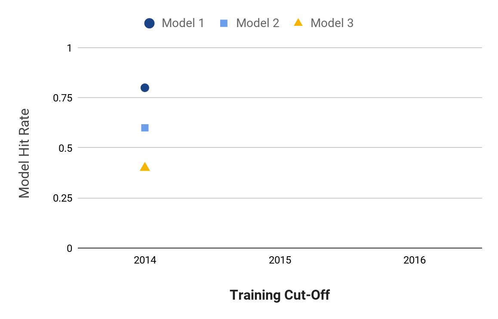{width="800px"}

## Model group

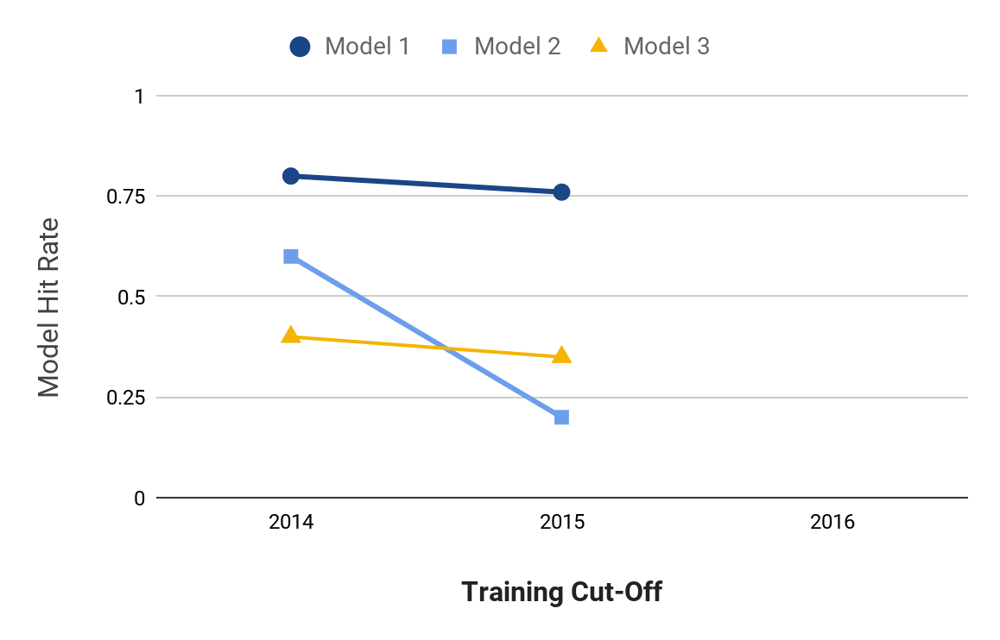{width="800px"}

## Model group

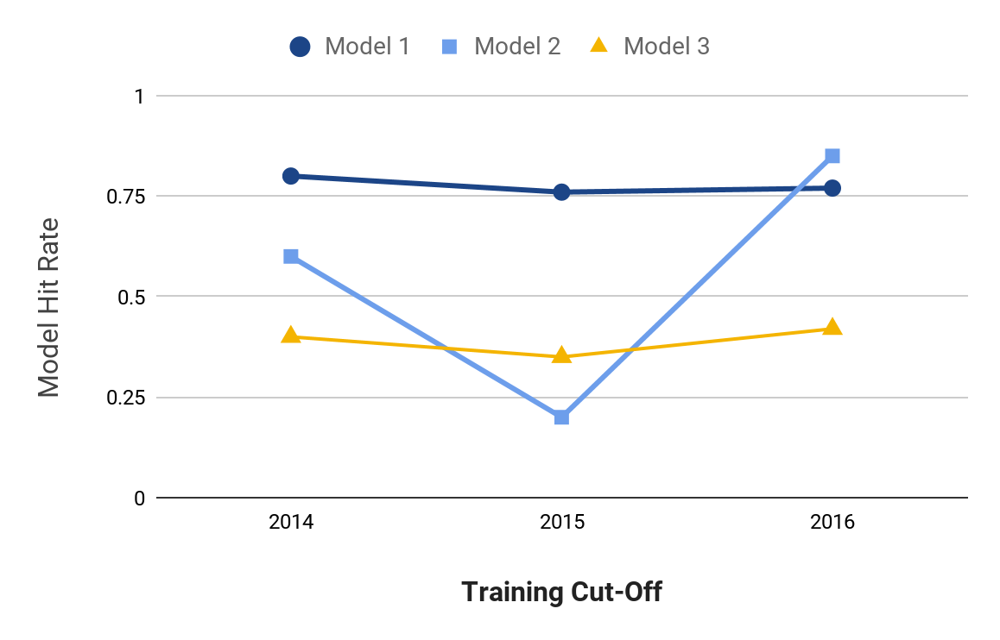{width="800px"}

## Model group

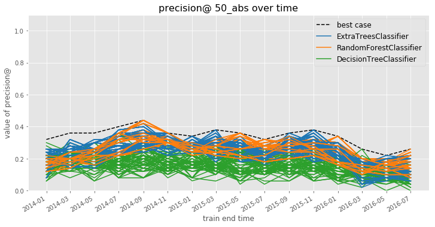{width="800px"}

## Analizando los resultados

- ¿Qué funcionó mejor?
    - ¿Qué clasificadores?
    - ¿Qué hiperparámetros?
    - ¿En qué métricas?
- ¿Efecto de diferentes predictores o grupos de predictores?
- ¿Varianza en el desempeño en el tiempo?
    - ¿Mejor promedio?
    - ¿Menor varianza?
    - ¿Mejorando en el tiempo?

## ¿Cómo selecciono el "mejor" modelo?

La elección depende de la **estrategia** según el contexto:

- ¿Un *model group* [estable]{.underline}? → mayor promedio en el tiempo
- ¿Un modelo sin comportamiento sorpresivo? → menor varianza
- ¿El mejor *model group* reciente? → mejor valor en el último punto

También hay que incluir métricas relacionadas con **sesgo e inequidad**, el desempeño global no es suficiente si el modelo falla sistemáticamente en algún grupo.


## Comportamiento en el tiempo (todos)

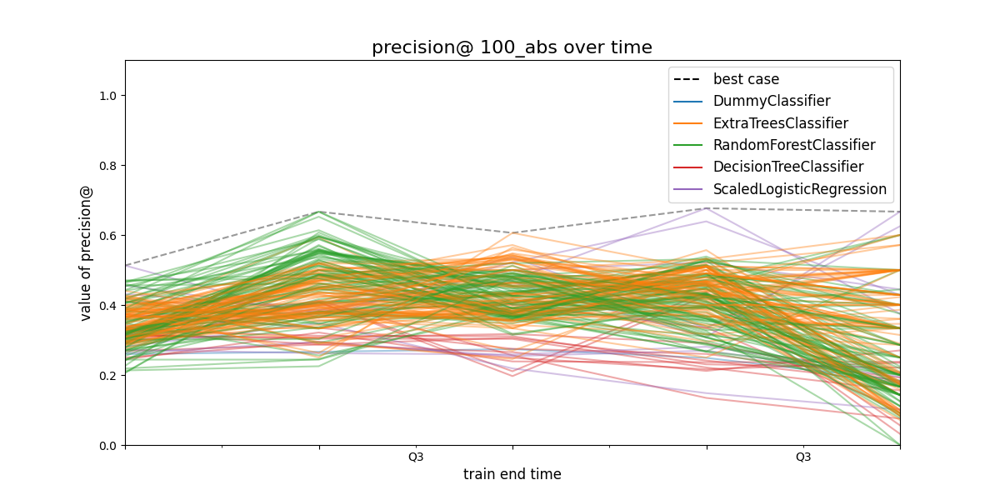{width="800px"}

## Comportamiento en el tiempo (filtrado)

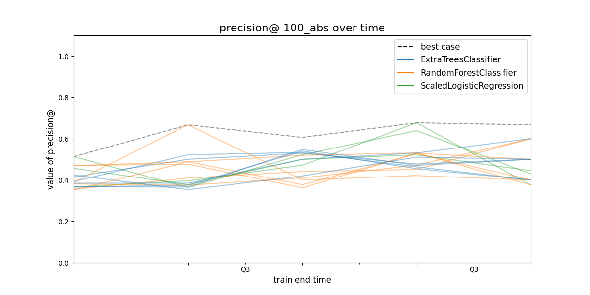{width="800px"}

## **Model selection**: recomendaciones

- Quizá no sea obvio cuál estrategia es la "mejor"
- En los candidatos "buenos", vale la pena investigar qué tan similares o diferentes son las listas que cada estrategia produce
- Es posible que quieras desplegar — o al menos probar — una combinación de varios *model groups*

-   Eficiencia y cobertura son las métricas importantes
-   Hay restricciones además de la cantidad de recursos a asignar
    (distancia, tiempo, legales, *expertise*)
-   Eficiencia es [más fácil]{.underline} de medir, pero quieres
    [optimizar]{.underline} cobertura

::: {.notes}
-   e.g. Inspectores en el norte de Chile, inspecciones en el sur
-   e.g. Recorrer todos los *foster homes* en un periodo de tiempo
    (legal)
-   Inspectores calificados o expertos
-   Métrica por tema, o región
:::

# Ejemplo techos

## Métricas generales
### Ejemplo

- Problema de los techos (30 casas)
- Detectar los techos con daño estructural
- Priorizar inspección de demolición o estabilización

|   | 1  | 2  | 3  | 4  | 5  |
|---|----|----|----|----|----|
| A | 🏠 | 🏠 | 🏠 | 🏠 | 🏠 |
| B | 🏠 | 🏠 | 🏠 | 🏠 | 🏠 |
| C | 🏠 | 🏠 | 🏠 | 🏠 | 🏠 |
| D | 🏠 | 🏠 | 🏠 | 🏠 | 🏠 |
| E | 🏠 | 🏠 | 🏠 | 🏠 | 🏠 |
| F | 🏠 | 🏠 | 🏠 | 🏠 | 🏠 |

## Predicciones
### Lo que el modelo predijo 

- Con el umbral definido
- El modelo predice que tienen alto riesgo
    - *Se mandarían inspectores a 15 casas*

|   | 1  | 2  | 3  | 4  | 5  |
|---|----|----|----|----|----|
| A | 🕵 |  🕵 | ⬛ | ⬛ | ⬛ |
| B | 🕵 | 🕵 | 🕵 | 🕵 | 🕵 |
| C | 🕵 | 🕵 | 🕵 | 🕵 | 🕵 |
| D | 🕵 | 🕵 |🕵   | ⬛️ | ⬛ |
| E | ⬛ | ⬛ | ⬛ | ⬛ | ⬛ |
| F | ⬛ | ⬛ | ⬛ | ⬛ | ⬛ |


## Observaciones
### Lo que realmente sucedió

- 13 casas realmente tuvieron daño estructural
- El algunos casos coinciden las predicciones
    - En otros no


|   | 1  | 2  | 3  | 4  | 5  |
|---|----|----|----|----|----|
| A | 🏚️ | 🏚️ | 🏚️ | 🏚️ | 🏚️ |
| B | 🏚️ | 🏚️ | 🏚️ | 🏚️ | 🏚️ |
| C | 🏚️ | 🏚️ | 🏚️ | 🏡 | 🏡 |
| D | 🏡 | 🏡 | 🏡 | 🏡 | 🏡 |
| E | 🏡 | 🏡 | 🏡 | 🏡 | 🏡 |
| F | 🏡 | 🏡 | 🏡 | 🏡 | 🏡 |


---

### [Basado en el curso: Machine Learning in practice]{.fg style="--col: #e64173"}

De Rayid Ghani and Kid Rodolfa

<div style="width: 40%;">
  
</div>


