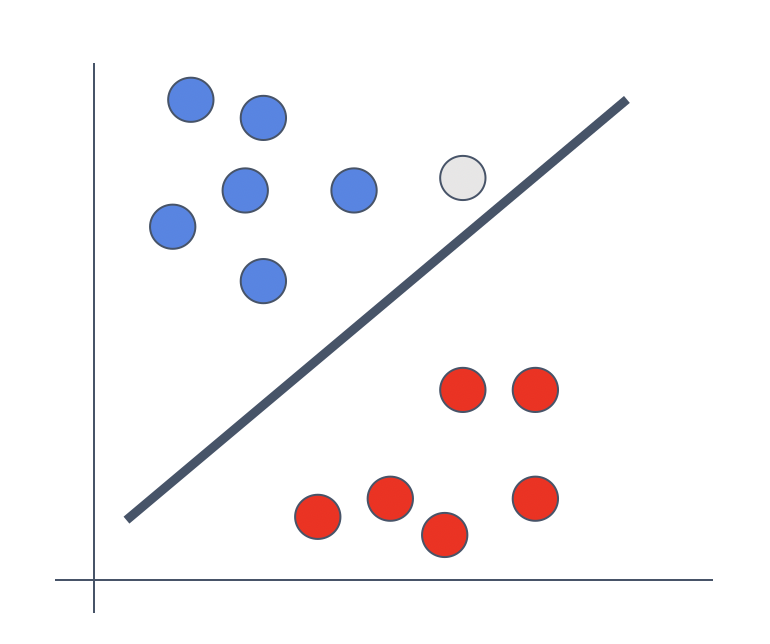
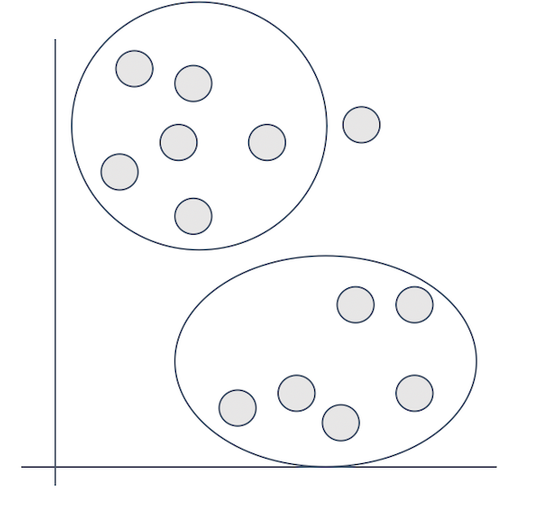
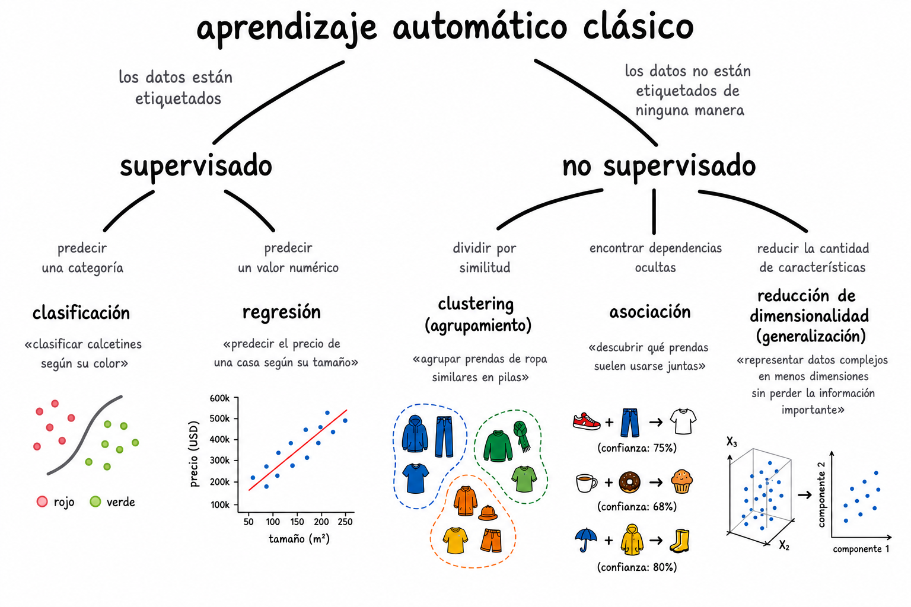
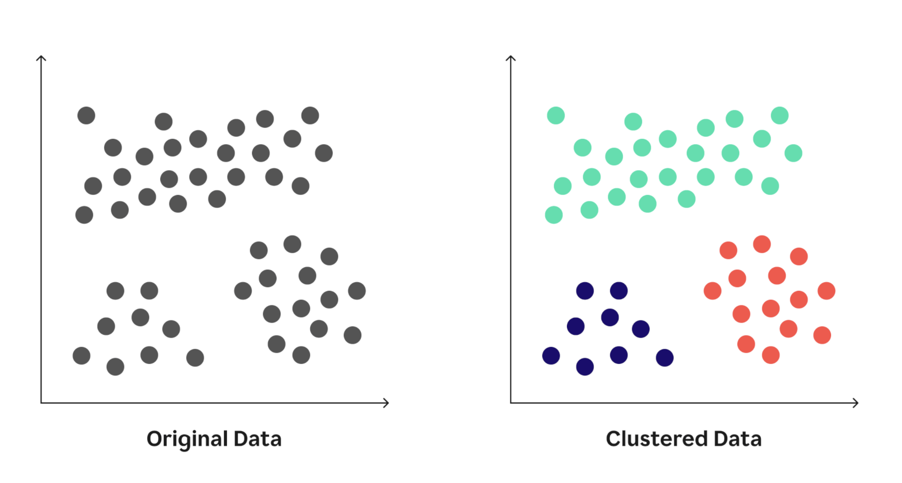
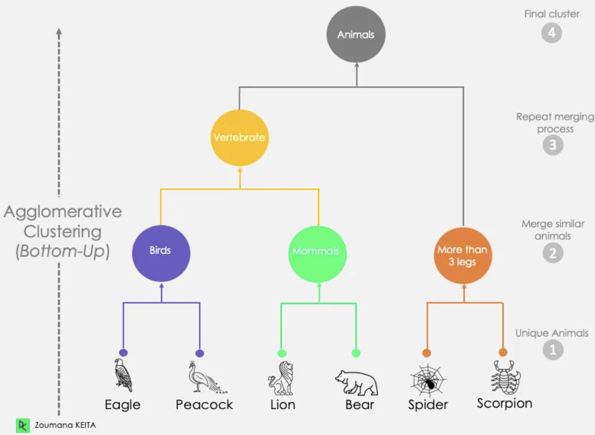

:::: {.columns}
::: {.column style="width:45%; font-size: 0.8em;"}

### Aprendizaje supervisado

- $y = f(x)$

- Entrenado con un conjunto de entrenamiento: 
    - $(x_1,y_1),(x_2,y_2),..., (x_n,y_n)$

- tal que $\hat y \approx y$

:::
::: {.column width="5%"}
<!-- empty column to create gap -->
:::
::: {.column style="width:45%; font-size: 0.8em;"}

### Aprendizaje no supervisado

- El conjunto de entrenamiento, solo tiene:
    - $x_1,x_2,...,x_n$

- No hay $y$ 

:::
::::

## Aprendizaje No Supervisado

- Encuentra patrones escondidos en los datos sin tener etiquetas o *respuestas correctas*.
- El modelo busca patrones o grupos por su cuenta.
- Sus algoritmos tienen como objetivo encontrar patrones y relaciones dentro de los datos sin ningún conocimiento a priori de lo que que significan los datos. 
- En estadística, esto se conoce como análisis multivariado

. . .

::: {.callout-tip}
### Ejemplo

Es como organizar una biblioteca sin saber las categorías, empiezas a agrupar libros por similitudes 📚

- ¿Qué caraterísticas utilizarías tú?

:::

##

---

### Tipos de problemas que aprendizaje no supervisado puede solucionar

:::: {.columns}
::: {.column style="width:45%; font-size: 0.8em;"}

**Agrupamiento** (clustering)

- Agrupar puntos de datos que tienen comportamiento similar
- *¿Qué grupos naturales existen en estos datos?*

**Reducción de dimensionalidad**

- Simplificar información mientras se mantiene la más importante
- *¿Cómo podemos representar estos datos complejos de una manera más simple?*

:::
::: {.column width="5%"}
<!-- empty column to create gap -->
:::
::: {.column style="width:45%; font-size: 0.8em;"}

**Detección de anomalías**

- Identificar puntos de datos inusuales o sospechosos
- *¿Qué no pertenece con lo que hace la mayoría?*

**Asociación**

- Encuentra relaciones entre diferentes variables
- *¿Qué cosas tienden a ocurrir juntas?*

:::
::::

## Casos de uso en política pública

- **Detección de fraude**: Identificar patrones inusuales en transacciones
  o en ejercicio del gasto público
- **Análisis geoespacial**: Detectar zonas de alta incidencia delictiva
  o puntos críticos de tráfico urbano
- **Categorización de documentos**: Agrupar solicitudes de transparencia o
  quejas ciudadanas en temas comunes.
- **Análisis de redes sociales**: Detección de comunidades o grupos
  de influencia en plataformas digitales
- **Segmentación territorial**: Agrupar municipios por patrones similares
  de indicadores sociales o de gasto público
- **Detección de anomalías**: Identificar registros que caen demasiado lejos
  de cualquier centroide legítimo (posible fraude o error de captura).

# Agrupamiento {background-color="#fdede8"}
- K-means
- Hierarchical clustering
- DBSCAN

## Agrupamiento

Proceso donde se particionan un conjunto de datos en subconjuntos, cada subconjunto es un grupo o un cluster. 

- Los datos en un mismo cluster "deben" ser similares entre sí
- Los datos de diferentes clusters deben ser diferentes entre sí. 

## K-Means

:::: {.columns}
::: {.column style="width:45%; font-size: 0.65em;"}

Agrupa los datos en K clusters donde cada punto pertenece al cluster con el centro más cercano (centroide)

1. **Elección de K**: Define el número de cluster que quieres descubrir
2. **Inicialización de centroides**: los colocas de manera aleatoria
3. **Asignación de puntos**: calculas las distancia de cada punto al centroide más cercano.
4. **Actualizas los centroides**: Mueves cada centroide al promedio de todos los puntos asignados a su cluster, lo que **minimiza** la inercia (suma de **distancias** al cuadrado) dentro del cluster.
5. **Repites hasta la convergencia**: el algoritmo se detiene cuando los centroides ya no cambian de posición entre una iteración y la siguiente 

:::
::: {.column width="5%"}
<!-- empty column to create gap -->
:::
::: {.column style="width:45%; font-size: 0.8em;"}

:::
::::

## K-Means

### Encontrando la K Óptima

:::: {.columns}
::: {.column style="width:45%; font-size: 0.65em;"}

Como el algoritmo requiere que definas K manualmente, existen técnicas matemáticas de apoyo:

- **Método del Codo (_Elbow Method_)**: Grafica la inercia (WCSS) contra diferentes k. Minimiza la distancia intra-cluster. Seleccionas donde la tasa de cambio decrece bruscamente. 
- **Coeficiente de Silueta (_Silhouette Coefficient_)**: Mide qué similiar es un punto de datos respecto a su propio cluster comparado con los otros. Balancea cohesión y separación. Seleccionas la k con mayor valor. 

:::
::: {.column width="5%"}
<!-- empty column to create gap -->
:::
::: {.column style="width:45%; font-size: 0.8em;"}

:::
::::

---

## K-Means
### Consideraciones Prácticas

:::: {.columns}
::: {.column style="width:100%; font-size: 0.9em;"}

#### Ventajas

- **Escalable** Su complejidad computacional es lineal, lo que lo hace rápido incluso con grandes volúmenes de datos.
- Fácil de implementar y de comunicar a tomadores de decisiones.

#### Limitaciones

- **Trampa de la inicialización aleatoria**: Centroides iniciales mal ubicados
  pueden llevar a soluciones subóptimas. 
- **Sensible a valores atípicos**: Los _outliers_ sesgan la media y jalan el
  centroide lejos del centro real del cluster.
- **Asume formas esféricas**: Tiene dificultades con geometrías complejas,
  anillos entrelazados o clusters alargados.

:::
::::

## Clustering Jerárquico

Crea una **jerarquía de clusters en forma de árbol**, mostrando relaciones
a diferentes niveles de granularidad.

- Como un árbol genealógico: primero agrupas hermanos, luego primos, luego ramas enteras de la familia, cada nivel revela una escala diferente de similitud.

### Tipos

- **Aglomerativo (bottom-up)**: Empieza con cada punto como su propio cluster y va fusionando los más cercanos. Es el más común en la práctica.
- **Divisivo (top-down)**: Empieza con todos los puntos en un solo cluster y los va dividiendo recursivamente.

---

## Clustering Jerárquico
### Aglomerativo

:::: {.columns}
::: {.column style="width:45%; font-size: 0.8em;"}

1. **Inicio**: Cada punto es su propio cluster
2. **Fusión**: Une los dos clusters más cercanos
3. **Repite**: Continúa hasta que todos los puntos forman un solo cluster
4. **Visualización**: El resultado es un **dendrograma**
    - un diagrama de árbol que muestra el historial de fusiones y permite elegir
   el nivel de corte (número de clusters) después del hecho

:::
::: {.column width="5%"}
<!-- empty column to create gap -->
:::
::: {.column style="width:45%; font-size: 0.8em;"}

:::
::::

## Clustering Jerárquico

### Dendograma

](img/dendo.png)

## Clustering Jerárquico

#### **Ventajas**

- No requiere especificar K antes de correr el algoritmo
- Produce un dendrograma que permite explorar la estructura a diferentes niveles
- Funciona bien con datasets pequeños y medianos
- Admite diferentes métricas de distancia (Euclidiana, Manhattan, etc.)

#### **Desventajas**

- Lento para datasets grandes
- Sensible a datos ruidosos y valores atípicos
- Las fusiones son irreversibles: una vez asignados los clusters,
  no hay reasignaciones (a diferencia de K-Means)

## DBSCAN
### *Density-Based Spatial Clustering of Applications with Noise*

Agrupa puntos densamente concentrados y marca los puntos en regiones
de baja densidad como valores atípicos (outliers).

- Ejemplo: las zonas residenciales densas forman colonias (clusters), y las casas aisladas en zonas rurales son outliers. 

- Los clusters emergen naturalmente de la densidad, sin necesidad de definir K de antemano.

---

## DBSCAN

#### Ventajas

- Determina automáticamente el número de clusters
- Detecta clusters de forma arbitraria (no solo esféricos)
- Robusto ante outliers, los identifica explícitamente

#### Limitaciones

- Elegir mal sus parámetros cambia
  drásticamente los resultados y no existe un método tan claro 
  para calibrarlos
- Dificultad cuando los clusters tienen densidades muy distintas entre sí
- Mal desempeño en dimensiones altas: la maldición de la
  dimensionalidad degrada el concepto de distancia y los vecinos
  dejan de ser informativos

## ¿Cuándo usar cada algoritmo?

| Situación | Recomendado |
|---|---|
| No sabes cuántos clusters hay y el dataset es pequeño | Jerárquico |
| Sabes cuántos clusters hay y el dataset es grande | K-Means |
| Hay outliers que quieres detectar explícitamente | DBSCAN |
| Los clusters tienen formas irregulares | DBSCAN |
| Necesitas comunicar resultados a tomadores de decisiones | K-Means o Jerárquico |
| Dataset muy grande con clusters compactos | K-Means |

# Reducción de dimensionalidad {background-color="#fdede8"}

- Reduce el número de dimensiones en los datos **preservando la información
más importante**.

---

## PCA

### Principal Component Analysis

Es una técnica de reducción de dimensionalidad lineal: 

- Se usa para explorar los datos, visualización, y preprocesamiento. 
- Los datos se transforman linealmente en un nuevo sistema de coordenadas tal que las direcciones (componentes principales) capturan la **variación más grande** 

- Los componentes son combinaciones lineales de las variables originales, no las variables mismas.

## PCA

### ¿cómo funciona?

1. **Estandariza los datos**: media = 0, desviación estándar = 1
2. **Calcula la matriz de covarianza**: cómo se relacionan las variables
   entre sí
3. **Encuentra eigenvectores y eigenvalores**: direcciones de máxima
   varianza en los datos
4. **Ordena por eigenvalor**: las direcciones más importantes primero
5. **Selecciona los componentes principales**: conserva solo las
   dimensiones más informativas

:::{.notes}

- **Primer Componente Principal**: dirección con la mayor varianza
  en los datos
- **Segundo Componente Principal**: dirección con la segunda mayor
  varianza, perpendicular al primero
- Cada componente siguiente captura la varianza restante, también
  perpendicular a los anteriores

:::

---

## PCA

### ¿Cuántos componentes conservar?

Igual que K-Means usa el método del codo, PCA usa una curva de
**varianza explicada acumulada**:

- Grafica el porcentaje de varianza explicada por cada componente
- Selecciona el punto donde agregar más componentes ya no aporta
  mucho (mismo principio del codo)
- Regla práctica: conservar componentes que expliquen **80-95%**
  de la varianza total

---

## PCA

#### **Ventajas**

- Reduce ruido eliminando dimensiones poco informativas
- Acelera algoritmos posteriores (como K-Means o modelos supervisados)
- Permite visualizar datos de alta dimensionalidad en 2D o 3D

#### **Limitaciones**

- Los componentes principales no son interpretables directamente
  — son combinaciones de variables originales
- Asume relaciones **lineales** entre variables
- Sensible a escala: requiere estandarización previa obligatoria

---

## Casos de Uso en Política Pública

- **Índices compuestos**: reducir decenas de indicadores sociales
  a unos pocos componentes para construir rankings municipales
- **Preprocesamiento**: reducir dimensionalidad antes de aplicar
  K-Means o modelos supervisados sobre datos administrativos
- **Visualización exploratoria**: proyectar solicitudes de
  transparencia o registros de gasto en 2D para detectar patrones

