## Natural Language Processing
### NLP

- Si las computadores solo pueden procesar datos binarios (0 y 1), ¿cómo hacemos que puedan representar y procesar el lenguaje humano?
- El lenguaje natural es la principal forma de comunicarnos entre los seres humanos.

> Área de las ciencias computacionales que desarrolla métodos para analizar, modelar y entender el lenguaje humano. [@vajjala2020practical]


## Introducción a NLP

1. Preprocesamiento de texto
3. Modelos básicos
4. Embeddings
5. Ejemplos 

# Preprocesamiento de texto {background-color="#fdede8"}

- Limpieza
- Normalización
- Preprocesamiento (variaciones)

## Limpieza
### Quita ruido y errores evidentes del texto

Elimina cosas que claramento no aportan significado lingüístico útil para etapas posteriores.

- Eliminar caracteres raros
- Quitar emojis (si así se requiere)
- Quitar duplicados de espacios
- Quitar saltos de línea innecesarios
- Eliminar registros vacíos o corruptos
- Corregir codificación (UTF-8, acentos rotos)


## Normalización de texto

Reduce **variaciones superficiales** del texto sin alterar su significado esencial. Transforma el texto para reducir variabilidad innecesaria.


- pasar a minúsculas
- quitar signos de puntuación
- normalizar acentos, números o variantes de palabras
- Ejemplo: 

		 "Árboles, niños y fútbol" → "arboles ninos y futbol"


::: {.callout-warning}
- Normalizar puede borrar información relevante
:::


## Preprocesamiento 

- El preprocesamiento **transforma texto crudo** en una representación
más manejable para análisis computacional.

- No existe un preprocesamiento “correcto” universal:
	- depende del idioma, del dominio y del objetivo analítico.

- Precedente para determinar qué es señal y qué es ruido en el texto.


## Stopwords

Son palabras muy frecuentes en un idioma que, en ciertos contextos, aportan poco contenido semántico por sí mismas.

- Ejemplos en español:
	- artículos: *el, la, los, las*
	- preposiciones: *de, con, sin*
	- pronombres: *él, ella, nosotros*

- Si no las controlas dominan frecuencias y pueden sesgar modelos

:::{.notes} 
a acá ahí al algo algún/a/o/s allá/í ambos ante antes aquel aquella/o/s aquí arriba así atrás aun aunque bien cada casi como con cual cuales cualquier/a/s cuan cuando cuanto/a/s de del demás desde donde dos el él ella/o/s en eres esa/e/o/s esta/s este/o/s etc ha hasta la/o/s me mi/s mía/s mientras muy ni nosotras/ nosotros nuestra/ nuestro/ nuestras / nuestros os otra/o/s para pero pues que qué si sí siempre siendo sin sino so sobre sr sra sres sta su/s te tu tus un/a/o/s usted/ ustedes vosotras/ vosotros vuestra/ vuestro/ vuestras / vuestros y ya yo

Ejemplos donde importan:
- análisis de estilo
- análisis legal
- modelos de lenguaje
- embeddings modernos
:::


## Tokenización


- Proceso de dividir el texto en unidades más pequeñas llamadas *tokens*.

- Es uno de los pasos más importantes del preprocesamiento,
porque define **qué es una unidad de análisis**.

- Tokens pueden ser:
	- palabras
	- subpalabras
	- caracteres
	- oraciones


- ¿Cuáles son los tokens en la siguiente oración?
    - Ayer pagué $12,543.25 por una televisión, me pareció barata. Hoy voy a estrenarla viendo el béisbol.


## Preprocesamiento
### Ejemplo

| Etapa              | Resultado                                      |
|--------------------|-----------------------------------------------|
| Original           | `"¡¡¡El camión llegóoo a las 10:30pm!!! 🚛🚛"` |
| Limpieza           | `"El camión llegóoo a las 10:30pm"`            |
| Normalización      | `"el camion llego a las 10 30 pm"`             |
| Preprocesamiento   | `["camion", "llegar", "10", "30", "pm"]`       |


- Una vez que ya hice un preprocesamiento, ¿qué se hace?
    - Exploración de texto: Tamaño del corpus, longitud de texto, tamaño y frecuencia de vocabulario 


# Modelos básicos {background-color="#fdede8"}

- ¿Cómo la computadora puede leer el lenguaje? 
    - BoW
    - TF-IDF

## Bags of Words (BoW)

- Representa un texto como una colección de palabras.


### Ejemplo

- Original
```
documents = ["Perro muerde persona.", # D1
             "Persona muerde perro.", # D2
			 "Perro come carne.",     # D3
			 "Persona come comida."]  # D4
```

- Corpus limpio


```
['perro muerde persona',
 'persona muerde perro',
 'perro come carne',
 'persona come comida']
```

- Vocabulario

```
{'perro': 4, 'muerde': 3, 'persona': 5, 'come': 1, 'carne': 0, 'comida': 2}
```

## Bags of Words (BoW)

### Ejemplo


- Representación BoW


| Doc | Texto preprocesado    | carne | come | comida | muerde | perro | persona |
| --- | --------------------- | ----- | ---- | ------ | ------ | ----- | ------- |
| D1  | perro muerde persona  | 0     | 0    | 0      | 1      | 1     | 1       |
| D2  | persona muerde perro  | 0     | 0    | 0      | 1      | 1     | 1       |
| D3  | perro come carne      | 1     | 1    | 0      | 0      | 1     | 0       |

## TF-IDF
###  Term Frequency–Inverse Document Frequency


:::: {.columns}
::: {.column style="width:100%; font-size: 0.8em;"}


- Expresa cuán relevante es una palabra para una colección de documentos, y basa su cuantificación en la frecuencia de ocurrencia de esa misma palabra.
    - Las palabras muy comunes suelen tener un peso bajo o incluso de 0.
    - Las palabras más raras o distintivas tienen un peso más alto, ya que ayudan mejor a diferenciar los documentos.


| Documento               | afuera | carne | come | duerme |  el | gato | juega | mucho | perro | pescado |
| ----------------------- | :----: | :---: | :--: | :----: | :-: | :--: | :---: | :---: | :---: | :-----: |
| "El gato come pescado"  |    0   |   0   | 0.17 |    0   |  0  | 0.17 |   0   |   0   |   0   |   0.34  |
| "El perro come carne"   |    0   |  0.34 | 0.17 |    0   |  0  |   0  |   0   |   0   |  0.17 |    0    |
| "El gato duerme mucho"  |    0   |   0   |   0  |  0.34  |  0  | 0.17 |   0   |  0.50 |   0   |    0    |
| "El perro juega afuera" |  0.34  |   0   |   0  |    0   |  0  |   0  |  0.50 |   0   |  0.17 |    0    |

:::
::::


:::{.notes}
It's a commonly used representation
scheme for information-retrieval systems, for extracting relevant documents from a
corpus for a given text query.
:::

## TF-IDF
### Idea:
- Si una palabra aparece varias veces en un documento pero no ocurre frecuentemente en la colección de documentos, entonces la palabra debe ser de gran importancia en el documento.
    - La importancia de la palabra incrementa conforme su frecuencia en el documento.
    - Pero si esa misma palabra es frecuente en la colección de documentos, reduce su relevancia.

### Características

- Cada dimensión es una palabra del vocabulario
- No entiende significado, solo **frecuencia y rareza**


# Embeddings {background-color="#fdede8"}


¿Cómo describirían la palabra **Olímpicos** con solo números?

- Problema de medición

---

### Medición de características

- Score: 38/100 

::: {.columns}

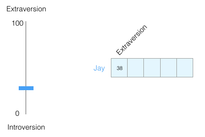

<small>

Tomado de @alammar2019illustrated

</small>

:::

---

### Medición de características

- Lo ponemos en un rango de -1 a 1

::: {.columns}

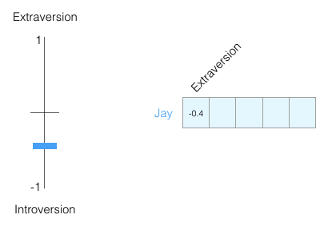

:::

---

### Medición de características

- Agregamos información (otra dimensión)
- Representamos los scores como un vector desde el origen a ese punto de coincidencia

::: {.columns}

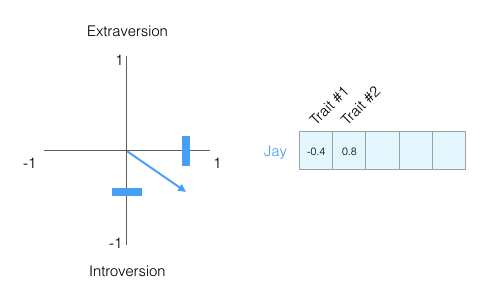


:::

---

### Medición de características

- Puedo agregar información de otras personas

::: {.columns}

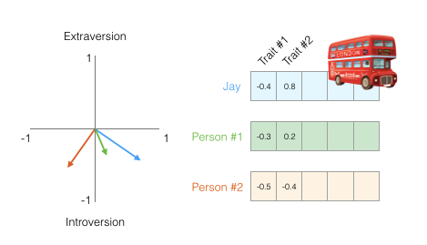

:::

---

### Medición de características

- Quiero buscar alguien similar a Jay 

::: {.columns}

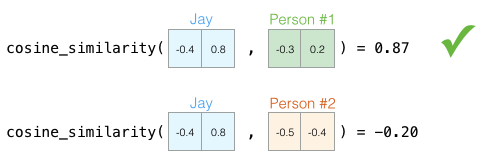

<small>

Tomado de @alammar2019illustrated

</small>


:::

---

### Medición de características

- Pero necesito más información 

::: {.columns}

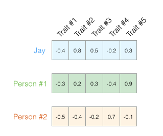

:::

---

### Medición de características

- Ya no es tan sencillo ver las flechas en dos dimensiones. 
- En ML trabajamos con espacios de muchas dimensiones 
	- pero podemos seguir viendo que tanto se parecen los vectores entre sí

::: {.columns}

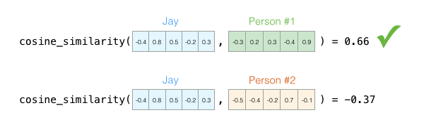

:::


---

### Medición de características

- Podemos representar cosas (palabras) como vectores
- Podemos ver qué tan similares son los vectores entre ellos. 

::: {.columns}

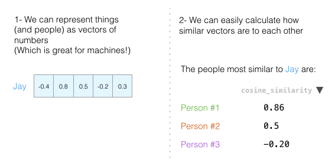

:::


---

### Embedding

Representación vectorial de una palabra, frase o documento.

::: {.columns}

- Es decir, la palabra la podemos representar con diferentes dimensiones, por ejemplo, la palabra **king** con: 


```
[ 0.50451 , 0.68607 , -0.59517 , -0.022801, ..., -2.223 , -1.0756 , -1.0783 , -0.34354 , 0.33505 , ... , -0.25663 , -0.8523 , 0.1661 , 0.40102 , 1.1685 , -1.0137 , -0.21585 , -0.15155 , 0.78321 , -0.91241 , -1.6106 , -0.64426 , -0.51042 ]
```

- Si lo graficamos:


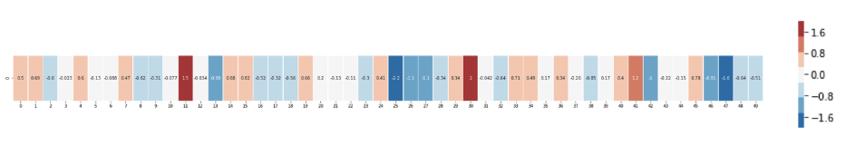

<small>

Tomado de @alammar2019illustrated

</small>


:::


:::{.notes}

Una matriz densa es una matriz donde la mayoría o casi todos sus elementos tienen valores distintos de cero.

:::

---

### Embeddings

- Comparemos ahora **king** con otras palabras 
- ¿Qué observas?

::: {.columns}

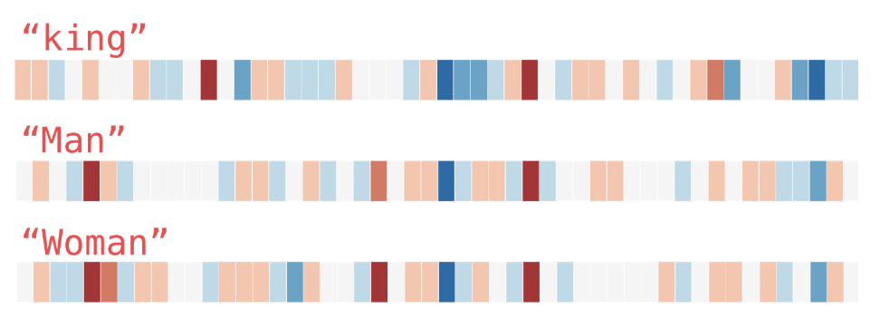

:::

---

### Embeddings

- Estas representaciones vectoriales capturan un poco de información/significado/asociación de estas palabras 

::: {.columns}

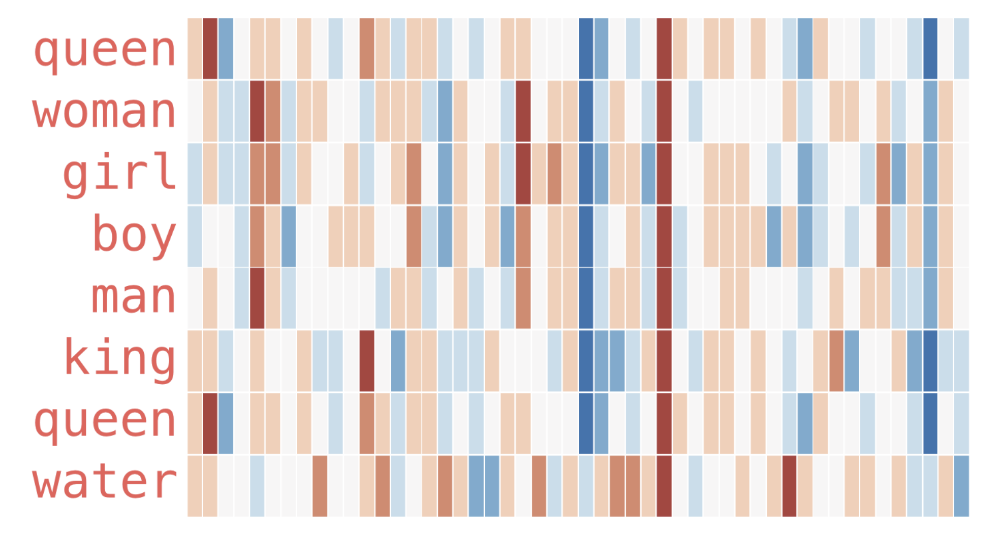

:::


---

### Embeddings

- Si hacemos operaciones con los vectores:

::: {.columns}

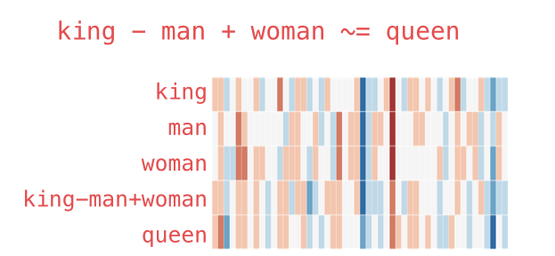

:::

## Word embeddings


- **Vectores densos** que representan palabras, frases o documentos
- Capturan **similitud semántica** en un espacio multidimensional
- Las dimensiones dependen del modelo
	- típicamente 100-768 dimensiones
- Palabras con significados similares → vectores cercanos en el espacio

::: {.callout-note}
**Vector Space Model (VSM)**: Modelo matemático que representa unidades de texto como vectores. 
:::

:::{.notes}

- Para trabajar con cadenas de texto, el texto debe de convertirse en una forma matemática.
- Modelo algebráico simple que representa cualquier unidad de texto. 
- Se usa para:
	- Information retrival
	- Scoring de documentos
	- Clasificción
	- Document clustering

:::

## Similitud del coseno

- La manera más común de ver qué tan similares son vectores
- Es el coseno del ángulo entre sus vectores correspondientes
- También se utiliza la distancia Euclideana entre vectores para captar similitud


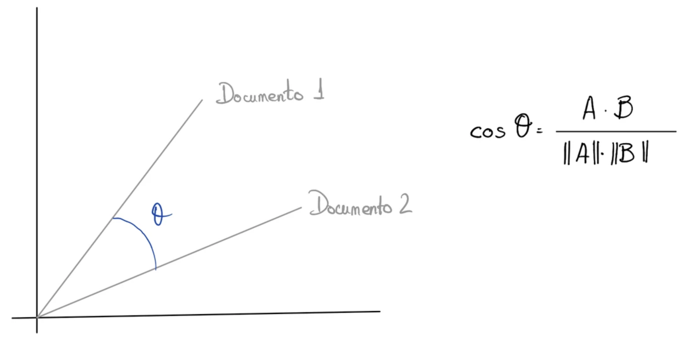

## Similitud del coseno

### Mide el ángulo entre dos vectores:

$$\cos(\theta) = \frac{\mathbf{a} \cdot \mathbf{b}}{\|\mathbf{a}\| \|\mathbf{b}\|} = \frac{\sum_{i=1}^{n} a_i b_i}{\sqrt{\sum_{i=1}^{n} a_i^2} \cdot \sqrt{\sum_{i=1}^{n} b_i^2}}$$

Donde:

- $\mathbf{a} \cdot \mathbf{b}$ es el producto punto entre los dos vectores
- $\|\mathbf{a}\|$ y $\|\mathbf{b}\|$ son las normas (magnitudes) de cada vector
- El resultado está siempre entre $-1$ y $1$
	- **1**: Vectores idénticos (muy similares)
	- **0**: Vectores ortogonales (sin relación)
	- **-1**: Vectores opuestos

## Modelos clásicos de embeddings


Una representación por palabra:

- **Word2Vec** (2013): Skip-gram y CBOW, diseñado por Google
- **GloVe** (2014): Basado en co-ocurrencias globales
- **FastText** (2017): Considera sub-palabras


# Tareas {background-color="#fdede8"}


## Corrección de spelling

- Detectar errores ortográficos
- Propone una o más correcciones plausibles
- Puedes crear diccionarios manuales o implementaciones con similitud
- Traducción si viene en varios idiomas**

### Ejemplo: 

```
“sentensia” → “sentencia”
“Juam Pérez” → “Juan Pérez”
```


::: {.callout-warning}
Corregir la ortografía no es entender significado
:::


## Named Entity Recognition (NER)

- Proceso de identificar y clasificar fragmentos de texto que representan entidades del mundo real.
- Se asigna un rol semántico o extracción de entidades como: 
	- PERSON
	- ORGANIZATION
	- LOCATION / GPE
	- DATE
	- MONEY
	- LAW / CASE (en dominio legal)
- Más adelante veremos cómo funciona


## Named Entity Recognition (NER)

### Ejemplo

```
“El juez Julián Pérez dictó sentencia en la Ciudad de México”
```

- Salida NER:
	- Julián Pérez → PERSON
	- Ciudad de México → LOCATION

### Se usa para:


- análisis de actores
- gráficos (personas–organizaciones)
- deduplicación
- búsquedas avanzadas
- análisis temporal


## Clasificación de texto


La categorización de texto consiste en asignar una o más etiquetas a un documento
a partir de su contenido.

- Se utilizan los algoritmos como Naive Bayes, Regresión logística, etc. 

### Tipos de clasificación supervisada:

- **Binaria**: Dos clases posibles (*ser o no ser*)
- **Multiclase**: Más de dos clases mutuamente excluyentes (positivo / neutral / negativo)
- **Multi-etiqueta**: Un documento puede pertenecer a varias clases simultáneamente. 
	- "Derecho penal" + "Corrupción" + "Procedimiento"


## Clasificación de texto

### Consideraciones

:::: {.columns}

::: {.column style="width:45%; font-size:0.7em;"}

**¿Por qué suele funcionar bien?**

- Muchos temas utilizan vocabulario distintivo:

  - Derecho: `juez, corte, evidencia`
  - Puertos: `contenedor, terminal, patio`

- TF-IDF reduce el peso de palabras comunes y resalta términos informativos.

- En muchos casos bastan pocos datos etiquetados para aprender una frontera de decisión útil.

:::

::: {.column width="5%"}
:::

::: {.column style="width:45%; font-size:0.7em;"}

**¿Qué hace difícil la clasificación de texto?**

- Alta dimensionalidad del espacio de palabras
- Vocabulario grande y disperso
- Clases desbalanceadas
- Ambigüedad semántica: una palabra puede tener varios significados
- Dependencia del dominio: el lenguaje cambia entre contextos

:::

::::

:::{.notes}

TF-IDF reduce ruido porque:
- baja peso a palabras comunes
- sube palabras discriminativas.
- (`n_col=vocab`)

- En NLP, muchas veces el éxito no viene del modelo, sino de cómo el lenguaje organiza naturalmente los datos.

:::


## Topic Modeling

Conjunto de métodos no supervisados cuyo objetivo es:

- Descubrir los **temas latentes** en un corpus
- Explicar la co-ocurrencia de palabras mediante *variables ocultas*
- Identifica las palabras con mayor probabilidad dentro de cada tópico
	- Identifica los temas principales	con una mezcla palabras clave
	- Interpreta una estructura temática emergente

## Topic Modeling

### Aplicaciones

- Explorar grandes colecciones de texto
- Organizar documentos por temática
- Identificar patrones discursivos
- Preprocesamiento para tareas supervisadas
- Análisis exploratorio en investigación social


## Topic Modeling
### Interpretación de un tópico

- Un tópico no es una etiqueta explícita.
- Es un conjunto de palabras con alta probabilidad conjunta. Ejemplo:
	- Tópico 1: `police, suspect, arrest, investigation`
	- Tópico 2:  `container, terminal, yard, vessel`


::: {.callout-warning}
- Supone modelo Bag-of-Words (ignora orden)
- Número de tópicos debe fijarse previamente
- Los tópicos no son "verdades", son construcciones estadísticas
- Sensible al preprocesamiento
- Puede generar tópicos difíciles de interpretar
:::


## Clustering de documentos

- Agrupar documentos similares (por proximidad geométrica).
	- Basado en medidas de similitud (coseno, distancia euclídea).


---

### Clustering vs Topic Modeling vs t-SNE

Clustering:

- Agrupa (por distancia) documentos similares.
- ¿Qué documentos están cerca entres sí?

Topic Modeling:

- Descubre temas latentes 
- ¿Qué temas explican la co-ocurrencia de palabras?

t-SNE:

- Visualiza datos de alta dimensión en 2D/3D.
- ¿Cómo puedo visualizar la estructura de alta dimensión?

---

### Clustering vs Topic Modeling vs t-SNE

- Imagina 1000 documentos.
	- Clustering: te dice que hay 5 grupos.
	- Topic Modeling: te dice que existen 5 temas con ciertas palabras.
	- t-SNE: te dibuja los 1000 documentos en 2D.

-

::: {.callout-warning}
t-SNE no es un método de modelado solo transforma de $\mathbb{R}^{300} \rightarrow \mathbb{R}^{2}$
:::


# Ejemplo 1 {background-color="#fdede8"}

- Clasificación del delito 

## Clasificación del delito
### Contexto

- Artículo: *Text mining and machine learning for crime classification: using unstructured narrative court documents in police academic*
	- @bifari2024text

Objetivo: Desarrollar un sistema automático de clasificación de delitos utilizando:

- Documentos narrativos judiciales
- Texto no estructurado
- Casos etiquetados por tipo de delito


## Clasificación del delito

Se construye un modelo de Machine Learning en dos fases.

- Modelo 1: *Crime Scene Existence* (CSE)
	- Determina si el documento contiene información sobre la escena del crimen.
	- Es una clasificación binaria (sí / no).

- Modelo 2: *Crime Type* (CT)
	- Determina el tipo de delito cometido según el contexto del texto.
	- Es una clasificación multiclase.

Ambos modelos utilizan vectores TF-IDF como representación del texto.

:::{.notes}
- Entrenan clasificadores supervisados con sus respectivas etiquetas.

Para el modelo CT:

- Solo se utilizan los documentos que fueron clasificados como positivos por el modelo CSE.
:::


## Pipeline

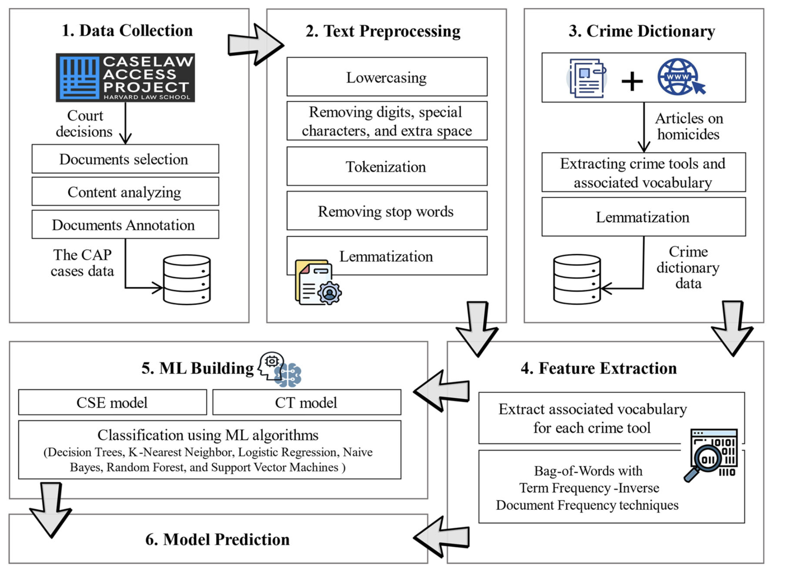

## Resultados


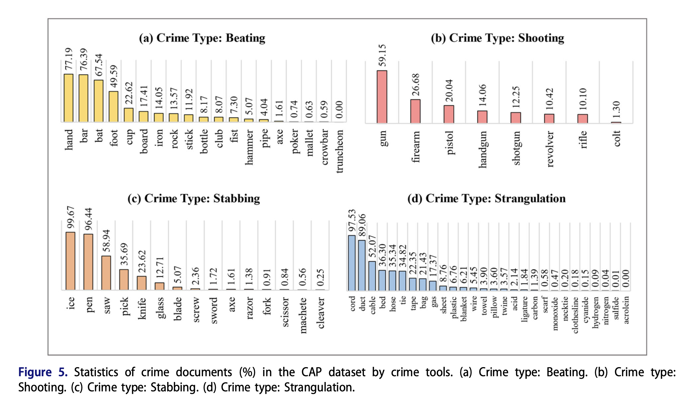

## Resultados


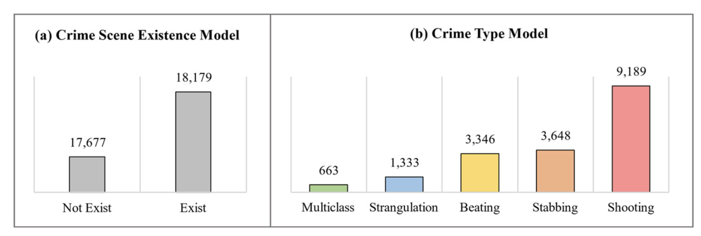

# Ejemplo 2 {background-color="#fdede8"}


- Buscadores de empleo


## Modelo de recomendaciones de ofertas para buscadores de trabajo
### Servicio Nacional del Empleo

- Su portal permite:
	- a las personas que están en busca de empleo registrar su perfil o competencias laborales, 
	- y que las empresas puedan registrar sus ofertas de empleo.


## Modelo de recomendaciones de ofertas para buscadores de trabajo
### Objetivos
- Generar **recomendaciones** de vacantes y de personas tanto a buscadores de trabajo como a empresas de acuerdo a sus intereses. 
- Asignar puntajes a la afinidad entre cada recomendación y cada usuario del sistema. 


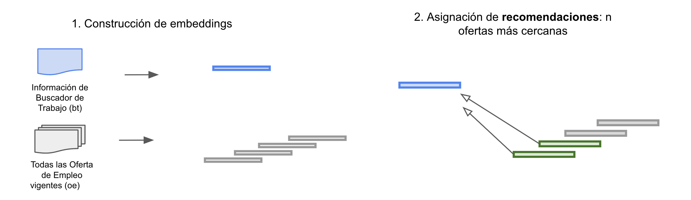

## Implementación

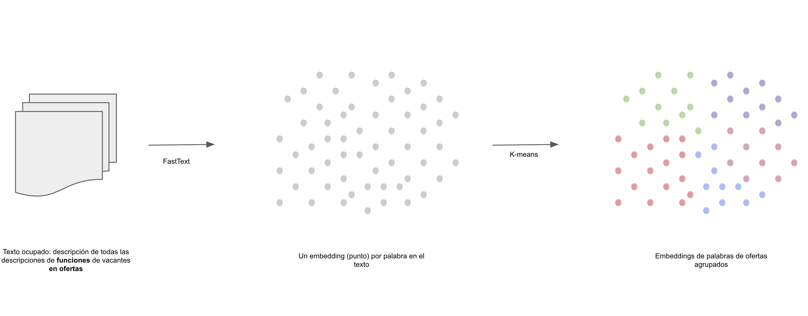

## Implementación

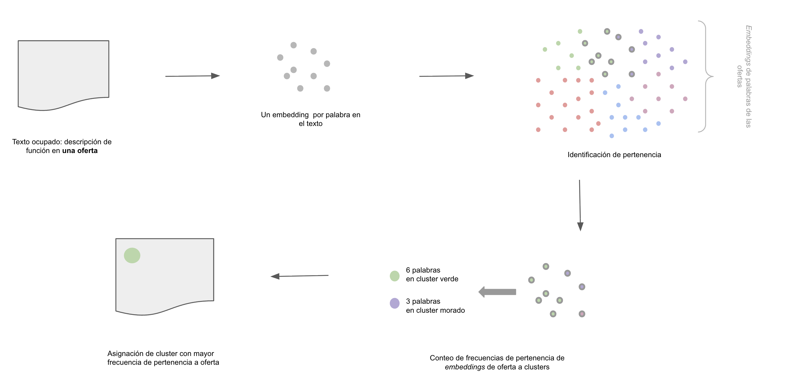

## Implementación

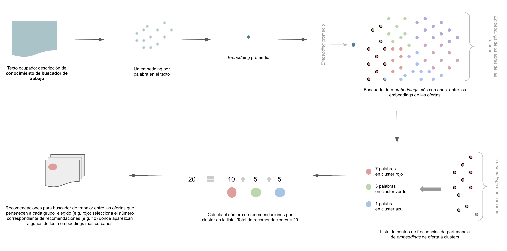

## Implementación

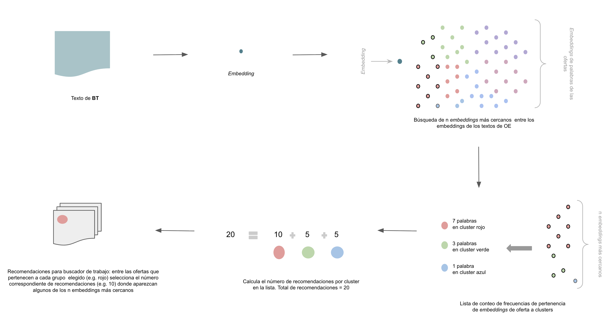

# Ejemplo 3 {background-color="#fdede8"}

- Clasificación de la mercancía

## Contexto

- Campo de texto que se utiliza de manera libre de parte de los usuarios para describir mercancía
- Descripción explícita o utilizando un código que se basa en un catálogo internacional de aránceles
- Se utilizó por la relevancia al proyecto

## Preprocesamiento

### Paso 1

:::: {.columns}
::: {.column style="width:30%; font-size: 0.8em;"}

- Se encontraron varios idiomas
- Se hizo traducción de palabras en español más repetidas, ej: papel, madera, aluminio, máquina, sales, etc.
- Se quita la repetición de palabras como azzzulejo, por azulejo. 

:::
::: {.column width="5%"}
<!-- empty column to create gap -->
:::
::: {.column style="width:60%; font-size: 0.6em;"}


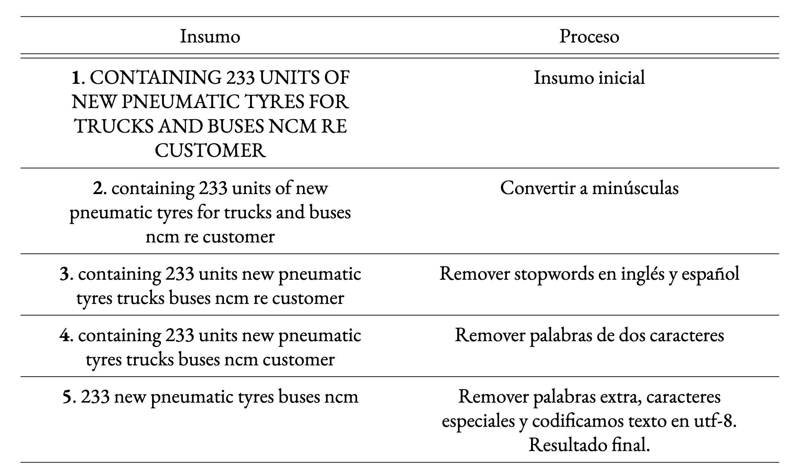

:::
::::


## Catálogo HS


:::: {.columns}
::: {.column style="width:30%; font-size: 0.7em;"}

### Paso 2

- Se emplea para clasificar productos comerciales
- Es utilizado internacionalmente
	- 21 secciones
	- 97 capítulos


- Se hace la búsqueda de los códigos armónicos buscando la palabra code y los siguientes dos dígitos:
	- ej. `graphite l hs code 8249965 etc saskia`
- Solo el 25% tenía esta clasificación


:::
::: {.column width="5%"}
<!-- empty column to create gap -->
:::
::: {.column style="width:60%; font-size: 0.6em;"}

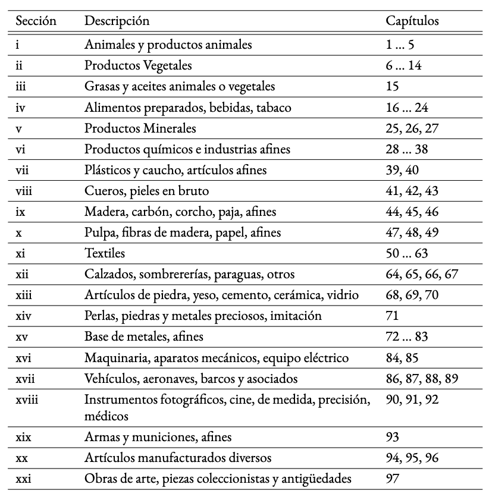

:::
::::


---

## Proceso de clasificación de la mercancía (75%)
### Paso 3


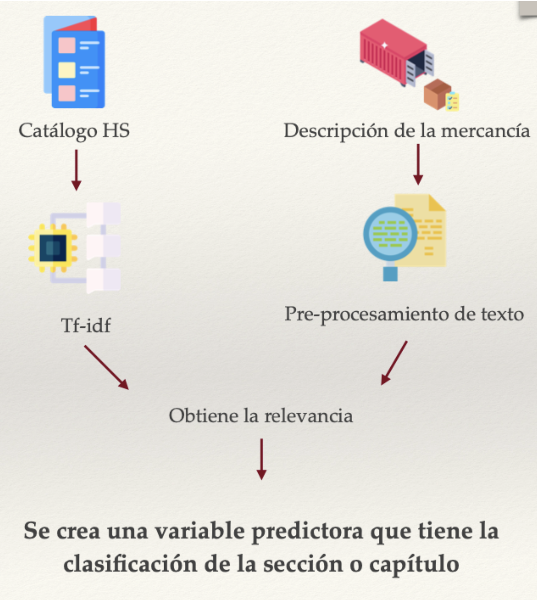

## Aprendizaje por Refuerzo

El modelo aprende **tomando decisiones en un entorno**, recibiendo recompensas cuando acierta y penalizaciones cuando se equivoca.

> Así aprenden los niños a caminar: prueban, se caen (penalización) y ajustan hasta lograrlo (recompensa).

Ejemplos:

- Estrategias de atención al cliente
- Asignación de líneas de crédito
- Robots que aprenden a moverse


## Referencias
