# Responsabilidad ética {background-color="#fdede8"}

## Sabemos que los datos pueden mejorar la sociedad... pero no de forma automática

Las herramientas de ciencia de datos han transformado la forma en que los gobiernos toman decisiones: desde asignar recursos hasta detectar fraude o focalizar programas sociales.

Pero esta capacidad no viene sola: viene acompañada de preguntas que **no tienen respuesta técnica**.

> Debemos estar de acuerdo con no tener todas las respuestas, pero sí con plantear más preguntas que puedan ser informadas empíricamente.

## Nuestras políticas reflejan nuestros valores

- Las cuestiones éticas **siempre** han existido en la toma de decisiones públicas.
- Antes de construir cualquier modelo, debemos hacer explícitas las preguntas de valor que subyacen al diseño:
    - ¿Qué entendemos por **equidad**?
    - ¿Está bien discriminar positivamente a un grupo para alcanzarla?
    - ¿Tiene más peso el derecho a la privacidad que el derecho a la salud o a la seguridad?

**No existe una única respuesta correcta. Por eso debemos incluir las perspectivas de todos los grupos afectados en el proceso de diseño.**

## Preguntas que debemos hacernos

Antes de iniciar cualquier proyecto de datos con impacto en personas, conviene hacerse estas preguntas [@fosterBigDataSocial2021]:

- ¿Estás utilizando los datos para los fines para los que fueron recopilados?
- ¿Cómo estás protegiendo los datos?
- ¿Las personas que "poseen" los datos saben que los estás utilizando?
- ¿Tienes su consentimiento? ¿Cómo fue obtenido?
- ¿Las personas afectadas saben por qué están siendo intervenidas?
- ¿Qué recursos tienen para impugnar una decisión?
- ¿La noticia de lo que haces sería un escándalo en la portada del NYT?

::: {.notes}
Esta última pregunta —el "test del NYT"— es una heurística práctica para evaluar si una decisión resistiría el escrutinio público. No es un sustituto del análisis ético, pero es un buen punto de partida para detectar problemas evidentes.
:::

## El mapa de problemas éticos en IA

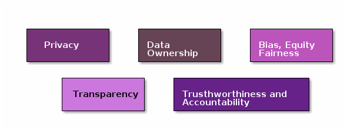

## Privacidad

La privacidad no es un estado binario (datos públicos vs. datos secretos). Es un **espectro de niveles de control** que va desde qué se recopila hasta qué se puede inferir [@fosterBigDataSocial2021].

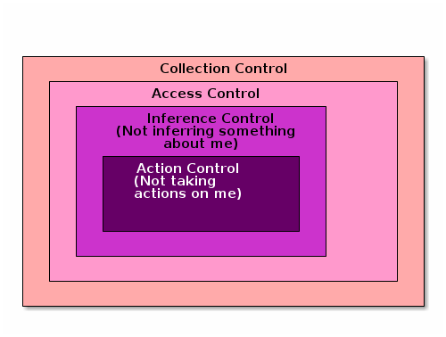

::: {.notes}
- **(No recopilar mis datos)**: el nivel más fuerte de protección.
- **(No dar acceso a mis datos)**: control de acceso una vez que los datos existen.
- **(No inferir algo sobre mí)**: el nivel más difícil de proteger: incluso datos "no sensibles" pueden combinarse para revelar información íntima.

A medida que descendemos en estos niveles, los controles deben ser más estrictos, porque el daño potencial es mayor y más difícil de detectar.
:::

## Transparencia

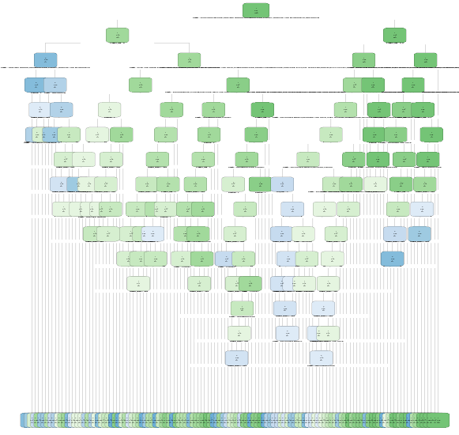

## ¿Qué se necesita para que un análisis sea realmente transparente?

Responder preguntas en múltiples niveles:

- **El proceso**: ¿qué hace el pipeline? 
- **El control**: ¿quién diseñó el proceso y quién puede modificarlo?
- **Los datos**: ¿qué datos se usaron? ¿Con qué limitaciones?
- **El objetivo**: ¿qué se le pidió estimar al modelo?
- **El desempeño**: ¿qué tan bien cumplió su objetivo?
- **El impacto**: ¿cómo afectó a distintos grupos de personas?

La falta de transparencia en cualquiera de estos niveles **es un riesgo ético**, no solo técnico.

# Sesgo, justicia y equidad {background-color="#fdede8"}

## El sesgo puede filtrarse en cada paso del pipeline

Desde la definición del problema hasta la implementación, cada decisión de diseño es una oportunidad para introducir o amplificar sesgos [@saleiroAequitasBiasFairness2019].

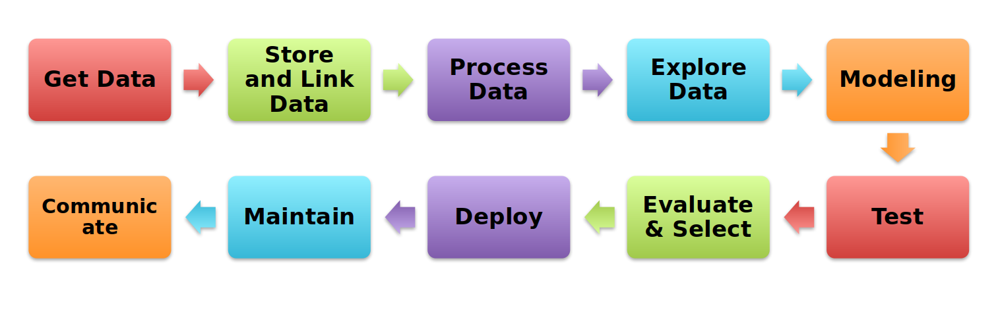{width="800px"}

## Las fuentes del sesgo son múltiples

El sesgo no aparece solo en el algoritmo. Se puede introducir en **cada etapa del proceso**:

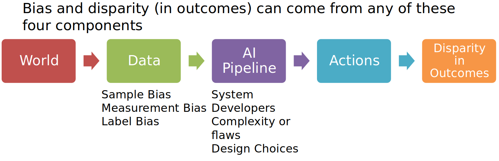{width="800px"}

## El objetivo no es solo un modelo justo: es un sistema justo

Un modelo puede ser estadísticamente "justo" y aun así producir resultados inequitativos. El foco debe estar en **todo el sistema** y en sus resultados reales sobre las personas.

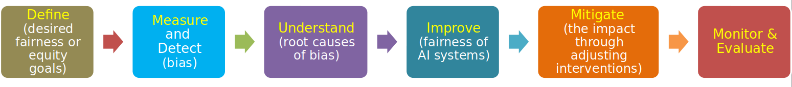{width="800px"}

## Conceptos base para medir equidad

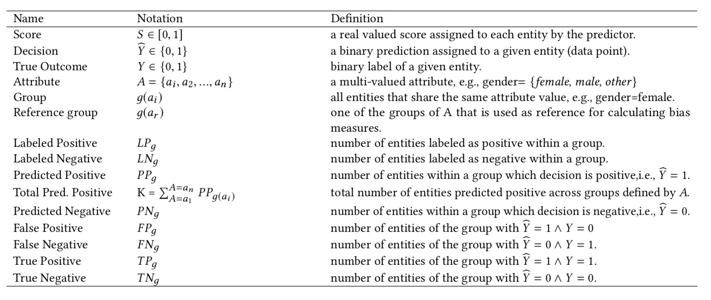{width="800px"}

## Métricas de equidad: retomando la matriz de confusión

:::: {.columns}
::: {.column style="width:35%; font-size: 0.7em;"}

A partir de los aciertos y errores de un modelo, podemos calcular tasas que nos ayudan a evaluar la equidad en las predicciones:

<small>

- **Tasa de falsos positivos (FPR)**: fracción de entidades con etiquetas reales negativas que el modelo clasifica erróneamente como positivas.
- **Tasa de falsos negativos (FNR)**: fracción de entidades con etiquetas reales positivas que el modelo clasifica erróneamente como negativas.
- **Tasa de falsos descubrimientos (FDR)**: fracción de entidades a quienes el modelo predice positivo, pero la etiqueta real es negativa.
- **Tasa de omisiones falsas (FOR)**: fracción de entidades a quienes el modelo predice negativo, pero la etiqueta real es positiva.

</small>

:::

::: {.column width="5%"}
<!-- espacio vacío -->
:::

::: {.column style="width:50%; font-size: 0.8em;"}

<small>

- **Prevalencia real**: fracción de entidades dentro de un grupo donde el resultado fue positivo.
- **Prevalencia predicha**: fracción de entidades dentro de un grupo predichas como positivas.
- **Precisión (Precision)**: fracción de predicciones positivas que son correctas.
- **Cobertura (Recall)**: fracción de casos positivos reales que el modelo identificó correctamente.

</small>

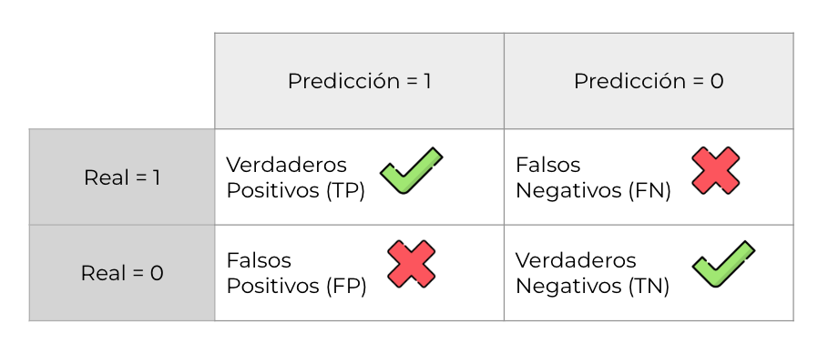

:::
::::

## Catálogo de métricas de equidad

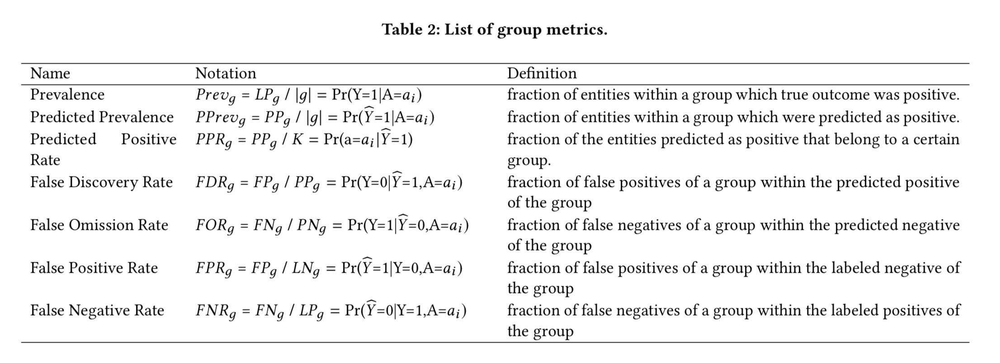{width="800px"}

## Muchas métricas, ninguna universal

| Métrica                         | Descripción breve                                                                 |
|--------------------------------|------------------------------------------------------------------------------------|
| Statistical/Demographic Parity | Igual proporción de decisiones positivas entre grupos.                             |
| Impact Parity                  | Igual proporción de impacto de la decisión en distintos grupos.                    |
| False Discovery Rate Parity    | Igual tasa de falsos positivos sobre todas las predicciones positivas por grupo.   |
| False Omission Rate Parity     | Igual tasa de falsos negativos sobre todas las predicciones negativas por grupo.   |
| False Positive Rate Parity     | Igual tasa de falsos positivos sobre los casos realmente negativos por grupo.      |
| False Negative Rate Parity     | Igual tasa de falsos negativos sobre los casos realmente positivos por grupo.      |

Todas estas métricas son válidas. El problema es que **no se pueden satisfacer todas al mismo tiempo** cuando los grupos tienen prevalencias distintas [@chouldechovaFairPredictionDisparate2017; @kleinbergHumanDecisionsand2018].

## El algoritmo COMPAS

COMPAS (*Correctional Offender Management Profiling for Alternative Sanctions*) es un sistema de puntuación de riesgo de reincidencia utilizado en tribunales de Estados Unidos para apoyar decisiones de fianza y libertad condicional.

En 2016, ProPublica publicó una investigación que concluyó que COMPAS **estaba sesgado contra personas negras** [@angwinMachineBias2016].

Northpointe, la empresa creadora, respondió que el modelo **era justo** [@dieterichCompasRiskScales2016].

¿Cómo pueden llegar a conclusiones opuestas sobre los mismos datos?

## Los datos del caso

Métrica                    Caucásico   Afroamericano
  ------------------------- ----------- ------------------
  Tasa de falsos positivos   23%         45%
  Tasa de falsos negativos   48%         28%

ProPublica identificó disparidades considerables:

-   El algoritmo tenía el doble de probabilidades de *predecir incorrectamente* que los individuos negros tenían un alto riesgo de reincidencia (FPR).

-   También tenía casi el doble de probabilidades de *predecir incorrectamente* que los individuos blancos tenían un bajo riesgo de reincidencia (FNR).

## La respuesta de Northpointe

   Métrica                         Caucásico   Afroamericano
  ------------------------------ ----------- ------------------
  Tasa de falsos positivos         23%         45%
  Tasa de falsos negativos         48%         28%
  Tasa de falsos descubrimientos   41%         37%

Sin embargo, Northpointe señaló que el modelo estaba bien balanceado en **precisión entre razas**: 

- De todos los que el modelo acusó, ¿cuántos eran inocentes?
    - ¿cuanto te señalo como peligroso, ¿qué tan seguido me equivoco?

::: {.notes}
Del libro @fosterBigDataSocial2021:

"ProPublica se centró en FPR y FNR. En su respuesta, Northpointe argumentó que FDR debería ser el enfoque: si el modelo te etiqueta como de alto riesgo, ¿la probabilidad de que esté equivocado depende de tu raza? Bajo esta definición, COMPAS es justo: el 37% de los acusados negros etiquetados como de alto riesgo no reincidieron, vs. el 41% de los blancos."
:::

## El significado detrás de los números

**Modelo: ¿Riesgo de que la persona reincida?**

  ---------------------------------------------------------------------------------------------------------
  Métrica   Significado                                                         Caucásico   Afroamericano
  --------- ------------------------------------------------------------------ ----------- ----------------
  FPR       Si eres una persona que **no** reincidirás, ¿la probabilidad        23%         45%
            de ser clasificado como alto riesgo depende de tu etnicidad?

  FNR       Si eres una persona que **sí** reincidirá, ¿la probabilidad de      48%         28%
            ser clasificado como bajo riesgo depende de tu etnicidad?

  FDR       Si el modelo te clasifica como alto riesgo, ¿la probabilidad de     41%         37%
            que esté equivocado al hacerlo depende de tu etnicidad?
  
  ---------------------------------------------------------------------------------------------------------

## ¿Quién tiene razón?

- ¿El algoritmo COMPAS es sesgado?
- ¿No puede el algoritmo lograr ambas medidas de equidad al mismo tiempo?

La respuesta es **no**: matemáticamente es imposible satisfacer ambas condiciones cuando los grupos tienen tasas de reincidencia distintas.

::: {.notes}
Nota importante: COMPAS **NO** usa machine learning. Es un modelo estadístico basado en encuestas de riesgo.
:::

## La incompatibilidad es matemática, no técnica

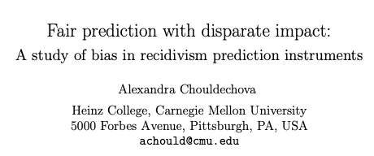

Chouldechova (2017) y Kleinberg et al. (2016/2018) demostraron de forma independiente que, cuando dos grupos tienen **tasas base distintas** en el resultado de interés, ningún clasificador puede satisfacer simultáneamente calibración e igualdad en tasas de error, salvo en el caso trivial de predicción perfecta [@chouldechovaFairPredictionDisparate2017; @kleinbergHumanDecisionsand2018].

## Entonces... ¿qué significa esto?

- No podemos tenerlo todo.
- Pero esto **no significa** que la equidad sea inalcanzable ni que no valga la pena intentarlo.
- Significa que debemos **elegir explícitamente** qué métrica de equidad importa más en nuestro contexto y **justificar esa elección**.

El debate no es técnico: es un debate sobre valores y sobre quién asume el costo de los errores.

## ¿Cómo elegimos qué métrica nos importa?

La elección de métricas de equidad debe hacerse en función del **contexto de intervención** [@saleiroAequitasBiasFairness2019]:

- **Intervención punitiva** (encarcelar, sancionar): los falsos positivos son muy costosos → priorizar FPR.
- **Intervención asistencial** (becas, subsidios, atención médica): los falsos negativos son muy costosos → priorizar FNR/FOR.
- **Recursos limitados**: cuando solo puedes intervenir en una pequeña fracción de la población necesitada, la precisión (FDR) importa más.

No existe una respuesta única. Lo importante es **hacer explícita la elección y sus implicaciones**.

## El Árbol de Equidad

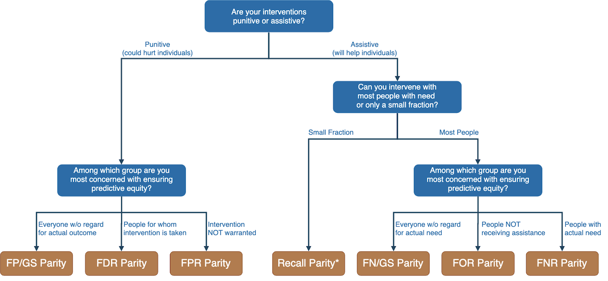{width="800px"}

## Elección de métricas: paso a paso

1. **Proporcionar todas las métricas** disponibles en la auditoría de equidad.
2. **Evaluar el contexto tangible**: ¿es una intervención punitiva o asistencial? ¿Hay recursos limitados?
3. **Seleccionar la métrica prioritaria** en función del daño que queremos minimizar.
4. **Observar disparidades** en esa métrica a través de los grupos protegidos.
5. **Documentar y justificar** la elección ante las partes interesadas.

---

## Aequitas: herramienta de código abierto para la auditoría de sesgo y equidad

- **Web interactiva**: @AequitasBiasReport
- **Documentación**: @BiasFairnessAudit
- **Artículos**: @saleiroAequitasBiasFairness2019; @saleiroDealingBiasFairness2020

Permite auditar modelos de clasificación binaria en múltiples grupos y métricas, y genera reportes interpretables para equipos técnicos y de política pública.

## Flujo de trabajo de equidad en ML

El trabajo con equidad no termina al construir el modelo: es un ciclo continuo [@saleiroAequitasBiasFairness2019]:

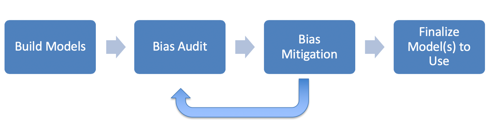{width="800px"}

# Reducir el sesgo: estrategias y compensaciones {background-color="#fdede8"}

## ¿Cómo podemos reducir el sesgo?

Existen intervenciones en distintas etapas del pipeline:

- **Corregir el mundo**: atender las causas estructurales del sesgo en los datos.
- **Preprocesamiento**: corregir los datos de entrada.
  - Eliminar atributos sensibles (y sus correlatos).
  - Remuestrear o reponderar grupos protegidos.
- **Procesamiento interno**: optimizar la equidad durante el entrenamiento del modelo.
- **Posprocesamiento**:
  - Seleccionar modelos justos durante la evaluación.
  - Aplicar ajustes post hoc para eliminar sesgo de las puntuaciones.

## Estrategias de mitigación de sesgo

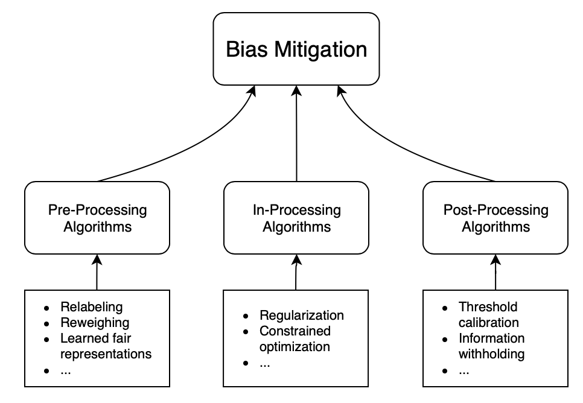{width="800px"}

## Explorando las compensaciones (equity-accuracy tradeoffs)

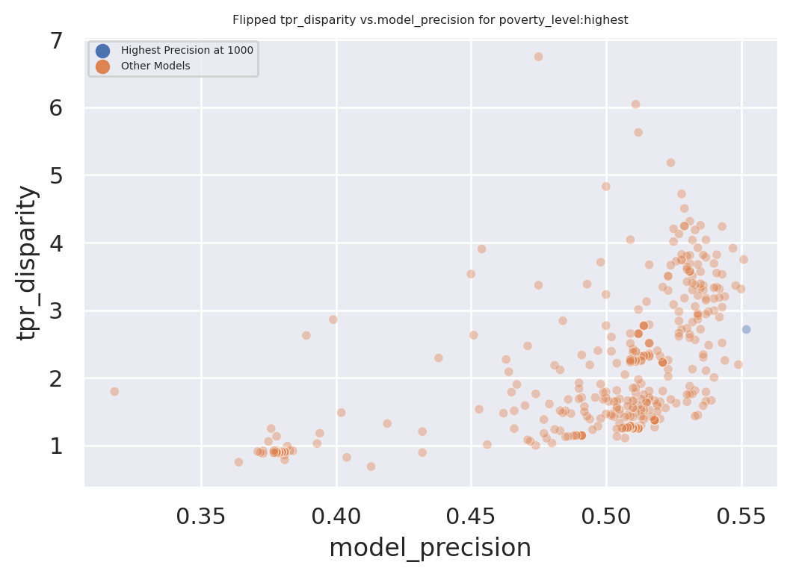{width="800px"}

::: {.notes}
- Cada punto representa una especificación diferente del modelo.
- Los puntos más a la derecha son más precisos.
- Los puntos más cercanos a 1 en el eje Y son más justos (en la métrica seleccionada).
- El azul representa el "mejor" modelo basado únicamente en precisión en k puntos.

La lección: maximizar precisión y maximizar equidad no siempre apuntan en la misma dirección, pero tampoco son objetivos irreconciliables en todos los contextos.
:::

---

### Percepciones (erróneas) comunes entre profesionales

Estas ideas suenan razonables pero son incorrectas o incompletas:

- *"No considerar la raza en mis modelos los hace no racistas."*
- *"Usar la raza en mis modelos los vuelve racistas."*
- *"El sesgo surge y se puede corregir solo 'corrigiendo' los datos."*
- *"Debo eliminar todo sesgo para poder implementar el sistema."*
- *"Debo cumplir con todas las medidas de sesgo para ser justo."*
- *"Siempre existe un equilibrio entre imparcialidad y precisión."*
- *"Un modelo de ML justo = resultados justos y equitativos."*
- *"Los métodos de reducción de sesgo realmente reducen el sesgo en el mundo real."*

---

### ¿Cómo prepararse para construir sistemas más justos?

- **Crear un entorno de discusión**: donde se puedan debatir valores desde el inicio del proyecto, no al final.
- **Involucrar a los afectados**: incluir en el diseño a las comunidades sobre las que opera el sistema.
- **Analizar opciones en cada etapa**: desde la formulación hasta el impacto, no solo en el modelado.
- **Medir los resultados correctos**: no solo métricas de desempeño técnico.
- **Probar con las pruebas correctas**: equidad en distribuciones reales, no solo en datos de entrenamiento.
- **Monitorear y actualizar**: los sistemas y las poblaciones cambian con el tiempo.
- **Adaptar el diseño al escenario de implementación**: las decisiones de diseño que son éticas en un contexto pueden no serlo en otro.

## Lo que aprendimos hoy

1. Las preguntas éticas en datos no son nuevas, pero la **escala y opacidad** de los sistemas de IA las amplifican.
2. La **privacidad** tiene múltiples niveles de control; la inferencia es el nivel más difícil de proteger.
3. La **transparencia** va mucho más allá de publicar código: involucra procesos, datos, objetivos e impacto.
4. Existen **muchas métricas de equidad** y son matemáticamente incompatibles cuando los grupos tienen prevalencias distintas.
5. La elección de métricas es una **decisión de valores**, no solo técnica: depende de quién asume el costo de los errores.
6. El objetivo final es un **sistema justo**, no solo un modelo justo.

## Recursos útiles

- [Guía de alcance de proyectos de ciencia de datos para el bien público](http://dsapp.uchicago.edu/resources/data-science-project-scoping-guide/)
- [Aequitas — herramienta de auditoría de sesgo](http://aequitas.dsapp.uchicago.edu/)
- [Tutorial práctico sobre equidad y sesgo (Jupyter notebooks)](https://dssg.github.io/fairness_tutorial/)
- [Repositorio de proyectos DSSG](https://www.github.com/dssg)
- [Triage: kit de herramientas de aprendizaje automático](https://github.com/dssg/triage)

## Referencias {.unnumbered}

::: {#refs}
:::
