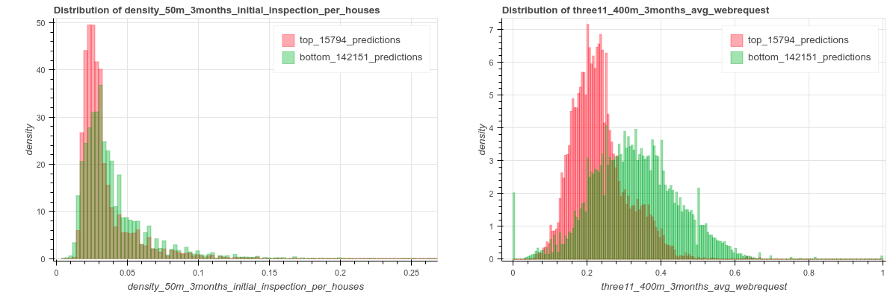
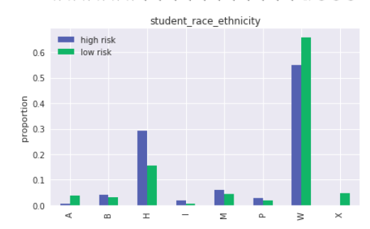
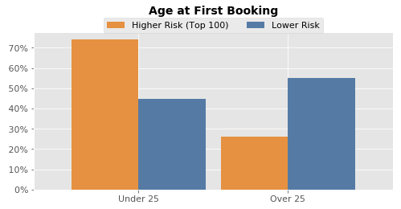
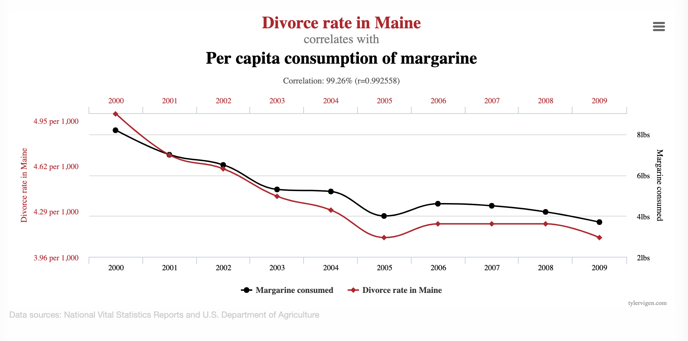
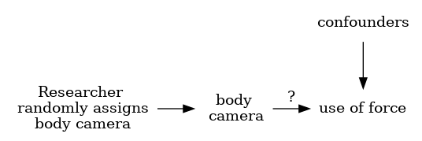
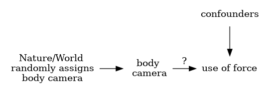
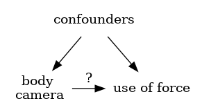
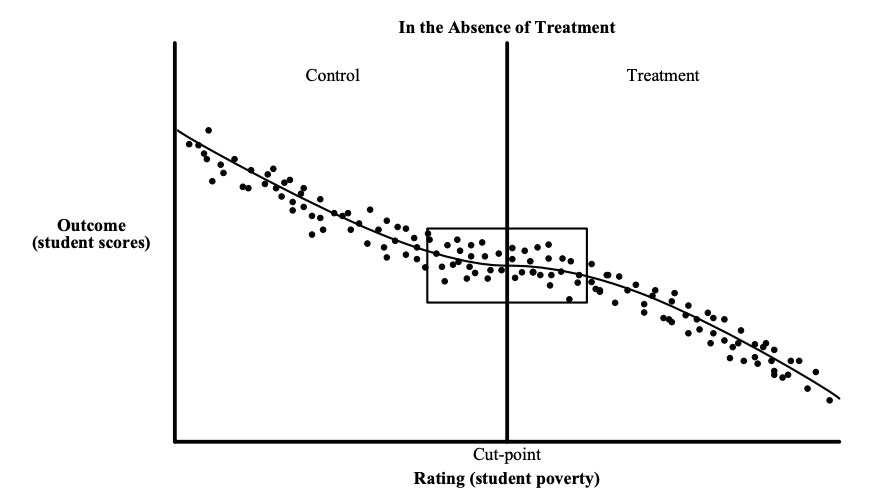
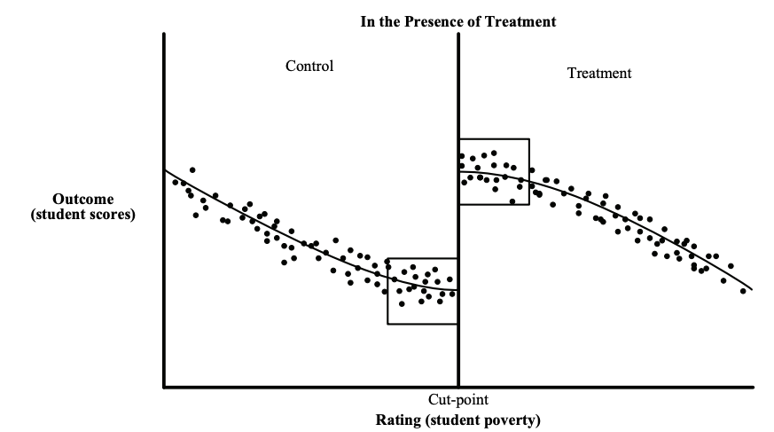
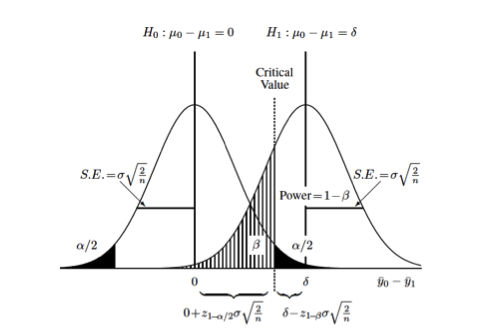

# Postmodelado {background-color="#fdede8"}


## Entender lo que el modelo está haciendo

- Ver el modelo (hiperparámetros)

- Ver las distribuciones de score y calibración

- Ver las *feature importances*

- Ver las contribuciones de *feature groups* o grupos de variables

- Cross-Tabs sobre las predicciones

- Análisis de error


## *Leave one out feature groups*

-   (Incremental) Utilidad predictiva de un grupo de variables:

    -   Correr los modelos con todas los grupos de variables
    -   Correr los modelos con 1 grupo de variables
    -   Correr los modelos con todo menos con un grupo de variables

## Entiende las predicciones

-   Distribuciones de score

-   Cross-Tabs

-   Clustering

## Revisa las entidades predichas en el top k

{width="800px"}

## Cross-Tabs: **Variables categóricas**

1.  Chi-Square Test / Prueba exacta de Fisher\'s

    - **Hipótesis nula:** Los grupos de alto riesgo y bajo riesgo tienen la misma distribución en la *feature* analizada.


{width="500px"}


## Cross-Tabs: **Continuous Variables**


1. Prueba t de Student

    - **Hipótesis nula:** La media de la *feature* en el grupo de alto riesgo es igual a la del grupo de bajo riesgo.

2. Prueba de Kolmogorov-Smirnov (KS)

    - **Hipótesis nula:** La distribución de la *feature* en el grupo de alto riesgo es igual a la del grupo de bajo riesgo.

{width="800px"}


# Causalidad y pruebas de campo {background-color="#fdede8"}

## Validación en campo: Más allá de las pruebas A/B

- ¿Qué tan bien funciona el modelo en el mundo real?
  - Validación con datos verdaderamente no vistos del futuro; es la única manera de asegurarse de evitar *leakage* (fugas de información).

- ¿Qué supuestos clave en nuestra formulación deben ser puestos a prueba?
  - ¿Estamos interviniendo con las personas “correctas”?
  - ¿Estamos interviniendo de la mejor manera posible?
  - ¿Cuál es el impacto de decisiones históricas o de etiquetas selectivas?

- Lo más importante: ¿Qué tan bien ayuda el sistema de ML que estamos construyendo a que la organización cumpla sus objetivos?


## Metas de la prueba de campo



---

### ¿Las cámaras corporales (body cameras) en la policía reducen el uso de la fuerza? 

```{mermaid}
graph LR
    A[camaras corporales] -->|?| B[uso de la fuerza]

```

¿Qué otras cosas afectan al uso de fuerza?

- El entrenamiento previo del policía,

- La zona o vecindario donde opera (más o menos conflictivo),

- O incluso el turno o experiencia del oficial.


---

### ¿Las cámaras corporales (body cameras) en la policía reducen el uso de la fuerza? 

```{mermaid}
graph TD
    C[factores de confusión] --> A[camaras corporales]
    C --> B[uso de la fuerza]
    A -- ? --> B
```

- Se rompe la interpretación causal directa entre cámara y fuerza.

- Si no se controla por estos confounders:
    - Podemos sobreestimar o subestimar el verdadero efecto de las cámaras.
    - El modelo puede estar detectando correlaciones espurias.


## Diseño de experimental 

-   Experimentos

-   Quasi-experimentos

-   Estudios observacionales

## Experimento

{width="800px"}

## Quasi-Experimentos

{width="800px"}

## Estudios observacionales

{width="800px"}

**Incluye los factores confusores en la regresión**

## Métodos para inferencia causal

- Uso de datos observacionales  
- Uso de experimentos  

## Inferencia causal con datos observacionales

- Emparejamiento (Matching)  
- Diferencias en diferencias (DiD)  
- Diseño de discontinuidad en la regresión (RDD)  
- Variables instrumentales  
- ¿Limitaciones?

## Inferencia causal con datos observacionales


{width="800px"}

## Inferencia causal con datos observacionales

{width="800px"}

## Inferencia causal con experimentos

### *Randomized Controlled Trials*

- Diseño del experimento
  - Resultado (outcome)
  - Tamaño de muestra (potencia estadística)
  - Aleatorización

- Consideraciones éticas

## Algunas cosas a tener en cuenta

Tamaño de muestra ↑  
Potencia ↑ Tamaño del efecto ↓ Nivel de significancia ↑  

Tamaño del efecto → lo que es útil y significativo en la práctica  
Nivel de significancia → relacionado con el costo de implementar el nuevo sistema/modelo

## Diseñando pruebas para validar sistemas de ML

- ¿Qué podemos hacer con datos históricos?
  - Selección de modelo
  - Estimación del rendimiento

- ¿Cómo seleccionamos el modelo a desplegar?
  - Comparar modelos preseleccionados con la línea base (baseline)

- ¿Cómo validamos si nuestro sistema de ML funcionará al desplegarlo?

## Diseñando un experimento

- ¿Qué estamos tratando de probar?
- ¿Cómo creamos los diferentes grupos del experimento?
- ¿Cómo ejecutamos el experimento?
- ¿Qué medimos?
- ¿Cómo evaluamos?

## ¿Qué estamos probando en un experimento?

- ¿Mejora en resultados (*lift*)?
- ¿Clasificación?
- ¿Estimaciones de probabilidad?
- ¿Ranking?

- ¿Cómo cambia el diseño del experimento según esto?


## ¿Cuántos [estudiantes, inspecciones, proyectos] debemos incluir en nuestro experimento?

Realizar un experimento durante [y] años con [n] [estudiantes/inspecciones/proyectos] por año  
nos dará una probabilidad del [p%] de detectar un incremento del [e%] en  
[resultado deseado], con un nivel de significancia estadística del [s%].

## ¿Cuántos [estudiantes, inspecciones, proyectos] debemos incluir en nuestro experimento?

{width="800px"}

## Algunas referencias

1.  *[References on causal
    inference](https://github.com/dssg/hitchhikers-guide/tree/master/sources/curriculum/3_modeling_and_machine_learning/quantitative-social-science)*

    -   *[The seven tools of causal inference, with reflections on
        machine
        learning](https://ftp.cs.ucla.edu/pub/stat_ser/r481.pdf)* by
        Pearl, J.

    Comm ACM. 2019

    -   *[Elements of Causal
        Inference](https://mitpress.mit.edu/books/elements-causal-inference)*
        by Peters et al. MIT Press. (Open Access Text)

    -   Counterfactuals and Causal Inference: Methods and Principles for
        Social Research by Morgan and Winship. Cambridge University
        Press.

    -   Data Analysis Using Regression and Multilevel/Hierarchical
        Models by Gelman and Hill. Cambridge University Press.

## ¿Y en inspecciones?

## Validación: Experimento

-   Existen varios problemas en los cuales **NO** se conoce la etiqueta
    (la respuesta a la pregunta que nos interesa sobre las entidades ),
    los problemas de inspección se encuentran este grupo.
-   Las **únicas** etiquetas que tienes están en las entidades con las
    que se ha interactuado, por ejemplo, con una inspección
-   **NO** conocemos la tasa [real]{.underline}
-   ¿Cuánto se está dispuesto a invertir en estimar la tasa real?

## Validación: Proceso

-   Selecciona el mejor modelo
-   Entrena en todos los datos etiquetados
-   Experimento

## Las diferentes tasas

Existen tres tasas de incidencia:

-   Tasa real
-   Tasa encontrada por una muestra aleatoria
-   Tasa encontrada por el modelo

## La importancia de la tasa real

Esperamos que el modelo nos ayude a reducir el [real rate]{.underline}
tal como lo estámos midiendo con el [random sample]{.underline}

Si no estamos reduciendo el número de violaciones, no estamos haciendo
un buen trabajo. La meta del programa no es encontrar violaciones y
arreglarlas, la meta del programa es **reducir** el número de
violaciones en total.

Si la tasa es constante, hay que ver como cambiamos el budget de la
cantidad de inspecciones a realizar para que reduzcan la tasa real de
violaciones, ya que no deberíamos de estar gastando dinero en
inspecciones que no tienen efecto

## Experimento

### Ejemplo

-   Particicionado aleatorio (*Randomize splits*):
    -   Partición 1: Aleatorio
    -   Partición 2: Modelo
    -   Partición 3: Aproximación actual

**Otros ejemplos**: @rodolfaCaseStudyPredictive2020,
@baumanReducingIncarcerationPrioritized2018,
@potashRandomizationBiasField2018

## Proceso: Suposiciones

**Suposiciones**:

-   Tienes $k$ recursos disponibles.
-   Seleccionaste el mejor modelo basado en $k$.
-   El modelo genera una lista de $k$ entidades a inspeccionar en el
    siguiente periodo de tiempo.
-   Tienes la lista de longitud $k$ de las inspecciones que se iban a
    realizar dado el *approach* actual

## Proceso: *Particiones*

-   Dividir el \"presupuesto\" de recursos en partes iguales (esto es un
    ejemplo, puede variar)

    1.  Selecciona $k/3$ entidades al azar de **toda** la población de
        entidades elegibles
    2.  Selecciona $k/3$ entidades al azar de la lista de longitud $k$
        generada por el proceso actual
    3.  Selecciona $k/3$ entidades al azar de la lista de longitud $k$
        generada por el modelo

## Proceso: Estimación

**Evalua el desempeño en cada uno de ellos**

1.  Estimación de la tasa real
2.  Estimación de la tasa de efectividad del proceso actual
3.  Estimación de la tasa de efectividad del modelo seleccionado

## El objetivo de las inspecciones al azar

Estimar la tasa real

> \"The larger the inspections allocated to the random, the closer will
> be the value of the the founded violation rate to the real violation
> rate.\"
>
> **Rayid Ghani**

## El objetivo de las inspecciones del modelo

> Estimar si el modelo mantiene su desempeño en datos reales

## El objetivo de las inspecciones con el proceso actual

> Comparar contra el modelo ¿Cuál es mejor?. Estas serán la [línea base
> real]{.underline}

## Alternativa: Doble modelo

-   Modelo que calcula el riesgo de que la entidad [falle]{.underline}
    una inspección.
    -   Este es el modelo del que hemos hablado **todo** el curso
    -   Este modelo estima $P(V|I)$
-   Modelo que calcula el riesgo de que la entidad [sea
    inspeccionada]{.underline}.
    -   Estima la similitud de las entidades a las que inspeccionamos
    -   Este modelo tiene **etiquetas** para **todas** las entidades
        siempre: ¿Esta entidad fué inspeccionada?
    -   Este modelo es parecido a un modelo de **alerta temprana**
        (*Early Warning System*)
    -   Este modelo estima $P(I)$
    -   **NOTA**: [Ninguno]{.underline} de estos modelos nos da $P(V)$.

---
