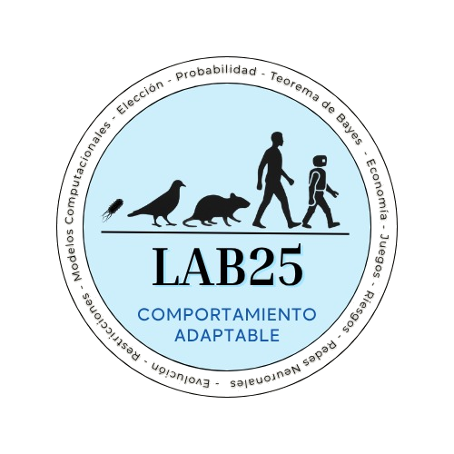
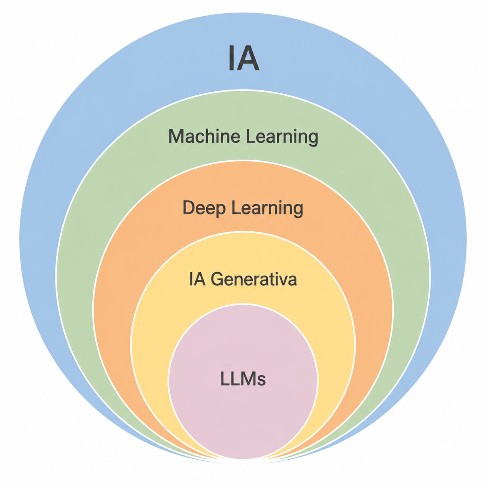
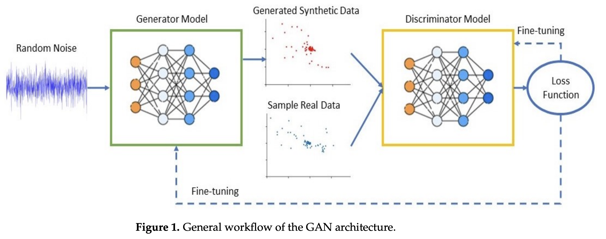

# Un poco de contexto... {background-color="#fdede8"}

:::: {.columns}
::: {.column style="width:45%; font-size: 0.9em;"}

:::
::: {.column width="5%"}
<!-- empty column to create gap -->
:::
::: {.column style="width:50%; font-size: 0.8em;"}

 
- Antes estudiaba cómo las personas toman decisiones  
  - elección intertemporal  
  - regla de integación 
  - mecanismos cognitivos del comportamiento  

- Hoy sigo trabajando con decisiones...  
  - pero ahora diseñando herramientas, basadas en datos, que ayudan a informarlas mejor 

:::
::::

---

### *¿Qué hago hoy?*

- Diseño soluciones basadas en datos para resolver un problema:

    - organizar información  
    - identificar patrones  
    - automatizar tareas complejas  
    - apoyar la toma de decisiones  

- Trabajo con los datos disponibles de organizaciones e instituciones: 

    - desordenados, incompletos, no estructurados

- Gran parte del trabajo ocurre antes de la IA:

    - definir el problema correcto
    - limpiar datos  
    - estructurar información  

:::{.notes}

| Psicología experimental | Mundo real       |
| ----------------------- | ---------------- |
| controlado              | ruidoso          |
| pocas variables         | muchas variables |
| datos limpios           | datos sucios     |
| hipótesis clara         | problema ambiguo |

> “En el mundo real, antes de modelar… hay que construir el problema”

:::

## ¿Qué es la **ciencia** de **datos**?

Desarollo de *sistemas* que dan soporte a la toma de decisiones que se traducen en acciones.

| **Ciencia** | **Datos** |
|-------------|-----------|
| Uso del método científico en el diseño e implementación de una solución | Para probar hipótesis |

- El resultado final es un **producto de datos** implementado (*modelo vivo*)
    - Dependencia de los datos disponibles
    - Usualmente, responde a una sola pregunta
    - Supone un sistema dinámico complejo
    - Los modelos generados no se pueden utilizar en otros sistemas 
    - Supone que modifica la realidad para la cuál fue diseñado

## Producto de datos 

### *No solamente es un modelo, es un sistema complejo*

- Conjunto de procesos que atraviesan los datos y que se adaptan al sistema en el que está implementado

---

### *¿Cómo utilizo IA para dar soporte a la toma de decisiones?*

:::: {.columns}
::: {.column style="width:50%; font-size: 0.7em;"}

- **Machine Learning (ML)**
    - Aprendizaje supervisado para clasificar o predecir
    - Aprendizaje no supervisado para identificar patrones

- **Deep Learning (DL)**
    - Redes neuronales con grandes volúmenes de datos
    - Base de muchas aplicaciones actuales de IA generativa

- **Procesamiento de Lenguaje Natural (NLP)**
    - Permite procesar lenguaje humano en máquinas
    - Clasificar, extraer, resumir y generar texto

:::
::: {.column width="5%"}
<!-- empty column to create gap -->
:::
::: {.column style="width:35%; font-size: 0.6em;"}

:::
::::

# Ciencia de datos (IA) para política pública {background-color="#fdede8"}

- **DSSG (Data Science for Social Good)**
- Carnegie Mellon University
- [https://dssgfellowship.org/](https://dssgfellowship.org/)
    - Sistemas de priorización de recursos
    - Sistemas de alerta temprana

## Daño estructural en techos

### Ciudad de Baltimore

:::: {.columns}
::: {.column style="width:50%; font-size: 0.6em;"}
- **Problema**
    - Edificios abandonados generan daños estructurales en viviendas vecinas
    - El deterioro puede extenderse a propiedades contiguas

- **Meta**
    - Reducir el número de casas con daño estructural 

- **Acción**
    - Realizar inspecciones e intervenciones preventivas para determinar demolición de emergencia, estabilización u otras reparaciones

- **Datos**
    - Imágenes aéreas
    - Datos administrativos
    - Historial de inspecciones

- **Análisis**
    - Generar un ranking de propiedades con mayor riesgo (score)

:::
::: {.column width="5%"}
<!-- empty column to create gap -->
:::
::: {.column style="width:45%; font-size: 0.6em;"}

:::
::::

## Priorización de carpetas de investigación

### Fiscalía de Zacatecas

:::: {.columns}
::: {.column style="width:50%; font-size: 0.6em;"}
- **Problema**
    - Sobrecarga de trabajo y poca capacidad institucional en fiscalía

- **Meta**
    - Aumentar la tasa de carpetas procesadas (reducir tiempo de resolución)

- **Acción**
    - Revisión de carpetas de investigación priorizadas

- **Datos**
    - Administrativos e información de carpetas de investigación

- **Análisis**
    - Generar un ranking de carpetas que tienen mayor probabilidad de finalizar en un plazo de 6 meses

:::
::: {.column width="5%"}
<!-- empty column to create gap -->
:::
::: {.column style="width:45%; font-size: 0.6em;"}

- Preprint: [https://arxiv.org/abs/2601.00396](https://arxiv.org/abs/2601.00396)

:::
::::

## Distribución eficiente de contenedores

### Terminal portuaria

:::: {.columns}
::: {.column style="width:50%; font-size: 0.6em;"}
- **Problema**
    - Gran número de reacomodos innecesarios al momento de estibar contenedores

- **Meta**
    - Reducir los movimientos desperdicio al momento de estibar contenedores

- **Acción**
    - Distribuir los contenedores de manera eficiente, proporcionando información sobre la prioridad de estiba

- **Datos**
    - Contenedores y movimientos

- **Análisis**
    - Predicción de contenedores con servicio y tiempo de estadía

:::
::: {.column width="5%"}
<!-- empty column to create gap -->
:::
::: {.column style="width:45%; font-size: 0.6em;"}

- Preprint: [https://arxiv.org/html/2604.06251v1](https://arxiv.org/html/2604.06251v1)

:::
::::

## Distribución eficiente de contenedores

### Terminal portuaria

---

### *Pipeline*

# NLP en acción {background-color="#fdede8"}

- Muchas instituciones no tienen su información estructurada

- Tienen:
    - documentos
    - reportes
    - bases de texto libre
    - PDFs
    - registros administrativos

- El reto:
    - transformar texto desordenado en información útil

---

## ¿Qué entiende una máquina del lenguaje?

### *Las máquinas no entienden texto como nosotros.*

Primero necesitan convertir palabras en números:

:::: {.columns}

::: {.column style="width:45%; font-size:0.8em;"}

**Métodos clásicos**

- TF-IDF  
- Bag of Words  

    - Basados en frecuencia de palabras  

:::

::: {.column width="5%"}
:::

::: {.column style="width:50%; font-size:0.8em;"}

**Métodos modernos**

- Embeddings  
- Transformers  
    - Capturan significado y contexto

:::

::::

## Aplicación

:::: {.columns}

::: {.column style="width:45%; font-size:0.7em;"}

### Clasificación de mercancías

**Problema**

- Muchas descripciones de mercancías vienen en texto libre
- Frecuentemente incompletas o inconsistentes

**Objetivo**

- Asignar categorías estandarizadas (HS codes)

**Técnicas**

- TF-IDF

:::

::: {.column width="5%"}
:::

::: {.column style="width:50%;"}

:::

::::

## Aplicación

:::: {.columns}

::: {.column style="width:45%; font-size:0.7em;"}

### Record Linkage

**Problema**

- Una misma persona/empresa aparece múltiples veces
- Con nombres escritos de forma distinta

**Objetivo**

- Detectar registros duplicados

**Técnicas**

- Similitud textual entre cadenas
    - Distancia de Levenshtein
    - Trigramas
- Grafos

:::

::: {.column width="5%"}
:::

::: {.column style="width:50%;"}

](https://egobiernoytp.tec.mx/sites/default/files/2026-02/portada-blog-record-linkage.png)

:::

::::

## Bases de datos sintéticas

:::: {.columns}

::: {.column style="width:45%; font-size:0.7em;"}

**Problema**

El acceso a datos operativos puede estar limitado por:

- seguridad de la información  
- datos sensibles  
- restricciones para compartir información fuera de infraestructura segura  

**Solución**

Generar bases de datos sintéticas que:

- preserven relaciones temporales  
- mantengan estructura entidad-evento  
- conserven utilidad analítica para investigación y desarrollo

:::

::: {.column width="5%"}
:::

::: {.column style="width:50%; font-size:0.7em;"}

**GANs**

- Un **generador** crea datos sintéticos a partir de ruido aleatorio  
- Un **discriminador** intenta distinguir datos reales de sintéticos  
- ambos modelos mejoran hasta generar datos cada vez más realistas

:::

::::

# Lo que cambió (y lo que no) {background-color="#fdede8"}

## Lo que cambió

- ahora trabajo con bases de datos más grandes  
- texto no estructurado  
- instituciones públicas y privadas  
- problemas operativos complejos  
- herramientas de IA  

 

## Lo que no cambió

- uso del método científico
- mi interés por entender decisiones  
- cómo reducir incertidumbre  
- cómo generar mejor evidencia  
- cómo traducir análisis en acción

## Qué he aprendido sobre IA

- El entendimiento del problema es de lo más importante 
- La mayor parte del trabajo no está en el modelo  
- Los datos suelen estar desordenados  
- Muchas organizaciones no tienen información estructurada  

 

> La IA rara vez reemplaza decisiones humanas.  
> Su mayor valor está en ayudar a tomar decisiones mejor informadas.

# ¡Gracias! {background-color="#fdede8"}

- ¿Preguntas?

- [www.linkedin.com/in/elena-villano](www.linkedin.com/in/elena-villano)
- [villalobos_elena@tec.mx](villalobos_elena@tec.mx)

---

### [Referencias]{.fg style="--col: #e64173"}

  

- Basado en el curso de Rayid Ghani and Kid Rodolfa

